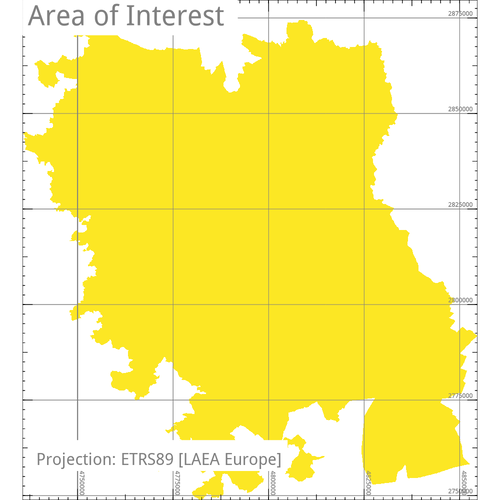
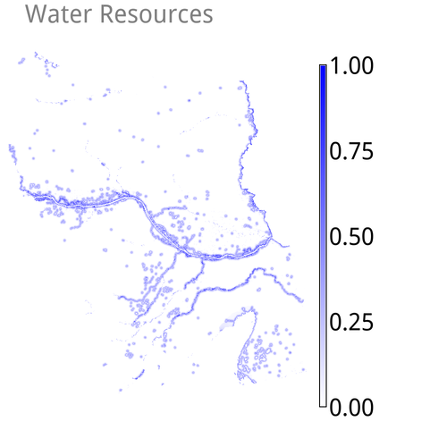

Description
-----------

*r.estimap* is an implementation of the ESTIMAP recreation algorithm to
support mapping and modelling of ecosystem services (Zulian, 2014).

Examples
--------

For the sake of demonstrating the usage of the module, we use the
following "component" maps

-   area_of_interest
-   land_suitability
-   water_resources
-   protected_areas

(available to download at: ...) to derive a recreation *potential* map.

 

Before anything, we need to define the extent of interest using

    g.region  raster=area_of_interest

### Using pre-processed maps

The first four input options of the module are designed to receive
pre-processed input maps that classify as either `land`, `natural`,
`water` and `infrastructure` resources.

#### Potential

To compute a *potential* output map, the simplest possible command call
requires the user to define the input map option `land` and define a
name for the output map option `potential`. Using a pre-processed map
that depicts the suitability of different land types to support for
recreation (here the map named
`land_suitability) the command to execute is: `

    r.estimap  land=land_suitability  potential=potential

Note, this will process the input map `land_suitability` over the extent
defined previously via `g.region`, which is the standard behaviour in
GRASS GIS.

To exclude certain areas from the computations, we may use a raster map
as a mask and feed it to the input map option `mask`:

    r.estimap  land=land_suitability  mask=area_of_interest  potential=potential_1

The use of a mask (in GRASS GIS' terminology known as **MASK**) will
ignore areas of **No Data** (pixels in the `area_of_interest` map
assigned the NULL value). Successively, these areas will be empty in the
output map `potential_1`. Actually, the same effect can be achieved by
using GRASS GIS' native mask creation module `r.mask` and feed it with a
raster map of interest. The result will be a raster map named **MASK**
whose presence acts as a filter. In the following examples, it becomes
obvious that if a single input map features such **No Data** areas, they
will be propagated in the output map.

Nonetheless, it is good practice to use a `MASK` when one needs to
ensure the exclusion of undesired areas from any computations. Also,
note the `--o` flag: it is required to overwrite the already existing
map named `potential_1`.

Next, we add a water component, a map named `water_resources`, modify
the output map name to `potential_2` and execute again, without a mask:

    r.estimap  land=land_suitability  water=water_resources  potential=potential_2

At this point it becomes clear that all `NULL` cells present in the
"water" map, are proagated in the output map `potential_2`.

Following, we provide a map of protected areas named `protected_areas`,
modify the output map name to `potential_3` and repeat the command
execution:

    r.estimap  land=land_suitability  water=water_resources  natural=protected_areas  potential=potential_3

While the `land` option accepts only one map as an input, both the
`water` and the `natural` options accept multiple maps as inputs. In
example, we add a second map named `bathing_water_quality` to the water
component and modify the output map name to `potential_4`:

    r.estimap  land=land_suitability  water=water_resources,bathing_water_quality  natural=protected_areas  potential=potential_4

In general, arbitrary number of maps, separated by comma, may be added
to options that accept multiple inputs.

This example, features also a title and a legend, so as to make sense of
the map.

    d.rast  potential_4
    d.legend  -c  -b  potential_4  at=0,15,0,1  border_color=white
    d.text  text="Potential"  bgcolor=white

The different output map names are purposefully selected so as to enable
a visual comparison of the differences among the differenct examples.
The output maps `potential_1`, `potential_2`, `potential_3` and
`potential_4` range within \[0,3\]. Yet, they differ in the distribution
of values due to the different set of input maps.

All of the above examples base upon pre-processed maps that score the
access to and quality of land, water and natural resources. For using
*raw*, unprocessed maps, read section **Using unprocessed maps**.

#### Spectrum

To derive a map with the recreation (opportunity) `spectrum`, we need in
addition an `infrastructure` component. In this example a map that
scores distance to infrastructure (such as the road network) named
`distance_to_infrastructure` is defined as an input:

Naturally, we need to define the output map option `spectrum` too:

    r.estimap  \
      land=land_suitability \
      water=water_resources,bathing_water_quality \
      natural=protected_areas \
      infrastructure=distance_to_infrastructure
      spectrum=spectrum  \

or, the same command in a copy-paste friendly way:

    r.estimap  land=land_suitability  water=water_resources,bathing_water_quality  natural=protected_areas  infrastructure=distance_to_infrastructure  spectrum=spectrum

Missing to define the `infrastructure` map, the command will abort and
inform about.

The image above, was produced via the following native GRASS GIS
commands

    d.rast  spectrum
    d.legend  -c  -b  spectrum  at=0,30,0,1  border_color=white
    d.text  text="Spectrum"  bgcolor=white

##### Opportunity

The `opportunity` map is actually an intermediate step of the algorithm.
The option to output this map `opportunity` is meant for expert users
who want to explore the fundamentals of the processing steps. Hence, it
requires to define the output option `spectrum` map as well. Building
upon the previous command, we add the `opportunity` output option:

    r.estimap  \
      mask=area_of_interest \
      land=land_suitability \
      water=water_resources,bathing_water_quality \
      natural=protected_areas \
      spectrum=spectrum  \
      infrastructure=distance_to_infrastructure \
      opportunity=opportunity

or, the same command in a copy-paste friendly way:

    r.estimap  mask=area_of_interest  land=land_suitability  water=water_resources,bathing_water_quality  natural=protected_areas  spectrum=spectrum  infrastructure=distance_to_infrastructure  opportunity=opportunity

#### More input maps

To derive the outputs met `demand` distributiom, `unmet` demand
distributiom and the actual `flow`, additional requirements are a
`population` map and one of boundaries, as an input to the option
`base`, within which to quantify the distribution of the population.
Using a map of administrative boundaries for the latter option, serves
for deriving comparable figures across these boundaries. The algorithm
sets internally the spatial resolution of all related output maps
`demand`, `unmet` and `flow` to the spatial resolution of the
`population` input map.

Population

In this example, the population map named `population_2015` is of
1000m\^2.

Local administrative units

The map named `local_administrative_units` serves in the following
example as the base map for the zonal statistics to obtain the demand
map.

#### Demand

    r.estimap --o \
      mask=area_of_interest \
      land=land_suitability \
      water=water_resources,bathing_water_quality \
      natural=protected_areas \
      infrastructure=distance_to_infrastructure \
      demand=demand \
      population=population_2015 \
      base=local_administrative_units

#### Unmet Demand

    r.estimap --o \
      mask=area_of_interest \
      land=land_suitability \
      water=water_resources,bathing_water_quality \
      natural=protected_areas \
      infrastructure=distance_to_infrastructure \
      demand=demand \
      unmet=unmet_demand \
      population=population_2015 \
      base=local_administrative_units

#### Mobility

The *mobility* bases upon the same function used to quantify the
attractiveness of locations for their recreational value. It includes an
extra *score* term.

The computation involves a *distance* map, reclassified in 5 categories
as shown in the following table. For each distance category, a unique
pair of coefficient values is assigned to the basic equation.

  Distance   Kappa     Alpha
  ---------- --------- ---------
  0 to 1     0.02350   0.00102
  1 to 2     0.02651   0.00109
  2 to 3     0.05120   0.00098
  3 to 4     0.10700   0.00067
  &gt;4      0.06930   0.00057

Note, the last distance category is not considered in deriving the final
"map of visits". The output is essentially a raster map with the
distribution of the demand per distance category and within predefined
geometric boundaries

    r.estimap --o \
      mask=area_of_interest \
      land=land_suitability \
      water=water_resources,bathing_water_quality \
      natural=protected_areas \
      infrastructure=distance_to_infrastructure \
      mobility=mobility \
      population=population_2015 \
      base=local_administrative_units

#### All in one call

Of course it is possible to derive all output maps with one call:

    r.estimap --o  \
      mask=area_of_interest  \
      land=land_suitability  \
      water=water_resources,bathing_water_quality  \
      natural=protected_areas  \
      infrastructure=distance_to_infrastructure  \
      potential=potential  \
      opportunity=opportunity  \
      spectrum=spectrum  \
      demand=demand  \
      unmet=unmet_demand  \
      mobility=mobility  \
      population=population_2015  \
      base=local_administrative_units
      timestamp='2018'

Note the use of the `timestamp` parameter! This concerns the `spectrum`
map. If plans include working with GRASS GIS' temporal framework on
time-series, this will be useful.

### Using unprocessed input maps

The module offers a pre-processing functionality for all of the
following input components:

-   landuse
-   suitability\_scores

<!-- -->

-   landcover
-   land\_classes

<!-- -->

-   lakes
-   lakes\_coefficients
-   default is set to: euclidean,1,30,0.008,1

<!-- -->

-   coastline
-   coastline\_coefficients
-   default is set to: euclidean,1,30,0.008,1
-   coast\_geomorphology

<!-- -->

-   bathing\_water
-   bathing\_coefficients
-   default is set to: euclidean,1,5,0.01101

<!-- -->

-   protected
-   protected\_scores
-   11:11:0,12:12:0.6,2:2:0.8,3:3:0.6,4:4:0.6,5:5:1,6:6:0.8,7:7:0,8:8:0,9:9:0

<!-- -->

-   anthropic
-   anthropic\_distances
-   0:500:1,500.000001:1000:2,1000.000001:5000:3,5000.000001:10000:4,10000.00001:\*:5

<!-- -->

-   roads
-   roads\_distances
-   0:500:1,500.000001:1000:2,1000.000001:5000:3,5000.000001:10000:4,10000.00001:\*:5

A first look on how this works, is to experiment with the `landuse` and
`suitability_scores` input options.

Let's return to the first example, and use a fragment from the
unprocessed CORINE land data set, instead of the `land_suitability` map.
This requires a set of "score" rules, that correspond to the CORINE
nomenclature, to translate the land cover types into recreation
potential.

In this case, the rules are a simple ASCII file (for example named
`corine_suitability.scores` that contains the following

    1:1:0:0
    2:2:0.1:0.1
    3:9:0:0
    10:10:1:1
    11:11:0.1:0.1
    12:13:0.3:0.3
    14:14:0.4:0.4
    15:17:0.5:0.5
    18:18:0.6:0.6
    19:20:0.3:0.3
    21:22:0.6:0.6
    23:23:1:1
    24:24:0.8:0.8
    25:25:1:1
    26:29:0.8:0.8
    30:30:1:1
    31:31:0.8:0.8
    32:32:0.7:0.7
    33:33:0:0
    34:34:0.8:0.8
    35:35:1:1
    36:36:0.8:0.8
    37:37:1:1
    38:38:0.8:0.8
    39:39:1:1
    40:42:1:1
    43:43:0.8:0.8
    44:44:1:1
    45:45:0.3:0.3

This file is provided in the `suitability_scores` option:

    r.estimap  landuse=corine_land_cover_2006 suitability_scores=corine_suitability.scores  potential=potential_corine --o

The same can be achieved with a long one-line string too:

    r.estimap \
      landuse=corine_land_cover_2006 \
      suitability_scores="1:1:0:0,2:2:0.1:0.1,3:9:0:0,10:10:1:1,11:11:0.1:0.1,12:13:0.3:0.3,14:14:0.4:0.4,15:17:0.5:0.5,18:18:0.6:0.6,19:20:0.3:0.3,21:22:0.6:0.6,23:23:1:1,24:24:0.8:0.8,25:25:1:1,26:29:0.8:0.8,30:30:1:1,31:31:0.8:0.8,32:32:0.7:0.7,33:33:0:0,34:34:0.8:0.8,35:35:1:1,36:36:0.8:0.8,37:37:1:1,38:38:0.8:0.8,39:39:1:1,40:42:1:1,43:43:0.8:0.8,44:44:1:1,45:45:0.3:0.3"  potential=potential_1 --o

In fact, this very scoring scheme, for CORINE land data sets, is
integrated in the module, so we obtain the same output even by
discarding the `suitability_scores` option:

    r.estimap  landuse=corine_land_cover_2006  suitability_scores=corine_suitability.scores  potential=potential_1 --o

This is so because CORINE is a standard choice among existing land data
bases that cover european territories. In case of a user requirement to
provide an alternative scoring scheme, all what is required is either of

-   provide a new "rules" file with the desired set of scoring rules
-   provide a string to the `suitability_scores` option

Author
------

Nikos Alexandris

Licence
-------

Copyright 2018 European Union

Licensed under the EUPL, Version 1.2 or – as soon they will be
approved by the European Commission – subsequent versions of the
EUPL (the "Licence");

You may not use this work except in compliance with the Licence.
You may obtain a copy of the Licence at:

https://joinup.ec.europa.eu/collection/eupl/eupl-text-11-12

Unless required by applicable law or agreed to in writing,
software distributed under the Licence is distributed on an
"AS IS" basis, WITHOUT WARRANTIES OR CONDITIONS OF ANY KIND,
either express or implied. See the Licence for the specific
language governing permissions and limitations under the Licence.

Consult the LICENCE file for details.
