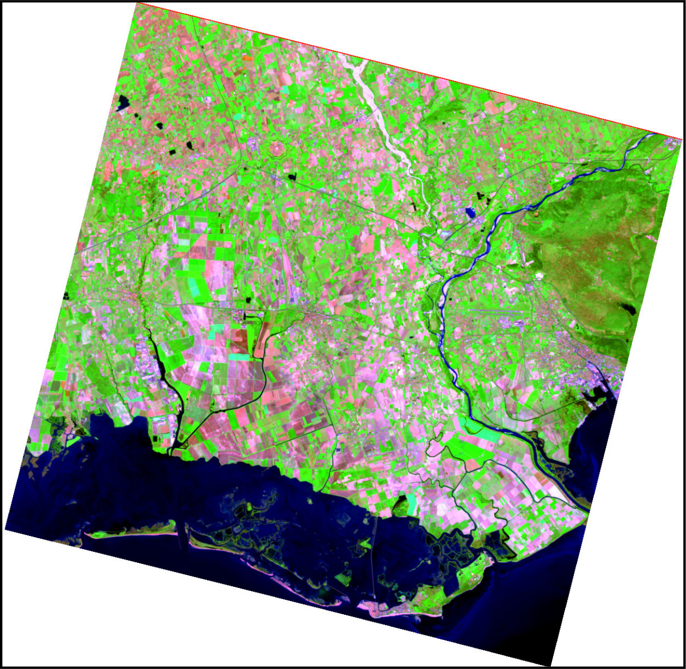
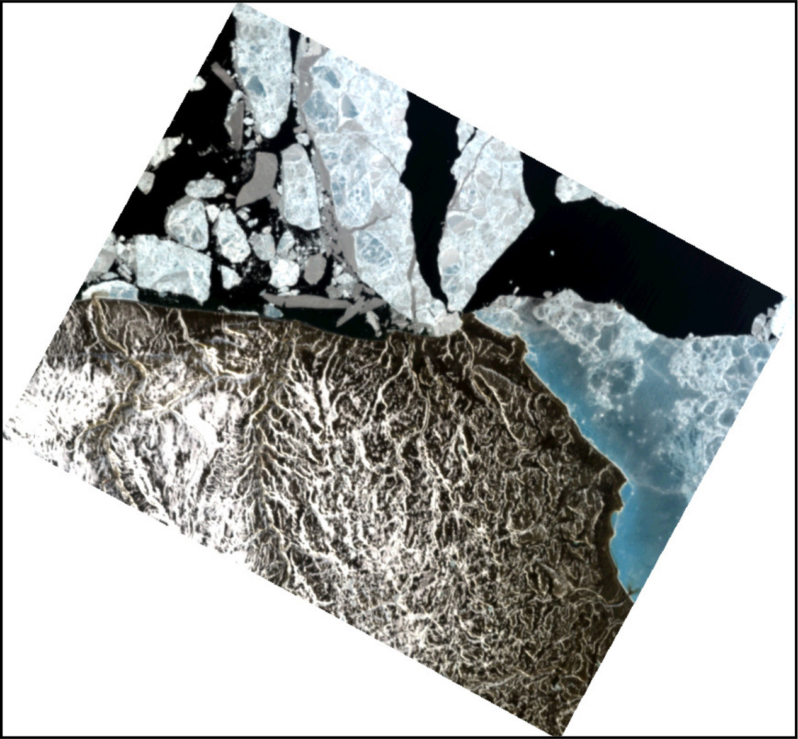

## DESCRIPTION

*i.hyper.import* imports hyperspectral imagery into a 3D raster map
(`raster_3d`).

The module reads supported hyperspectral products and converts their
spectral bands into a single 3D raster map. The vertical (*z*) dimension
of the 3D raster represents the spectral dimension, where each cell
(*voxel*) contains the reflectance value for a specific spatial position
(*x, y*) and spectral band index.

*i.hyper.import* is part of the **i.hyper** module family designed for
hyperspectral data import, processing, and analysis in GRASS. It is
typically used in combination with
[i.hyper.preproc](i.hyper.preproc.html),
[i.hyper.explore](i.hyper.explore.html),
[i.hyper.composite](i.hyper.composite.html), and
[i.hyper.export](i.hyper.export.html).

The module currently supports the following hyperspectral products:

- **PRISMA** -- PRecursore IperSpettrale della Missione Applicativa
  (ASI)
- **EnMAP** -- Environmental Mapping and Analysis Program (DLR / GFZ)
- **Tanager** -- Planet Labs hyperspectral mission

During import, the appropriate product library from `i_hyper_lib` is
automatically loaded (for example, `enmap`, `prisma`, or `tanager`).
Metadata are parsed, bands are validated, and the resulting 3D raster
map is created with band metadata (**wavelength**, **FWHM**, **validity**)
and scene radiometric metadata (**radiometric_quantity**,
**radiometric_units**).

The metadata are used by other *i.hyper.\** modules, so data imported
with *i.hyper.import* or created with the same metadata structure are
fully compatible across the toolset.

The resulting `raster_3d` map can be analysed with standard GRASS 3D
raster tools (`r3.mapcalc`, `r3.stats`, `r3.univar`) or processed
further with the *i.hyper* suite of modules.

## NOTES

Imported 3D raster maps store hyperspectral reflectance or radiance
values (depending on the product). Bands containing only NULL values
are not added to the output `raster_3d`.

With the `-n` flag, source-band validity is recorded directly in
`bands.validity` (with `bands.count` and `bands.count_valid`) without
adding all-NULL bands to the output cube.

Imported datasets are written with metadata key `derived=false`. Datasets
produced later by processing modules (for example *i.hyper.preproc*) are
written as `derived=true`.

Extended metadata are written under unified branches
(`extended_metadata.acquisition`, `geometry`, `radiometry`, `atmosphere`,
`quality`, `processing`, `uncertainty`) and product-native provenance
branches (`extended_metadata.enmap`, `prisma`, `tanager`). Unified and
product-native keys may contain the same value when a unified key is
derived directly from a source product key.

When the *composites* option is used, predefined or custom band
combinations are exported as 2D raster composites (e.g., RGB, CIR,
SWIR). All temporary rasters are automatically removed after import.

During import, *i.hyper.import* temporarily adjusts the computational
region to match the input data, ensuring consistent alignment between
imported bands. This region setting is temporary and restored at the end
of processing.

*i.hyper.import* can also restore hyperspectral data directly from a
native GRASS archive with `product=ihyper`. The archive structure is
validated from its contents rather than the filename suffix, so any
input filename is accepted as long as it contains a valid native
archive. Native archives are unpacked into the current mapset and
restore the native `raster_3d` together with its metadata.

Product notes:

- Product levels that are not orthorectified are imported using product
  geolocation and nearest-neighbor assignment onto the current GRASS grid.
  This preserves original values, but may leave small holes or irregular
  borders where no source pixel maps to an output cell, which can be
  interpolated or otherwise handled later with existing GRASS tools.
- **Tanager BASIC** products (`/HDFEOS/SWATHS/HYP/...`) use per-pixel
  geolocation and `Planet_Ortho_Framing` for projection and gridding.
- **Tanager ortho** products (`/HDFEOS/GRIDS/HYP/...`) are imported
  directly in native map grid geometry (no geolocation reprojection).
- For Tanager ortho products, map grid parameters are read from
  `/HDFEOS INFORMATION/StructMetadata.0` (UL/LR corners),
  `/HDFEOS/GRIDS/HYP` attribute `epsg_code`, and spectral dataset shape
  (rows/cols).

## EXAMPLES

::: code

    # EnMAP example
    # Create a new GRASS project with EPSG:32633 (UTM Zone 33N)
    grass -c EPSG:32633 -e ~/grassdata/hyper_33N

    # Initialize and enter the new project (PERMANENT Mapset)
    grass ~/grassdata/hyper_33N/PERMANENT
:::

::: code

    # PRISMA L2D example
    i.hyper.import input=/data/PRISMA.he5 \
                   product=prisma \
                   output=prisma \
                   composites='rgb,cir,swir_agriculture,swir_geology'

    # Console output:
    Importing product: PRISMA
    Loading floating point  data with 4  bytes ...  (1254x1222x234)
    Created 3D raster map with all bands: prisma (234 bands).
    Generated composite raster: prisma_rgb
    Generated composite raster: prisma_cir
    Generated composite raster: prisma_swir_agriculture
    Generated composite raster: prisma_swir_geology
    (Fri Nov  5 13:12:00 2025) Command finished (1 min 23 sec)
:::

:::::::::: {align="center" style="margin: 10px"}
::: {align="center" style="margin: 10px"}
{width="600"
height="600" border="0"}\
*Figure: PRISMA SWIR-geology composite generated with i.hyper.import*\
[*Data source: PRISMA Product © Italian Space Agency (ASI), used under
ASI License to Use.*]{.small}
:::
::::::::::

::: code

    # Import an EnMAP L2A product and create RGB and CIR composites
    i.hyper.import input=/data/EnMAP_data_folder/ \
                   product=enmap \
                   output=enmap \
                   composites='cir,swir_agriculture' \
                   composites_custom='650,1650,2200'
:::

::::::: {align="center" style="margin: 10px"}
::: {align="center" style="margin: 10px"}
{width="600" height="600" border="0"}\
*Figure: EnMAP SWIR-agriculture composite generated with
i.hyper.import*\
[*Data source: Copyright © 2012-2025 EnMAP at Earth Observation Center
EOC of DLR.*]{.small}
:::
:::::::

::: code

    # Tanager BASIC radiance example
    i.hyper.import input=/data/Tanager.h5 \
                   product=tanager \
                   output=tanager \
                   composites='rgb'
:::

:::: {align="center" style="margin: 10px"}
::: {align="center" style="margin: 10px"}
{width="600"
height="600" border="0"}\
*Figure: Tanager-1 RGB composite generated with i.hyper.import*\
[*Data source: Planet Labs - Open Data, CC-BY-4.0.*]{.small}
:::
::::

::: code

    # Restore a native hyperspectral archive into the current mapset
    i.hyper.import input=/data/hyperspectral_data.ihyper \
                   product=ihyper \
                   output=ignored_name
:::

For native archive restore, the archived map name is restored as-is and
the `output` option is ignored.

## SEE ALSO

[EnMAP Example Data
Products](https://www.enmap.org/data_tools/exampledata/), Tanager Core
Imagery,
[i.hyper.preproc](i.hyper.preproc.html),
[i.hyper.metadata](i.hyper.metadata.html),
[i.hyper.explore](i.hyper.explore.html),
[i.hyper.composite](i.hyper.composite.html),
[i.hyper.export](i.hyper.export.html),
[r3.stats](https://grass.osgeo.org/grass-stable/manuals/r3.stats.html),
[r3.univar](https://grass.osgeo.org/grass-stable/manuals/r3.univar.html)

## DEPENDENCIES

- **NumPy** -- Core numerical operations and array manipulation.
- **h5py** -- Interface for reading and writing `.h5` (HDF5)
  hyperspectral data products such as PRISMA and Tanager.
- **pyproj** -- Coordinate reference system and geospatial
  transformation library.

## AUTHORS

Alen Mangafić and Tomaž Žagar, Geodetic Institute of Slovenia
