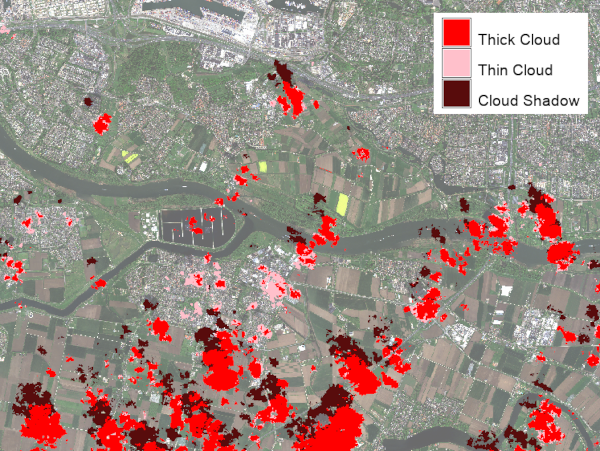

## DESCRIPTION

The *i.omnicloudmask* is a GRASS addon that provides an interface to the
OmniCloudMask (OCM) deep learning model for cloud and cloud shadow detection in
optical satellite imagery.

OmniCloudMask (OCM) is a sensor-agnostic deep learning model that segments
clouds and cloud shadows developed by Nicholas Wright and Jordan A.
Caraballo-Vega (2025). It demonstrates robust state-of-the-art performance
across various satellite platforms when classifying clear, cloud, and shadow
classes. The model was designed to generalise across sensors, spatial
resolutions, and processing levels, reducing the need for sensor-specific cloud
masking models.

This addon integrates OmniCloudMask into GRASS workflows, allowing users to run
cloud masking directly on GRASS raster data or on external multiband GeoTIFF
files.

With the GRASS raster workflow, the user provides three input rasters
representing the Red, Green, and NIR bands. The cloud detection will be done for
the current region.

With the GeoTIFF workflow, the user provides a multiband GeoTIFF. The module
will call omnicloudmask direcly to process the scene, and import the resulting
rasters into GRASS. This will always be done for the whole GeoTIFF scene.

By default, the module produces a categorical prediction raster with the
following class values:

- 0 = Clear
- 1 = Thick Cloud
- 2 = Thin Cloud
- 3 = Cloud Shadow

With the **-c** flag, the module creates confidence rasters instead of the
categorical prediction. In that case, four rasters are created using the
**output** parameter as basename, with suffixes *_clear*, *_thick_cloud*,
*_thin_cloud*, and *_cloud_shadow*.

## NOTES

This addon requires the opens-source Python package *omnicloudmask* to be
installed in the Python environment used by GRASS GIS. For installation
instructions, usage examples, and background information, see the
[OmniCloudMask documentation](https://omnicloudmask.readthedocs.io).

By default, softmax normalization of confidence rasters is performed by
OmniCloudMask using the GPU, if available. On systems with limited GPU memory,
this can cause out-of-memory errors, particularly during the patch mosaicking
stage.

Possible strategies are, in order of preference:

1. Set **mosaic_device=cpu** to move only the mosaicking step to system RAM
   while keeping neural network inference on the GPU.
2. Use **inference_dtype=fp16** to halve GPU memory usage during inference.
3. If RAM is limited, the **-l** flag can be set. If set, the softmax
   normalization will be done in GRASS, which can handle very large rasters. Use
   the **nprocs** option to set the number of threads used for this computation.

## EXAMPLES

### 1: Predict cloud classes from GRASS rasters

```sh
i.omnicloudmask \
  red=band_red \
  green=band_green \
  nir=band_nir \
  output=cloudmask
```

This creates the categorical raster *cloudmask* in the current mapset, with
category labels: Clear, Thick Cloud, Thin Cloud, and Cloud Shadow.



### 2: Create confidence rasters from GRASS rasters

```sh
i.omnicloudmask -c \
  red=band_red \
  green=band_green \
  nir=band_nir \
  output=cloudconf
```

This creates four confidence rasters: *cloudconf_clear*,
*cloudconf_thick_cloud*, *cloudconf_thin_cloud*, and *cloudconf_cloud_shadow*.

### 3: Predict cloud classes from a multiband GeoTIFF

```sh
i.omnicloudmask \
  geotiff=/path/to/scene.tif \
  geotiff_band_order=3,2,4 \
  output=cloudmask
```

This processes the whole GeoTIFF scene using OmniCloudMask, imports the
prediction raster into GRASS GIS, and removes the temporary exported GeoTIFF.
The example assumes that the Red, Green, and NIR bands are stored in bands 3, 2,
and 4 of the input file.

### 4: Create confidence rasters from a multiband GeoTIFF

```sh
i.omnicloudmask -c \
  geotiff=/path/to/scene.tif \
  output=cloudconf
```

This creates four confidence rasters in the current mapset after importing the
multiband confidence GeoTIFF produced by OmniCloudMask.

## REFERENCES

- Wright, N., Duncan, J. M. A., Callow, J. N., Thompson, S. E., & George, R. J.
  (2025). Training sensor-agnostic deep learning models for remote sensing:
  Achieving state-of-the-art cloud and cloud shadow identification with
  OmniCloudMask. Remote Sensing of Environment, 322, 114694.
  [https://doi.org/10.1016/j.rse.2025.114694](https://doi.org/10.1016/j.rse.2025.114694).
- [OmniCloudMask documentation](https://omnicloudmask.readthedocs.io/en/latest/index.html)
- [OmniCloudMask repository](https://github.com/DPIRD-DMA/OmniCloudMask)

## SEE ALSO

*[i.sentinel.mask](https://grass.osgeo.org/grass-stable/manuals/addons/i.sentinel.mask.html),
[i.sentinel.import](https://grass.osgeo.org/grass-stable/manuals/addons/i.sentinel.import.html),
[i.landsat.qa](https://grass.osgeo.org/grass-stable/manuals/addons/i.landsat.qa.html)*

## AUTHOR

[Paulo van Breugel](https://ecodiv.earth), [HAS green academy](https://has.nl),
[Innovative Biomonitoring research group](https://www.has.nl/en/research/professorships/innovative-bio-monitoring-professorship/),
[Climate-robust Landscapes research
group](https://www.has.nl/en/research/professorships/climate-robust-landscapes-professorship/)
