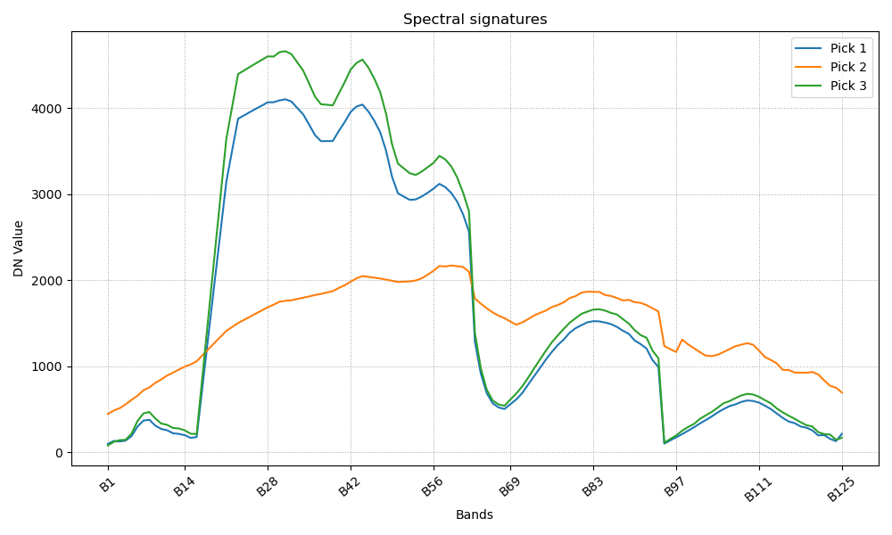

# NAME

**i.spec.convexhull** -- Applies continuum removal to each band in an
imagery group using convex hull analysis and outputs a new imagery
group.

# KEYWORDS

imagery, spectral analysis, continuum removal, convex hull

# SYNOPSIS

    i.spec.convexhull
       input_group=name
       output_group=name
       outputbasename=name
       [--overwrite] [--help]

# DESCRIPTION

**i.spec.convexhull** processes all raster bands in a GRASS imagery
group, performing continuum removal via convex hull analysis on the
spectral profile of each pixel. The result is a new group of raster
maps, each corresponding to an input band, with the continuum-removed
spectra.

This module is useful for spectral preprocessing in remote sensing,
particularly for mineral mapping, vegetation analysis, and other
applications where normalization of spectral features is required.

# OPTIONS

**input_group**=*name*
:   Name of input imagery group containing raster bands to process.

**output_group**=*name*
:   Name for the output imagery group to be created.

**outputbasename**=*name*
:   Base name for output raster maps. Each output will be named as
    \<outputbasename\>\_\<bandname\>.

# EXAMPLES

    i.spec.convexhull input_group=090727_Steinbeissen_rad_geo_atm output_group=convexhull outputbasename=convexhull

## Original signature from the 090727_Steinbeissen_rad_geo_atm imagery (EnMap Cal/Val)

{width="1000" height="600"
longdesc="Original signature from the 090727_Steinbeissen_rad_geo_atm imagery (EnMap Cal/Val)"}

## Processed signature with convexhul from the 090727_Steinbeissen_rad_geo_atm imagery (EnMap Cal/Val)

{width="1000" height="600"
longdesc="Processed signature with convexhul from the 090727_Steinbeissen_rad_geo_atm imagery (EnMap Cal/Val)"}

# SEE ALSO

-   [i.group](i.group.html)
-   [i.spectral](i.spectral.html)

# AUTHOR

Yann Chemin\

------------------------------------------------------------------------

GRASS GIS Manual Page\
© 2003-2025 GRASS Development Team
