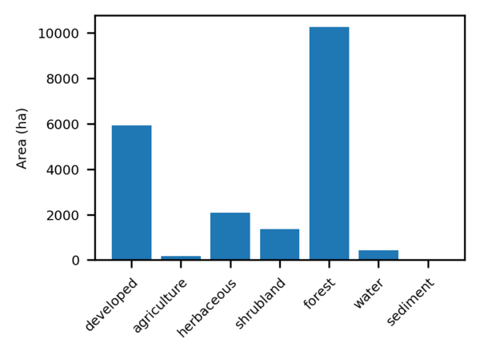
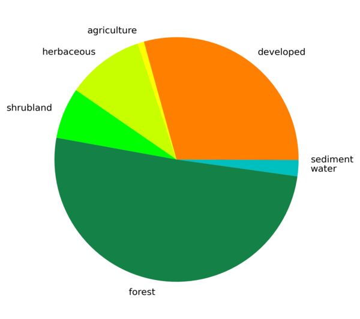
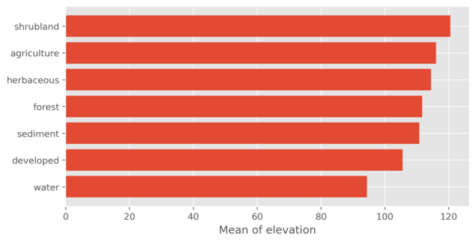

## DESCRIPTION

*r.barplot* draws a barplot or piechart summarizing a **zones** raster. For each
category of the zonal map it computes a **statistic** and plots one bar or pie
wedge per category.

The statistic can be the **count** of cells, the surface **area**, or a
percentage (see the **unit** option). If a value raster is given with the
**map** option, the statistic can instead be the **sum**, **mean**, **minimum**
or **maximum** of the value raster per zone. For **count**, the cells counted
are the non-null cells of the value raster within each zone; without a value
raster, all cells of the zone are counted.

The **unit** option applies to *statistic=count* and sets the reporting unit:
cell count (*cells*), *percent* of the total, or surface area in *m2*, *ha* or
*km2*. Areas are derived from the current region resolution.

Set **plot_type=pie** to draw a piechart instead of a barplot. A piechart
requires non-negative values and is most meaningful for additive statistics
(count, area, sum).

By default the bars and wedges are colored with the active Matplotlib style
palette. Set a single **color** to override this, or use the **-c** flag to
color them with the category colors of the zonal map. Border **color** and
**width** can be set separately.

Layout options include sorting the bars/wedges (**order**), drawing the barplot
horizontally (**-h**), adding grid lines (**-g**), rotating the category labels
(**rotate_labels**), and printing the values on the bars or wedges (**-n**). A
**title**, base **fontsize**, **font** family and labels for the value axis
(**y_label**) and category axis (**x_label**) can be set as well. Axis labels do
not apply to a piechart.

The plot can be styled with a Matplotlib
[style sheet](https://matplotlib.org/stable/gallery/style_sheets/style_sheets_reference.html)
through the **style** option, e.g. *style=ggplot*.

By default the plot is shown on screen. If **output** is given, the plot is
written to that file, with the format determined by the file extension (e.g.
*output=plot.png*). The size (**plot_dimensions**, in inches) and resolution
(**dpi**) of the image can be set.

## NOTE

The statistics are computed over the current computational region and respect an
active raster mask. Set the region to the zonal map before running the module if
needed.

## EXAMPLE

The examples use the North Carolina sample dataset.

### Example 1

Barplot of the area (in hectares) of each land use category.

```sh
g.region raster=landclass96
r.barplot zones=landclass96 statistic=count unit=ha output=r_barplot_01.png rotate_labels=45
```



### Example 2

Piechart of the number of cells per land use category, using the colors of the
zonal map.

```sh
r.barplot -c zones=landclass96 statistic=count plot_type=pie output=r_barplot_02.png
```



### Example 3

Horizontal barplot of the mean elevation per land use category, sorted in
descending order. The **style** option is used to style the plot to resemble the
default *ggplot* appearance.

```sh
r.barplot -h zones=landclass96 map=elevation statistic=mean order=descending style=ggplot output=r_barplot_03.png
```



## SEE ALSO

*[r.boxplot](https://grass.osgeo.org/grass-stable/manuals/addons/r.boxplot.html),
[v.boxplot](https://grass.osgeo.org/grass-stable/manuals/addons/v.boxplot.html),[v.scatterplot](https://grass.osgeo.org/grass-stable/manuals/addons/v.scatterplot.html),[v.histogram](https://grass.osgeo.org/grass-stable/manuals/addons/v.histogram.html),
[r.series.boxplot](https://grass.osgeo.org/grass-stable/manuals/addons/r.series.boxplot.html),
[r.stats](https://grass.osgeo.org/grass-stable/manuals/r.stats.html),
[r.univar](https://grass.osgeo.org/grass-stable/manuals/r.univar.html)*

## AUTHOR

[Paulo van Breugel](https://ecodiv.earth), [HAS green academy](https://has.nl),
[Innovative Biomonitoring research
group](https://www.has.nl/en/research/professorships/innovative-bio-monitoring-professorship/),
[Climate-robust Landscapes research
group](https://www.has.nl/en/research/professorships/climate-robust-landscapes-professorship/)
