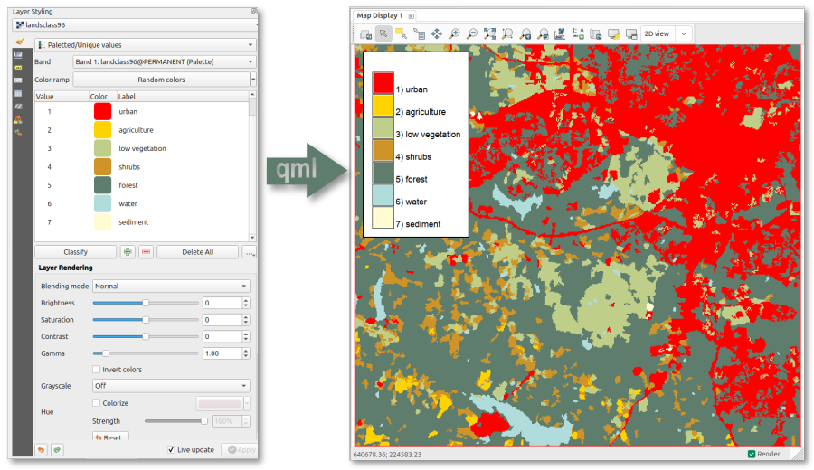

## DESCRIPTION

*r.colors.qml* applies raster symbology defined in QGIS in a QML style file to
the same raster in GRASS. The user provides the QML style file and the raster to
which to apply the symbology (color and labels) from that file.



QML is a format for storing layer styling in QGIS, including the colors and
labels that are defined under symbology. The addon extracts the raster colors
and the raster labels and uses these to construct the color table and raster
categories in GRASS.

### Singleband Pseudocolor

- Continuous (Interpolated): Generates a smooth color gradient.
- Discrete: QGIS discrete classes are translated into GRASS "step" rules by
  duplicating boundary values, creating hard color transitions without
  gradients.
- Forced Discrete: Users can force a continuous QGIS ramp to be interpreted as
  discrete steps using the **-d** flag.

### Paletted (Unique Values)

Treated as an exact mapping. Each unique value in the palette is assigned its
specific color and label. Other colors are assigned the default color (white or
user-defined).

### Range and Clipping Behavior

The effective range is determined by the minimum and maximum values defined in
the QGIS settings. If undefined, the lowest and highest values found in the
color ramp items are used.

By default, for raster values outside the effective range, the color ramp is
extended to infinity. I.e., values below the defined minimum inherit the start
color, and values above the defined maximum inherit the end color. If clipping
is enabled, values outside the effective range are assigned the default color
(default: white).

## NOTE

Transparency is silently ignored, as this is not supported by GRASS.

There are many different ways to style a raster in QGIS, and not all
combinations have been checked. In case a QML file does not result in the
expected styling in GRASS, carefully check your settings first.

Text labels defined in the QGIS symbology are extracted and applied using
*r.category*. Any characters in the label that match the output field separator
are replaced with a space.

## EXAMPLES

Apply both colors and labels defined in the landclass96.qml file to the raster
layer **landclass96** in GRASS.

```sh
r.colors.qml map=landclass96 qml=landclass96.qml
```

## SEE ALSO

*[r.category.trim](https://grass.osgeo.org/grass-stable/manuals/addons/r.category.trim.html)*

## AUTHOR

[Paulo van Breugel](https://ecodiv.earth), [HAS green academy](https://has.nl),
[Innovative Biomonitoring research
group](https://www.has.nl/en/research/professorships/innovative-bio-monitoring-professorship/),
[Climate-robust Landscapes research
group](https://www.has.nl/en/research/professorships/climate-robust-landscapes-professorship/)
