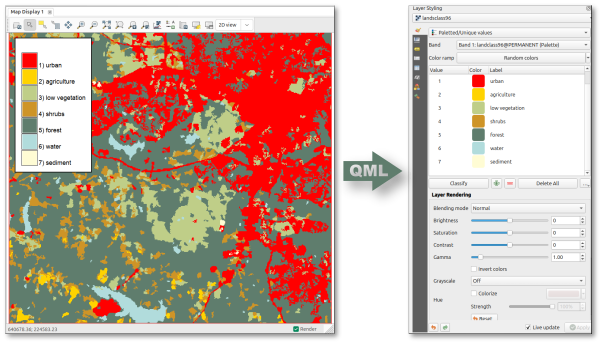

## DESCRIPTION

*r.colors.toqml* exports raster symbology defined in GRASS GIS to a QGIS
QML style file. The addon reads the GRASS raster color table and, where
applicable, raster category labels, and writes a QML file that can be used to
style the raster in QGIS.

Optionally, the raster itself can be exported simultaneously to GeoTIFF, using
the same basename as the QML file. As long as the two files are kept in the same
folder, opening the GeoTIFF in QGIS will automatically apply the style.



The addon supports both:

- **Categorical rasters** (CELL with/without categories), exported as *paletted*
  QGIS renderers.
- **Continuous rasters** (FCELL/DCELL), exported as *singleband pseudocolor*
  renderers with interpolated or discrete color ramps.

For categorical rasters, only categories actually present in the current
computational region and MASK are included in the QML file.

## NOTE

Percentage-based color rules are not supported and cause the module to fail.
such rules are relative to the raster range in GRASS and cannot be faithfully
represented in a QGIS QML style, which requires absolute numeric breakpoints.

## KNOWN ISSUES

Continuous range vs. breakpoints: for continuous rasters, the QML range is
derived from the numeric color-rule breakpoints. If the raster range in a given
region is narrower than the color table domain, QGIS will still show the full
ramp domain defined by the breakpoints.

Category subset in current region: for categorical rasters, the exported palette
is filtered to categories present in the current region/MASK. If you want a
palette for the full raster extent, set the computational region to the full
raster before running the module.

## EXAMPLES

Export the color table and category labels of a categorical raster to a QML
file:

```sh
r.colors.toqml map=landclass96 output=landclass96.qml
```

Export a continuous raster color table to QML and simultaneously export the
raster to GeoTIFF:

```sh
r.colors.toqml -r map=cfactor output=cfactor.qml
```

Force a discrete color ramp for a continuous raster:

```sh
r.colors.toqml -r map=cfactor output=cfactor.qml discrete=yes
```

## SEE ALSO

*[r.colors.out](https://grass.osgeo.org/grass-stable/manuals/r.colors.out.html)*

## AUTHOR

[Paulo van Breugel](https://ecodiv.earth), [HAS green academy](https://has.nl),
[Innovative Biomonitoring research group](https://www.has.nl/en/research/professorships/innovative-bio-monitoring-professorship/),
[Climate-robust Landscapes research group](https://www.has.nl/en/research/professorships/climate-robust-landscapes-professorship)
