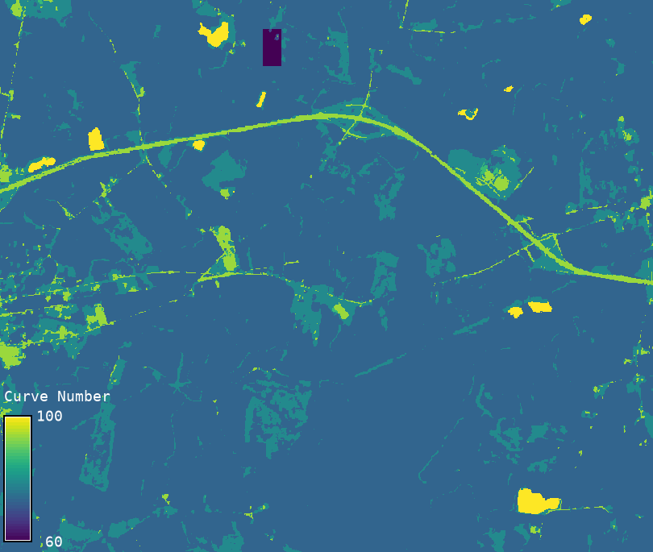

## DESCRIPTION

Generates a Curve Number (CN) raster using
landcover and hydrologic soil group (HSG) rasters,
along with user-specified hydrologic condition
and antecedent runoff condition.

### Landcover Source

Select the source of the landcover
classification and corresponding lookup table:

- nlcd: Built-in NLCD lookup
- esa: Built-in ESA WorldCover 2021 lookup
- custom: Custom lookup table provided as a CSV file

For custom, the CSV must include the following columns:  
`lc,hsg,hc,cn`

### Hydrologic Soil Groups (HSG)

The HSG raster must contain only:

- 1 – Group A: High infiltration, low runoff
- 2 – Group B: Moderate infiltration
- 3 – Group C: Low infiltration
- 4 – Group D: Very low infiltration, high runoff
- 11–14 – Dual groups: A/D, B/D, C/D, D/D (for drained/undrained soils)

Curve Number increases from HSG A to D
due to reduced infiltration associated
with increasing clay content and compaction.

If you are using SSURGO soil data,
Hydrologic Soil Group (HSG) values are
typically provided directly. For other
soil datasets that do not include HSG
classifications, see Reference 1 (Chapter 7)
for guidance on assigning HSGs based on soil texture,
hydraulic conductivity, and water table depth.
This information can be used to develop a custom HSG raster.

### Hydrologic Condition (HC)

Hydrologic condition reflects the percentage of
surface groundcover and affects runoff potential.
Generally:

- poor: Less than 30% cover — compacted or bare
- fair: 30–70% cover — partial vegetation (default)
- good: More than 70% cover — dense and healthy vegetation

Curve Number decreases from poor to good due to
improved infiltration with more vegetation.  
See Reference 2 for further discussion.

Note: Curve Number for Cropland for fair condition
is provided as the average of Curve Number of poor
and good hydrologic conditions.

### Antecedent Runoff Condition (ARC)

The variability in Curve Number (CN) arises
from factors such as rainfall intensity and duration,
total precipitation, soil moisture conditions,
vegetative cover density, growth stage, and
temperature. These factors collectively define
the Antecedent Runoff Condition (ARC),
which is classified into three categories:

- ARC I – Dry conditions (low antecedent moisture)
- ARC II – Average conditions (typical or normal moisture, default)
- ARC III – Wet conditions (high antecedent moisture)

Curve Number increases from ARC I to ARC III as runoff potential rises.

A standard conversion table is used
within the script to adjust CN values
from ARC II to ARC I or ARC III, based on
empirical relationships. This corresponds to
Table 10-1 in Reference 3.

### Sensitivity and CN Hierarchy

The CN is more sensitive to ARC than to HC.  
Typical curve number values for a soil-cover complex follow this order:

`p_iii > f_iii > g_iii > p_ii > f_ii > g_ii > p_i > f_i > g_i`

Where:

- `p`, `f`, `g` denote **poor**, **fair**, and **good** hydrologic conditions
- `i`, `ii`, `iii` denote **dry**, **average**, and **wet** antecedent runoff conditions

## EXAMPLES

```sh
# Example 1: NLCD lookup (built-in)
r.curvenumber \
  landcover=nlcd \
  hsg=soil_hsg \
  landcover_source=nlcd \
  h_c=poor \
  arc=iii \
  output=cn_nlcd

# Example 2: ESA WorldCover lookup (built-in)
r.curvenumber \
  landcover=esa \
  hsg=soil_hsg \
  landcover_source=esa \
  h_c=fair \
  arc=ii \
  output=cn_esa

# Example 3: Custom CSV lookup
r.curvenumber \
  landcover=custom_lc_map \
  soil=custom_hsg_map \
  landcover_source=custom \
  lookup=cn_table.csv \
  output=cn_custom
```


*Figure: Example output from r.curvenumber*

## REFERENCES

1. United States Department of Agriculture,
   Natural Resources Conservation Service. (2009).
   *National Engineering Handbook, Part 630 Hydrology:
   Chapter 7 – Hydrologic Soil Groups* (210-VI-NEH)

2. United States Department of Agriculture,
   Natural Resources Conservation Service. (2004).
   *National Engineering Handbook, Part 630 Hydrology:
   Chapter 9 – Hydrologic Soil-Cover Complexes* (210-VI-NEH)

3. United States Department of Agriculture,
   Natural Resources Conservation Service. (2004).
   *National Engineering Handbook, Part 630 Hydrology:
   Chapter 10 – Estimation of Direct Runoff from Storm Rainfall* (210-VI-NEH)

## AUTHOR

[Abdullah Azzam](mailto:mabdazzam@outlook.com), New Mexico State University
