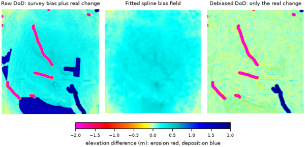

## DESCRIPTION

*r.dem.bias* removes terrain-correlated systematic bias that remains in a DEM
of Difference (DoD) after rigid co-registration. Alignment tools such as
*r.dem.coregister*, *r.dem.nk*, and *r.dem.icp* remove translation and rotation,
but a residual elevation difference often still varies with terrain (for
example a positive canopy bump in forest, or error that scales with slope,
roughness, or point density). This tool models that residual and subtracts it.

Three methods are provided through the **method** option.

### method=regression

Fits a multivariable linear model of the DoD on z-scored terrain predictors
over stable terrain, then subtracts the fitted surface from the full DoD.

- The dependent variable is the DoD restricted to the **stable_mask** region.
- Each **predictors** raster is standardized to zero mean and unit variance,
  on a log scale for the predictors named in **log_predictors** (positive
  values only; a predictor with non-positive values falls back to the linear
  scale with a warning).
- An ordinary-least-squares fit (numpy, on sampled stable cells; above 2
  million cells a deterministic subsample is drawn) estimates the intercept,
  per-predictor coefficients, and the coefficient covariance, and the fitted
  bias field `b0 + sum(b_i * z_i)` is subtracted from the DoD.
- The optional **output_se** raster is the 1-sigma coefficient-uncertainty
  term of the bias model, `sqrt(x' Cov x)` evaluated on the transformed
  predictors. It deliberately excludes the residual variance `s2` (reported
  in the raster metadata and the message stream) so that downstream
  quadratures (*r.dem.lod* **sigma_extra**, *r.dem.errprop* **sigma**) can
  combine it with local dispersion and registration terms without double
  counting. The covariance is iid OLS: under spatially
  correlated residuals it understates coefficient uncertainty, so treat the
  magnitude as a lower bound pending an autocorrelation-aware covariance.
- The optional **output_leverage** raster is the extrapolation distance
  `d = sqrt(n*h - 1)` in fit-sd units (Mahalanobis distance of each cell
  from the fit-cell predictor mean). It is independent of `n` and of the
  covariance assumptions, and is the honest "distance from control" map:
  coefficient uncertainty cannot express model-form error under
  extrapolation, which must be checked out-of-sample.
- The optional **fit_json** file persists the whole fit (`n_fit`, residual
  variance `s2_m2`, intercept, per-predictor coefficients, the coefficient
  covariance matrix, the applied transforms, and `max_fit_cells`) so a
  reported correction can be reproduced or re-applied without refitting.
- Log transforms are explicit via **log_predictors**; the earlier
  data-triggered skew rule was removed because a region-scoped statistic
  crossing a threshold must not silently change the model form (and a log
  of datum-referenced elevation would make the model datum-dependent).

Predictor rasters are typically produced by *r.dem.stats* (slope, roughness,
landform diversity, local sigma) together with a reference-DEM uncertainty
surface.

### method=spline

Interpolates the stable-cell residuals into a smooth spatial bias field with
*v.surf.rst* and subtracts it. This models the systematic error as what it
physically is, a smooth surface over the map (photogrammetric doming),
rather than a function of terrain predictors, and therefore has no
collinearity pathologies. The field is fit from **spline_npoints** randomly
sampled stable cells (deterministic seed) at the coarse **spline_res**
resolution (the error is long-wavelength) with **spline_tension** and
**spline_smooth**, then resampled bilinearly to the analysis grid.
Splines interpolate well and extrapolate poorly, so the correction is most
trustworthy near the stable cells; validate against independent data
(holdout) before trusting it far from control.

### method=forest

Estimates a local trimmed-median bias field over a masked subset of cells
(classically a forest canopy bump) and subtracts it.

- Within the **mask** region the DoD is trimmed to its
  [**trim_low**, **trim_high**] percentile core to exclude outliers.
- A moving-window median of that core over a **window**-cell window gives the
  local bias field.
- Outside the mask the bias field is zero, so unmasked cells are unchanged.

However, a local trimmed median cannot separate a canopy bump from real elevation
change, so any deposition or scour inside **mask** is removed along with the
bias. Keep known and suspected change areas out of the mask, using the
footprint from a coarse *r.dem.screen* pass where one is available.

## NOTES

The optional **bias_field** output stores the estimated correction surface that
was subtracted, which is useful for inspection and reporting.

For `method=regression` the corrected DoD is NULL wherever any predictor is
NULL (the fitted surface is undefined there); **output_se** follows the same
predictor-driven NULL pattern, and is defined even where the input DoD is
NULL.

The mask used by `method=forest` is applied through a temporary mask context and
is removed automatically; the user's existing mask and computational region are
left untouched. Intermediate rasters are removed on exit.

## EXAMPLES

The commands below use the example scene built in the
*[r.dem](r.dem.md)* toolset manual, which is derived from the North
Carolina sample dataset. Build it there first.

The scene carries three bias components, and each method removes a
different one. Chain them: no single method removes all three.

Start with the long-wavelength dome, fitted from the stable cells and
interpolated across the map:

```sh
g.region raster=elev_lid792_1m

r.dem.bias dod=dod_raw output=dod_spline method=spline \
    stable_mask=stable_terrain bias_field=bias_spline
```

Then the canopy bump, estimated as a local trimmed median under the forest
mask:

```sh
r.dem.bias dod=dod_spline output=dod_debiased method=forest \
    mask=forest window=21
```

The residual on stable terrain falls from 0.17 m to under 0.01 m, and the
residual over forest falls from 1.68 m to under 0.01 m.

The regression path models the bias against terrain predictors instead,
keeping the coefficient uncertainty for the uncertainty budget downstream:

```sh
r.dem.bias dod=dod_raw output=dod_regression method=regression \
    predictors=roughness stable_mask=stable_terrain \
    output_se=bias_se output_leverage=bias_leverage \
    fit_json=bias_fit.json
```

  
*Figure: Raw DoD carrying the survey bias, the fitted spline bias field, and
the difference after the spline and forest stages.*

## SEE ALSO

*[r.dem](r.dem.md)*,
*[r.dem.coregister](r.dem.coregister.md)*,
*[r.dem.errprop](r.dem.errprop.md)*,
*[r.dem.stats](r.dem.stats.md)*,
*[r.neighbors](r.neighbors.md)*,
*[v.surf.rst](v.surf.rst.md)*

## AUTHORS

Corey T. White, Center for Geospatial Analytics, NC State University
