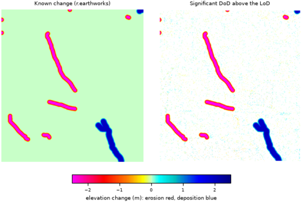

## DESCRIPTION

*r.dem.change* computes a DEM of Difference (DoD) between a co-registered
post-event DEM and a reference DEM, applies a Level of Detection (LoD)
threshold to isolate significant change, and reports volumetric erosion,
deposition, and net change. Optional cleanup stages remove gross blunders and
isolated significant cells.

The pipeline is:

1. **Raw DoD**: `output_dod = dem - reference`, the unmodified difference.
2. **Blunder trimming** (optional, **trim_percentile**): cells whose
   absolute difference exceeds a percentile of `|DoD|` are dropped before
   thresholding. The threshold is estimated over **stable_mask** when supplied,
   and **stable_mask** requires **trim_percentile** (without it the mask has no
   effect and the parser rejects the combination),
   otherwise over the whole DoD.
3. **LoD thresholding**: `output_sig` keeps cells where `|DoD|` exceeds
   the per-cell **lod** value (from *r.dem.lod* or *r.dem.errprop*).
4. **Speckle removal** (optional, **-n**): isolated significant cells
   (no significant neighbour among the eight surrounding cells) are removed.
5. **Volumetric summary**: erosion, deposition, and net volume in cubic
   metres (and cubic yards), optionally written to **volume_csv**.

With the **-k** flag the Fisher and Pearson kurtosis of the raw DoD distribution
are reported as a diagnostic of noise and tail behavior.

A precomputed difference (typically the bias-corrected DoD from
*r.dem.bias*) can be supplied via **dod** instead of **dem** and
**reference**; volumes are then integrated over the corrected surface, and
the `input` column of **volume_csv** records which raster was analyzed.

## NOTES

The **lod** input is a per-cell raster, so a spatially varying Level of
Detection from *r.dem.lod* (local mode) or *r.dem.errprop* can be used directly.
A uniform LoD is simply a constant raster.

`output_dod` always holds the raw, unmodified difference. Blunder trimming and
speckle removal affect only `output_sig` and the reported volumes, so the raw
difference remains available for inspection.

On the **dem** plus **reference** path the difference has to be written
somewhere, so **output_dod** is required there. It is rejected on the **dod**
path, where the difference already exists and is analyzed as supplied.

Volumes are computed from significant cells only, using the current region cell
size. Ensure the computational region matches the input DEM resolution.

The kurtosis diagnostic (**-k**) requires the Python *scipy* package.

## EXAMPLES

The commands below use the example scene built in the
*[r.dem](r.dem.md)* toolset manual, which is derived from the North
Carolina sample dataset. Build it there first.

Threshold the debiased difference against the detection limit and report
volumes:

```sh
g.region raster=elev_lid792_1m

r.dem.change -n dod=dod_debiased lod=lod_filled \
    output_sig=dod_significant volume_csv=volumes.csv
```

The volumes can be checked against the volumes *r.earthworks* moved when
the scene was built; they land within a few percent.

The **-n** flag matters here. Without it, noise that clears the detection
limit by chance is counted as change, and on this scene that inflates both
volumes by roughly ten percent. Speckle removal drops isolated cells, which
real erosion and deposition are not.

Trim blunders on stable ground first, remove isolated significant cells,
and report the distribution kurtosis as a noise diagnostic:

```sh
r.dem.change dod=dod_debiased lod=lod_local \
    output_sig=dod_significant_clean \
    trim_percentile=99 stable_mask=stable_terrain -n -k
```

On the **dem** plus **reference** path the raw difference has to be written,
so **output_dod** is required:

```sh
r.dem.change dem=dsm_post reference=elev_lid792_1m lod=lod_global \
    output_dod=dod_uncorrected output_sig=dod_significant_raw
```

  
*Figure: The known change added with r.earthworks, and the significant DoD
recovered above the Level of Detection.*

## SEE ALSO

*[r.dem](r.dem.md)*,
*[r.dem.coregister](r.dem.coregister.md)*,
*[r.dem.errprop](r.dem.errprop.md)*,
*[r.dem.lod](r.dem.lod.md)*,
*[r.neighbors](r.neighbors.md)*,
*[r.univar](r.univar.md)*

## AUTHORS

Corey T. White, Center for Geospatial Analytics, NC State University
