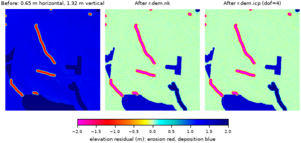

## DESCRIPTION

*r.dem.coregister* co-registers a post-event DSM to a reference DEM using
pseudo ground control points (PGCPs) sampled from stable features, terrain
assumed unchanged between surveys. Roads are the typical source, but any stable
feature works: buildings, parking lots, or fire hydrants. It removes a robust
vertical bias and can optionally chain horizontal (Nuth and Kaab) and ICP
refinement.

### method=pgcp_vertical (default)

The **pgcp** vector is buffered by **buffer** metres and rasterized, the
elevation residual `dem - reference` is sampled within that PGCP mask, and a
robust median vertical bias is estimated. The bias is removed with
`output = dem - median_bias`. Robust statistics (median bias, NMAD, RMSE) are
reported, and with the **-v** flag per-PGCP residuals are written to
**bias_output** as CSV.

If fewer than **min_points** PGCP samples are found the tool warns and proceeds.

### method=nk and method=nk_icp

These chain additional alignment after the PGCP vertical step, operating on the
PGCP-corrected DSM: `nk` adds a horizontal and vertical Nuth and Kaab correction
(*r.dem.nk*), and `nk_icp` further adds a point-to-plane ICP refinement
(*r.dem.icp*). The full chain is PGCP vertical, then N&K, then ICP.

Both methods require a **stable_mask** raster (1=stable). The Nuth and Kaab
method regresses the elevation difference against slope and aspect, so the mask
must cover **broad, sloped, unchanged terrain**. The flat PGCP features used
for the PGCP step are unsuitable here (they are filtered out by the N&K slope
limits), so a separate stable mask must be supplied. The same mask is passed to
*r.dem.icp* to restrict ICP to stable terrain.

### method=icp

This chains a point-to-plane ICP refinement (*r.dem.icp*) directly onto the
PGCP-corrected DSM, skipping the Nuth and Kaab step. The chain is PGCP vertical,
then ICP. Unlike `nk` and `nk_icp`, **stable_mask** is **optional** for this
method: when supplied it is passed to *r.dem.icp* to restrict the alignment to
unchanged terrain (recommended in change-detection contexts); when omitted, ICP
aligns over all valid terrain.

### Solving once and replaying onto another surface

**transform_output** writes the composed PGCP, N&K, and ICP transform to a file.
**apply_transform** replays a saved transform onto another DEM, skipping the
solve. This is intended for surfaces from the same acquisition (for example a
DSM and a DTM): solve the alignment on the cleaner bare-earth DTM, then replay it
onto the DSM so both share the same horizontal alignment. On replay the
**horizontal** components (N&K dx, dy and ICP dx, dy, yaw) are shared, while the
**vertical** bias is re-estimated per surface with the PGCP step, since the DSM
and DTM vertical offsets differ. Replay therefore still needs **pgcp** but not
a **stable_mask**.

## NOTES

The PGCP approach assumes the supplied features are stable reference surfaces.
When using roads, choose **buffer** to stay within the paved surface and avoid
curbs, vegetation, and vehicles. The computational region should match the input
DEM resolution.

## EXAMPLES

The commands below use the example scene built in the
*[r.dem](r.dem.md)* toolset manual, which is derived from the North
Carolina sample dataset. Build it there first.

Remove the vertical bias from road PGCPs alone, writing the per-PGCP
residuals to CSV:

```sh
g.region raster=elev_lid792_1m

r.dem.coregister dem=dsm_offset reference=elev_lid792_1m \
    pgcp=pgcp_roads output=dsm_pgcp method=pgcp_vertical \
    buffer=2.0 bias_output=pgcp_residuals.csv -v
```

Roads are flat, so the horizontal shift contributes almost nothing to the
elevation residual there and the median bias recovers the applied 1.32 m:

```text
N samples: 9725
Median bias: 1.3150 m
NMAD: 0.1014 m
```

Chain the Nuth and Kääb step to remove the horizontal offset as well. This
needs a **stable_mask** of broad sloped terrain, separate from the flat
PGCP features:

```sh
r.dem.coregister dem=dsm_offset reference=elev_lid792_1m \
    pgcp=pgcp_roads stable_mask=stable_terrain \
    output=dsm_coreg method=nk
```

  
*Figure: Stable-terrain residual before co-registration, after r.dem.nk, and
after r.dem.icp.*

## SEE ALSO

*[r.dem](r.dem.md)*,
*[r.dem.change](r.dem.change.md)*,
*[r.dem.icp](r.dem.icp.md)*,
*[r.dem.nk](r.dem.nk.md)*,
*[v.buffer](v.buffer.md)*,
*[v.to.rast](v.to.rast.md)*

## AUTHORS

Corey T. White, Center for Geospatial Analytics, NC State University
