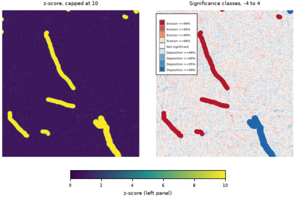

## DESCRIPTION

*r.dem.errprop* propagates per-source vertical uncertainty into a DEM of
Difference (DoD) and derives change-significance products from the combined
uncertainty. It is the analytical core of a DoD workflow: it answers *how much
of the measured elevation change is real* rather than measurement noise.

Given a DoD raster and one or more uncertainty (1 sigma) rasters, the tool
combines the uncertainty sources in quadrature:

```text
sigma_DoD = sqrt(sigma_1^2 + sigma_2^2 + ... + sigma_n^2)
```

Cells where any source is NULL are left NULL, so the propagated uncertainty is
only defined where every contributing source is defined. Typical sources are a
vertical-accuracy raster for each input DEM (for example derived from
land-cover class), plus optional co-registration or interpolation error terms.

The **sigma_const** option adds constant 1-sigma terms (meters) to the same
quadrature as the **sigma** rasters. All sigma sources must be independent of
the DoD being tested: deriving the uncertainty from the DoD itself (for example
a windowed dispersion of the same map) inflates sigma exactly where change is
real and suppresses its significance. Use the combined sigma from *r.dem.lod*
(**output_sigma**) or independent error budgets.

From the propagated **output_sigma** the tool can additionally produce:

- **output_lod**: a Level of Detection raster, `LoD = z(confidence) *
  sigma_DoD`, where `z` is the two-tailed normal critical value. Cells of the
  DoD whose magnitude exceeds the LoD are considered significant change.
- **output_zscore**: the absolute z-score `|DoD| / sigma_DoD` (sigma is
  treated as known, so the statistic is z-based rather than Student-t; the
  magnitude discards the sign of change).
- **output_pvalue**: a two-tailed p-value raster, using either a normal
  approximation (Abramowitz and Stegun 26.2.17, evaluated in *r.mapcalc*) or a
  Student-t distribution with **df** degrees of freedom.
- **output_class**: a categorical erosion/deposition significance map.
  Each cell is labeled by the highest confidence level (68/90/95/99%) at which
  the change exceeds the corresponding LoD, signed by the direction of change.

## NOTES

The categorical output uses signed integer classes:

| Class | Meaning            | Class | Meaning               |
|-------|--------------------|-------|-----------------------|
| -4    | Erosion >=99%      | 1     | Deposition >=68%      |
| -3    | Erosion >=95%      | 2     | Deposition >=90%      |
| -2    | Erosion >=90%      | 3     | Deposition >=95%      |
| -1    | Erosion >=68%      | 4     | Deposition >=99%      |
| 0     | Not significant    |       |                       |

Category labels and a diverging color table are written automatically.

The propagated uncertainty raster pairs naturally with *r.dem.change*, which
applies an LoD threshold and reports volumetric change. The **output_sigma**
raster can be supplied to *r.dem.lod* as a precomputed uncertainty surface.

**confidence** must be strictly between 0 and 1; the normal critical value is
infinite at 1 and zero at 0.5.

The tool requires the Python *scipy* package.

## EXAMPLES

The commands below use the example scene built in the
*[r.dem](r.dem.md)* toolset manual, which is derived from the North
Carolina sample dataset. Build it there first.

Turn the combined 1-sigma surface from *r.dem.lod* into significance
products:

```sh
g.region raster=elev_lid792_1m

r.dem.errprop dod=dod_debiased sigma=sigma_combined \
    output_sigma=sigma_dod output_lod=lod_95 \
    output_zscore=zscore output_class=significance confidence=0.95
```

The z-score raster is exactly `|DoD| / sigma`, and the class raster spans
-4 to 4 across the four confidence levels in both directions.

The local sigma from *r.dem.lod* is undefined wherever no stable cell falls
inside the window, and on this scene that includes the interior of the
change features. Those cells stay NULL through the propagation, which is
deliberate: a cell whose uncertainty is unknown is untestable. Where the
whole map has to be classified, fall back to the flight-wide sigma:

```sh
r.mapcalc "sigma_filled = if(isnull(sigma_combined), 0.0890, sigma_combined)"

r.dem.errprop dod=dod_debiased sigma=sigma_filled \
    output_sigma=sigma_dod output_class=significance
```

Combine several independent uncertainty sources, including constant terms,
and use a Student-t distribution for the p-value:

```sh
r.dem.errprop dod=dod_debiased sigma=sigma_combined,bias_se \
    sigma_const=0.05 output_sigma=sigma_total \
    output_pvalue=pvalue pmethod=student df=120
```

  
*Figure: z-score and the categorical significance classes at the 68, 90, 95,
and 99 percent levels.*

## SEE ALSO

*[r.dem](r.dem.md)*,
*[r.dem.change](r.dem.change.md)*,
*[r.dem.lod](r.dem.lod.md)*,
*[r.dem.stats](r.dem.stats.md)*,
*[r.mapcalc](r.mapcalc.md)*,
*[r.univar](r.univar.md)*

## AUTHORS

Corey T. White, Center for Geospatial Analytics, NC State University
