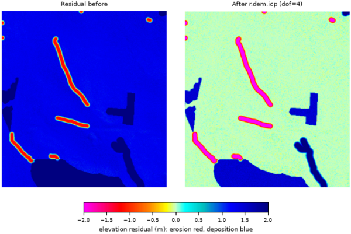

## DESCRIPTION

*r.dem.icp* performs constrained-rigid (4-DoF) co-registration of two DEM
rasters, with an experimental full 6-DoF mode, aligning a **source** DEM to a
**reference** DEM with an Iterative Closest Point (ICP) solver. Key properties
of the implementation:

* Point-to-plane ICP with projective correspondences (the target DEM is
  sampled at the transformed (x, y) location).
* Multiscale, coarse-to-fine alignment via an adjustable sampling **stride**.
* Trimmed ICP (keep the best residual fraction) with Huber robust weighting.
* OpenMP parallelization of the main loops.
* DEM-specific handling: surface normals from DEM gradients, an optional
  slope limit, and an optional stable-terrain **mask**.

## NOTES

* **Initialization:** If you already know an approximate horizontal shift or
  yaw (for example from metadata or phase correlation), pass it via the
  **init_dx**, **init_dy**, **init_dz**, and **init_yaw** options. A good
  **init_dz** is often the median of `source - reference` over stable terrain.
  In the experimental 6-DoF mode, **init_roll** and **init_pitch** (degrees)
  additionally seed the roll and pitch angles; they are ignored with `dof=4`.
* **Speed knobs:** Increase **stride** and reduce **levels** for quick tests,
  and relax **max_iterations**.
* **Robustness:** Use a conservative **trim** (`0.6`-`0.9`). Where there is a
  lot of real change (landslides, forest canopy), lower **trim** and/or
  **huber**.
* **Constraints:** 4-DoF (`dof=4`) is the supported mode and usually suffices
  (e.g., airborne photogrammetry vs LiDAR). The four solved parameters are the
  three translations plus yaw (planimetric rotation about the vertical axis),
  which absorbs residual georeferencing rotation; roll and pitch are
  deliberately excluded. **6-DoF (`dof=6`) is experimental:** rigid roll/pitch
  rotation is ill-conditioned for height-field DEMs and its resample is
  approximate, so leave it off unless you specifically need to model tilt. The
  residual that typically remains after 4-DoF is a sub-pixel horizontal shift
  and vertical offset; remove it by running *[r.dem.nk](r.dem.nk.md)* (Nuth &
  Kaeaeb) after ICP.
* **Validation:** After alignment, inspect the residual DoD and the stats
  file; residual bias should be near zero on stable terrain.

## EXAMPLES

The commands below use the example scene built in the
*[r.dem](r.dem.md)* toolset manual, which is derived from the North
Carolina sample dataset. Build it there first.

Align the misregistered surface with four degrees of freedom, which solves
three translations and yaw:

```sh
g.region raster=elev_lid792_1m

r.dem.icp source=dsm_offset reference=elev_lid792_1m \
    mask=stable_terrain output=dsm_icp dof=4 \
    transform_out=icp_transform.txt stats_out=icp_stats.csv
```

The reported transform is the one that maps the source onto the reference,
so its signs are opposite to those of *r.dem.nk*. Against an applied offset
of 0.4596 m east, 0.4596 m north, and 1.32 m up it returns:

```text
tx=-0.4590844708
ty=-0.4608043693
tz=-1.3201388046
yaw=0.0000935114
```

  
*Figure: Stable-terrain residual before and after r.dem.icp at dof=4.*

## REFERENCES

* **ICP framework (point-to-point origin).** Besl, P.J. and McKay, N.D. (1992).
  A method for registration of 3-D shapes. *IEEE Transactions on Pattern
  Analysis and Machine Intelligence*, 14(2), 239-256.
  [doi:10.1109/34.121791](https://doi.org/10.1109/34.121791)
* **Point-to-plane error metric (minimized here).** Chen, Y. and Medioni, G.
  (1992). Object modelling by registration of multiple range images. *Image and
  Vision Computing*, 10(3), 145-155.
  [doi:10.1016/0262-8856(92)90066-C](https://doi.org/10.1016/0262-8856%2892%2990066-C)
* **Projective correspondences (target sampled at the transformed x, y).** Blais,
  G. and Levine, M.D. (1995). Registering multiview range data to create 3D
  computer objects. *IEEE Transactions on Pattern Analysis and Machine
  Intelligence*, 17(8), 820-824.
  [doi:10.1109/34.400574](https://doi.org/10.1109/34.400574)
* **Efficient ICP variants (sampling, rejection, coarse-to-fine).** Rusinkiewicz,
  S. and Levoy, M. (2001). Efficient variants of the ICP algorithm. *Proceedings
  Third International Conference on 3-D Digital Imaging and Modeling (3DIM)*,
  145-152. [doi:10.1109/IM.2001.924423](https://doi.org/10.1109/IM.2001.924423)
* **Linearized least-squares point-to-plane solve.** Low, K.-L. (2004). Linear
  least-squares optimization for point-to-plane ICP surface registration.
  Technical Report TR04-004, Department of Computer Science, University of North
  Carolina at Chapel Hill.
  [PDF](https://www.cs.unc.edu/techreports/04-004.pdf)
* **Trimmed ICP (robust to partial overlap and change).** Chetverikov, D.,
  Stepanov, D. and Krsek, P. (2005). Robust Euclidean alignment of 3D point sets:
  the trimmed iterative closest point algorithm. *Image and Vision Computing*,
  23(3), 299-309.
  [doi:10.1016/j.imavis.2004.05.007](https://doi.org/10.1016/j.imavis.2004.05.007)
* **Robust M-estimator weighting.** Huber, P.J. (1964). Robust estimation of a
  location parameter. *The Annals of Mathematical Statistics*, 35(1), 73-101.
  [doi:10.1214/aoms/1177703732](https://doi.org/10.1214/aoms/1177703732)
* **Convergence analysis of point-to-plane registration.** Pottmann, H., Huang,
  Q.-X., Yang, Y.-L. and Hu, S.-M. (2006). Geometry and convergence analysis of
  algorithms for registration of 3D shapes. *International Journal of Computer
  Vision*, 67(3), 277-296.
  [doi:10.1007/s11263-006-5167-2](https://doi.org/10.1007/s11263-006-5167-2)

Related methods not implemented here: Nuth, C. and Kaeaeb, A. (2011),
*The Cryosphere* 5:271-290 (aspect/slope vertical-bias coregistration, provided
as *[r.dem.nk](r.dem.nk.md)*); Segal, A., Haehnel, D. and Thrun, S. (2009),
Generalized-ICP, *Robotics: Science and Systems*.

## SEE ALSO

*[r.dem](r.dem.md)*,
*[r.dem.coregister](r.dem.coregister.md)*,
*[r.dem.nk](r.dem.nk.md)*

## AUTHORS

Corey T. White, Center for Geospatial Analytics, NC State University
