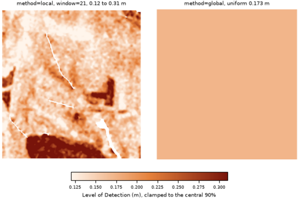

## DESCRIPTION

*r.dem.lod* computes a Level of Detection (LoD) raster for DEM differencing,
the elevation-change magnitude below which a measured difference cannot be
distinguished from noise. It supports a **global** (spatially uniform) and a
**local** (spatially variable) mode.

The uncertainty of the difference is estimated from the Normalized Median
Absolute Deviation (NMAD) of the elevation residuals on stable terrain:

```text
NMAD = 1.4826 * median(|dh - median(dh)|)
```

where `dh` is the residual and `z` below is the two-tailed normal critical
value for the requested **confidence** level. The residual comes either from
**dem** minus **reference**, or from a precomputed (typically bias-corrected)
difference supplied via **dod**. Both paths difference the surfaces before
estimation, so the NMAD estimates the dispersion of the difference directly
and no `sqrt(2)` epoch factor applies on either path.

### method=global

A single NMAD is estimated over the whole study area (or the **stable_mask**
region when supplied), producing a uniform LoD applied everywhere:

```text
LoD = z * sqrt(NMAD^2 + floor^2)
```

A non-zero **floor** here must be an independent registration budget (for
example a shift-parameter standard error), not the same population's NMAD,
or the two terms double-count.

### method=local

A spatially variable LoD is computed in a Gaussian-weighted moving window
of size **window** (the weighting matches *r.dem.stats*, so the two tools'
windowed dispersion estimators are numerically comparable):

```text
sigma_win(x,y) = 1.4826 * median_W(|dh - median_W(dh)|)
s_long^2       = max(0, floor^2 - median_stable(sigma_win^2))
LoD(x,y)       = z * sqrt(sigma_win^2 + s_long^2 + sum(sigma_extra_i^2))
```

**floor** is the flight-wide stable-residual NMAD (1 sigma). Because the
windowed NMAD already measures the short-wavelength part of that same
error budget, only the long-wavelength excess `s_long` is added, once (a
plain quadrature of `sigma_win` and the floor would count the
short-wavelength component twice and operate a nominal 95% limit at
roughly 99%). `s_long` is reported in the message output; note that
`output_sigma` therefore merges a per-cell random component with a
spatially correlated one, so it must not be aggregated to volume
uncertainty by sqrt(N) averaging. The local dispersion is defined only
where at least **min_stable** stable cells fall inside the window (with
fewer, the windowed median degenerates: a single stable cell yields
`sigma_win = 0` exactly); **sigma_extra** accepts additional 1-sigma rasters (for
example the bias-model coefficient SE from *r.dem.bias*). NULL in any
**sigma_extra** or **point_density** raster propagates to the LoD: a cell
whose uncertainty is unknown is untestable, so the significance domain
shrinks rather than silently assuming zero extra uncertainty. The optional
**output_sigma** raster stores the combined 1-sigma surface (`output` equals
`z` times it), and **output_domain** marks the cells where the LoD is
defined.

With a **stable_mask**, the windowed dispersion exists only within the
window's reach of stable cells, and the LoD is deliberately NOT extended
beyond that reach: coefficient-style uncertainty cannot express model-form
error under extrapolation, so an extension requires an out-of-sample error
envelope (against independent validation data), which is outside this tool's
scope. The tested share of observed cells is always reported.

When a **point_density** raster is supplied, the local uncertainty is penalised
in sparsely sampled areas before the LoD is computed.

## NOTES

A precomputed **nmad** value can be supplied to skip the stable-pixel
estimation, and a **stable_mask** restricts the residual statistics to terrain
assumed unchanged (roads, parking lots, bare ground).

The output LoD raster can be passed directly to *r.dem.change* as the **lod**
input for significance thresholding. For full per-source uncertainty
propagation (combining several error rasters in quadrature) use
*r.dem.errprop*.

The tool requires the Python *scipy* package.

## EXAMPLES

The commands below use the example scene built in the
*[r.dem](r.dem.md)* toolset manual, which is derived from the North
Carolina sample dataset. Build it there first.

A single detection limit for the whole map, estimated from the stable
residuals:

```sh
g.region raster=elev_lid792_1m

r.dem.lod dod=dod_debiased output=lod_global method=global \
    stable_mask=stable_lod confidence=0.95
```

The debiased residual on the stable cells is the injected noise, so the
result is `z(0.95)` times its NMAD:

```text
NMAD: 0.0890 m
LoD: 0.1743 m (uniform)
```

A spatially variable limit, keeping the combined 1-sigma surface for
*r.dem.errprop* and the domain raster that marks where the limit is
defined:

```sh
r.dem.lod dod=dod_debiased output=lod_local method=local window=21 \
    stable_mask=stable_lod output_sigma=sigma_combined \
    output_domain=lod_domain confidence=0.95
```

Because the survey noise varies across this scene, so does the limit: it
runs from roughly 0.12 m on the smooth fields to over 0.30 m under canopy,
against a single uniform value of 0.175 m. That is the case for
**method=local**, and the reason the mask must include forest.

However, the limit is undefined wherever no stable cell falls inside the
window,
which on this scene means the interior of the change features. Fall back to
the uniform limit there before thresholding:

```sh
r.mapcalc "lod_filled = if(isnull(lod_local), lod_global, lod_local)"
```

Add the bias-model coefficient SE from *r.dem.bias* to the quadrature when
the regression path was used:

```sh
r.dem.lod dod=dod_regression output=lod_with_se method=local \
    stable_mask=stable_terrain sigma_extra=bias_se \
    output_sigma=sigma_with_se
```

  
*Figure: The spatially variable Level of Detection against the uniform one, on
a shared scale. White marks cells with no stable cell inside the window, where
the local limit is undefined.*

## REFERENCES

- Wheaton et al. (2010), *Earth Surface Processes and Landforms* 35:136-156.
- Hoehle and Hoehle (2009), *ISPRS J. Photogramm. Remote Sens.* 64:398-406.

## SEE ALSO

*[r.dem](r.dem.md)*,
*[r.dem.change](r.dem.change.md)*,
*[r.dem.errprop](r.dem.errprop.md)*,
*[r.dem.stats](r.dem.stats.md)*,
*[r.neighbors](r.neighbors.md)*,
*[r.univar](r.univar.md)*

## AUTHORS

Corey T. White, Center for Geospatial Analytics, NC State University
