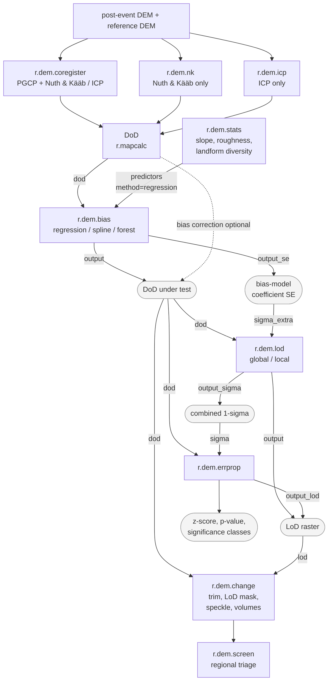

# Toolset for DEM co-registration, differencing, and topographic change analysis

## DESCRIPTION

The *r.dem* toolset supports topographic change analysis from pairs of
digital elevation models (DEMs), such as a post-event photogrammetric
(SfM) surface and a pre-event lidar reference. It covers co-registration,
systematic bias removal, DEM-of-difference (DoD) computation, uncertainty
propagation, and regional change screening. The toolset consists of nine
tools:

- [r.dem.coregister](r.dem.coregister.md)  
    co-registers a DEM to a reference DEM using pseudo ground control
    point (PGCP) vertical bias correction, optionally combined with
    Nuth & Kääb or ICP alignment
- [r.dem.nk](r.dem.nk.md)  
    estimates and removes horizontal and vertical offsets between two
    DEMs using the Nuth & Kääb (2011) aspect-correlation method
- [r.dem.icp](r.dem.icp.md)  
    aligns a DEM to a reference with robust multi-scale point-to-plane
    iterative closest point (ICP)
- [r.dem.bias](r.dem.bias.md)  
    removes systematic bias from a DoD by regression on terrain
    predictors, by spline interpolation of the stable-cell residuals, or
    by a local trimmed median under a canopy mask
- [r.dem.stats](r.dem.stats.md)  
    computes terrain surface metrics (slope, roughness, geomorphon
    diversity, local error sigma) used as DoD predictors
- [r.dem.lod](r.dem.lod.md)  
    computes the Level of Detection (LoD) for DEM difference maps with
    global and local uncertainty modes
- [r.dem.change](r.dem.change.md)  
    computes the DoD with cleanup, LoD masking, and volumetric summary
- [r.dem.errprop](r.dem.errprop.md)  
    propagates DEM uncertainty into a DoD and derives significance
    classes
- [r.dem.screen](r.dem.screen.md)  
    performs regional change screening by fusing topographic and
    spectral change with optional infrastructure overlays

## NOTES

The alignment tools (*r.dem.coregister*, *r.dem.nk*, *r.dem.icp*) remove
rigid offset and rotation. Everything downstream of them operates on the
DEM of difference rather than on the DEM pair: *r.dem.bias* takes a DoD
through **dod** and returns a corrected one, so bias removal sits between
differencing and change detection. *r.dem.stats* supplies the terrain
predictors for *r.dem.bias* **method=regression** only; **method=spline**
and **method=forest** need no predictors. *r.dem.lod* and *r.dem.change*
also accept **dem** and **reference** directly, which skips the explicit
DoD when no bias correction is wanted.

*r.dem.lod* and *r.dem.errprop* compose rather than compete. *r.dem.lod*
builds the combined 1-sigma surface from the windowed dispersion, the
long-wavelength excess over **floor**, and any **sigma_extra** rasters
(the bias-model coefficient SE from *r.dem.bias* **output_se** is the
usual one), and writes it to **output_sigma**. That raster is the
intended **sigma** input to *r.dem.errprop*, which converts it into
z-scores, p-values, and significance classes. Either tool's LoD raster
drives the **lod** input of *r.dem.change*.

Every sigma entering *r.dem.errprop* must be independent of the DoD being
tested. A windowed dispersion of the same map inflates sigma exactly where
change is real and suppresses its own significance, so *r.dem.stats*
**metric=error_sigma_local** applied to the DoD under test is not a valid
uncertainty source for it. Note also that *r.dem.lod* **output_sigma**
merges a per-cell random component with a spatially correlated one, so it
must not be aggregated to volume uncertainty by sqrt(N) averaging over the
volumes *r.dem.change* reports.

DoD cleanup, LoD masking, and volumetric summary all live in
*r.dem.change* as a single pipeline; there is no separate DoD tool.

The following chart shows how the tools work together. Rectangles are
tools, rounded nodes are rasters, and edge labels are the option keys that
carry each raster:

## REFERENCES

White, C.T. et al. (in preparation). Post-Hurricane Topographic Change
Assessment Using Civil Air Patrol Aerial Imagery and Structure-from-Motion
Photogrammetry. *Remote Sensing* (MDPI).

## SEE ALSO

*[r.mapcalc](r.mapcalc.md)*,
*[r.neighbors](r.neighbors.md)*,
*[r.regression.multi](r.regression.multi.md)*,
*[r.slope.aspect](r.slope.aspect.md)*,
*[r.univar](r.univar.md)*

## AUTHORS

Corey T. White, Center for Geospatial Analytics, NC State University
