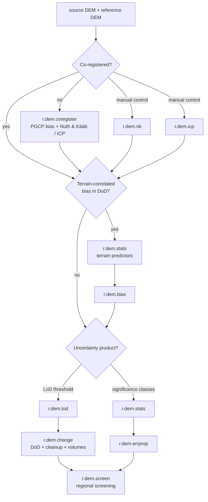

# Toolset for DEM co-registration, differencing, and topographic change analysis

## DESCRIPTION

The *r.dem* toolset supports topographic change analysis from pairs of
digital elevation models (DEMs), such as a post-event photogrammetric
(SfM) surface and a pre-event lidar reference. It covers co-registration,
systematic bias removal, DEM-of-difference (DoD) computation, uncertainty
propagation, and regional change screening. The toolset consists of nine
tools:

- [r.dem.coregister](r.dem.coregister.md)  
    co-registers a DEM to a reference DEM using pseudo ground control
    point (PGCP) vertical bias correction, optionally combined with
    Nuth & Kääb or ICP alignment
- [r.dem.nk](r.dem.nk.md)  
    estimates and removes horizontal and vertical offsets between two
    DEMs using the Nuth & Kääb (2011) aspect-correlation method
- [r.dem.icp](r.dem.icp.md)  
    aligns a DEM to a reference with robust multi-scale point-to-plane
    iterative closest point (ICP)
- [r.dem.bias](r.dem.bias.md)  
    removes terrain-correlated systematic bias from a DoD by regression
    on terrain predictors over stable areas
- [r.dem.stats](r.dem.stats.md)  
    computes terrain surface metrics (slope, roughness, geomorphon
    diversity, local error sigma) used as DoD predictors
- [r.dem.lod](r.dem.lod.md)  
    computes the Level of Detection (LoD) for DEM difference maps with
    global and local uncertainty modes
- [r.dem.change](r.dem.change.md)  
    computes the DoD with cleanup, LoD masking, and volumetric summary
- [r.dem.errprop](r.dem.errprop.md)  
    propagates DEM uncertainty into a DoD and derives significance
    classes
- [r.dem.screen](r.dem.screen.md)  
    performs regional change screening by fusing topographic and
    spectral change with optional infrastructure overlays

## NOTES

The alignment tools (*r.dem.coregister*, *r.dem.nk*, *r.dem.icp*) remove
rigid offset and rotation. *r.dem.bias* then removes terrain-correlated
systematic bias that survives alignment. *r.dem.stats* supplies the
terrain predictors that *r.dem.bias* and *r.dem.errprop* consume.
*r.dem.lod*, *r.dem.change*, and *r.dem.errprop* turn the aligned,
debiased surfaces into significance-masked change and volume products.
DoD computation, cleanup, LoD masking, and volumetric summary all live in
*r.dem.change* as a single pipeline; there is no separate DoD tool.

The following chart shows how the tools work together:

## REFERENCES

White, C.T. et al. (in preparation). Post-Hurricane Topographic Change
Assessment Using Civil Air Patrol Aerial Imagery and Structure-from-Motion
Photogrammetry. *Remote Sensing* (MDPI).

## SEE ALSO

*[r.mapcalc](r.mapcalc.md)*,
*[r.neighbors](r.neighbors.md)*,
*[r.regression.multi](r.regression.multi.md)*,
*[r.slope.aspect](r.slope.aspect.md)*,
*[r.univar](r.univar.md)*

## AUTHORS

Corey T. White, Center for Geospatial Analytics, NC State University
