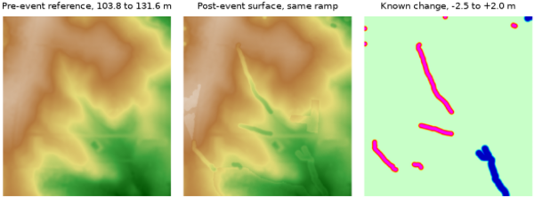

# Toolset for DEM co-registration, differencing, and topographic change analysis

## DESCRIPTION

The *r.dem* toolset supports topographic change analysis from pairs of
digital elevation models (DEMs), such as a post-event photogrammetric
(SfM) surface and a pre-event lidar reference. It covers co-registration,
systematic bias removal, DEM-of-difference (DoD) computation, uncertainty
propagation, and regional change screening. The toolset consists of nine
tools:

- [r.dem.coregister](r.dem.coregister.md)  
    co-registers a DEM to a reference DEM using pseudo ground control
    point (PGCP) vertical bias correction, optionally combined with
    Nuth & Kääb or ICP alignment
- [r.dem.nk](r.dem.nk.md)  
    estimates and removes horizontal and vertical offsets between two
    DEMs using the Nuth & Kääb (2011) aspect-correlation method
- [r.dem.icp](r.dem.icp.md)  
    aligns a DEM to a reference with robust multi-scale point-to-plane
    iterative closest point (ICP)
- [r.dem.bias](r.dem.bias.md)  
    removes systematic bias from a DoD by regression on terrain
    predictors, by spline interpolation of the stable-cell residuals, or
    by a local trimmed median under a canopy mask
- [r.dem.stats](r.dem.stats.md)  
    computes terrain surface metrics (slope, roughness, geomorphon
    diversity, local error sigma) used as DoD predictors
- [r.dem.lod](r.dem.lod.md)  
    computes the Level of Detection (LoD) for DEM difference maps with
    global and local uncertainty modes
- [r.dem.change](r.dem.change.md)  
    computes the DoD with cleanup, LoD masking, and volumetric summary
- [r.dem.errprop](r.dem.errprop.md)  
    propagates DEM uncertainty into a DoD and derives significance
    classes
- [r.dem.screen](r.dem.screen.md)  
    performs regional change screening by fusing topographic and
    spectral change with optional infrastructure overlays

## NOTES

The alignment tools (*r.dem.coregister*, *r.dem.nk*, *r.dem.icp*) remove
rigid offset and rotation. Everything downstream of them operates on the
DEM of difference rather than on the DEM pair: *r.dem.bias* takes a DoD
through **dod** and returns a corrected one, so bias removal sits between
differencing and change detection. *r.dem.stats* supplies the terrain
predictors for *r.dem.bias* **method=regression** only; **method=spline**
and **method=forest** need no predictors. *r.dem.lod* and *r.dem.change*
also accept **dem** and **reference** directly, which skips the explicit
DoD when no bias correction is wanted.

*r.dem.lod* and *r.dem.errprop* compose rather than compete. *r.dem.lod*
builds the combined 1-sigma surface from the windowed dispersion, the
long-wavelength excess over **floor**, and any **sigma_extra** rasters
(the bias-model coefficient SE from *r.dem.bias* **output_se** is the
usual one), and writes it to **output_sigma**. That raster is the
intended **sigma** input to *r.dem.errprop*, which converts it into
z-scores, p-values, and significance classes. Either tool's LoD raster
drives the **lod** input of *r.dem.change*.

Every sigma entering *r.dem.errprop* must be independent of the DoD being
tested. A windowed dispersion of the same map inflates sigma exactly where
change is real and suppresses its own significance, so *r.dem.stats*
**metric=error_sigma_local** applied to the DoD under test is not a valid
uncertainty source for it. Note also that *r.dem.lod* **output_sigma**
merges a per-cell random component with a spatially correlated one, so it
must not be aggregated to volume uncertainty by sqrt(N) averaging over the
volumes *r.dem.change* reports.

DoD cleanup, LoD masking, and volumetric summary all live in
*r.dem.change* as a single pipeline; there is no separate DoD tool.

The figures in these manuals color elevation differences with erosion in
red and deposition in blue, following the convention used for GRASS erosion
modeling and matching the categorical output of *r.dem.errprop*. Erosion
runs yellow to orange to red to magenta as it deepens, deposition runs cyan
to teal to blue, and near-zero differences are pale green. To apply it to a
DoD, scale the breaks to the range of the map:

```sh
r.colors map=dod_debiased rules=- << EOF
-3.0 #FF00FF
-1.8 #FF0000
-0.9 #FF7F00
-0.3 #FFFF00
0.0 #C8FFC8
0.3 #00FFFF
0.9 #00BFBF
1.8 #0000FF
3.0 #000080
nv #F0F0F0
EOF
```

The following chart shows how the tools work together. Rectangles are
tools, rounded nodes are rasters, and edge labels are the option keys that
carry each raster:

  
*Figure: Decision chart for selecting r.dem tools.*

The chart is generated from `r_dem_workflow.mmd`.

## EXAMPLES

The examples in this manual and in the individual tool manuals share one
scene, built from the North Carolina sample dataset so that every command
can be run as written. A known change surface is added with
*[r.earthworks](https://grass.osgeo.org/grass-stable/manuals/addons/r.earthworks.html)*,
a known rigid offset is applied, and known systematic bias fields are added,
so each tool's output can be compared with the answer.

The notebook `r_dem_examples.ipynb`, next to this manual page, runs the whole
walkthrough and regenerates every figure in these manuals.

### Building the scene

The change follows the drainage network, as a flood's would: scour along the
upper channel and deposition along the lower one. Derive the network first:

```sh
g.region raster=elev_lid792_1m

r.watershed elevation=elev_lid792_1m accumulation=accumulation
r.stream.extract elevation=elev_lid792_1m accumulation=accumulation \
    threshold=8000 stream_raster=streams

r.mapcalc "channel_scour_r = if(streams && elev_lid792_1m > 116 \
    && landcover_1m != 2, 1, null())"
r.mapcalc "channel_fill_r = if(streams && elev_lid792_1m < 110 \
    && landcover_1m != 2, 1, null())"
r.to.vect -s input=channel_scour_r output=channel_scour type=line
r.to.vect -s input=channel_fill_r output=channel_fill type=line
```

Both reaches are deliberately kept out of forest. *r.dem.bias*
**method=forest** cannot distinguish a canopy bump from real deposition, so
change under canopy would be removed by that stage rather than measured.

Now cut the upper reach and fill the lower one. The **-p** flag reports the
volume moved, which is the truth *r.dem.change* has to recover at the end:

```sh
r.earthworks -p elevation=elev_lid792_1m earthworks=dsm_scoured \
    operation=cut mode=relative lines=channel_scour z=-2.5 \
    function=linear linear=0.35 flat=5

r.earthworks -p elevation=dsm_scoured earthworks=dsm_event \
    operation=fill mode=relative lines=channel_fill z=2.0 \
    function=linear linear=0.30 flat=10

r.mapcalc "change_truth = dsm_event - elev_lid792_1m"
```

Add a survey error model. Each component is what one *r.dem.bias* method
removes: a smooth dome, a roughness-correlated term, and a canopy bump over
forest. The uncorrelated noise sets the level of detection:

```sh
r.dem.stats input=elev_lid792_1m output=roughness \
    metric=roughness_std window=13

r.mapcalc "bias_dome = 0.25 * (1 - ((x() - 638650) * (x() - 638650) \
    + (y() - 220375) * (y() - 220375)) / (400.0 * 400.0))"
r.mapcalc "bias_canopy = if(landcover_1m == 2, 1.5, 0)"
r.mapcalc "bias_truth = bias_dome + 0.6 * roughness + bias_canopy"

r.surf.gauss output=noise_unit mean=0 sigma=1 seed=42
r.mapcalc "sigma_survey = 0.05 + 0.20 * roughness \
    + if(landcover_1m == 2, 0.08, 0)"
r.mapcalc "noise = noise_unit * sigma_survey"

r.mapcalc "dsm_post = dsm_event + bias_truth + noise"
r.mapcalc "dod_raw = dsm_post - elev_lid792_1m"
```

The noise is deliberately not uniform: it grows with surface roughness and
again under canopy, as photogrammetric error does. A single detection limit
cannot serve both the smooth fields and the forest, which is what makes
*r.dem.lod* **method=local** worth running.

Build the masks. Three jobs need three different masks. **stable_terrain**
is the broad, sloped, unchanged terrain the Nuth and Kääb step and the bias
fits need. **pgcp_roads** is the flat road network the PGCP vertical step
needs. **stable_lod** is every unchanged cell including forest: forest is
stable ground for estimating uncertainty even though its canopy bump makes
it useless for the Nuth and Kääb regression, and leaving it out would leave
the noisiest part of the map uncharacterised:

```sh
r.mapcalc "change_foot = if(abs(change_truth) > 0.05, 1, null())"
r.mapcalc "stable_terrain = if(landcover_1m != 2 && landcover_1m != 1 \
    && isnull(change_foot), 1, null())"
r.mapcalc "stable_lod = if(landcover_1m != 1 \
    && isnull(change_foot), 1, null())"
r.mapcalc "forest = if(landcover_1m == 2, 1, null())"
v.clip -r input=streets_wake output=pgcp_roads
```

  
*Figure: Pre-event lidar reference, the post-event surface carrying the
survey error model, and the known change added with r.earthworks.*

Finally, a separately misregistered surface for the co-registration tools,
displaced by 0.65 m horizontally (0.4596 m on each axis) and 1.32 m
vertically:

```sh
g.copy raster=dsm_event,tmp_shift
r.region map=tmp_shift n=220750.4596 s=220000.4596 \
    e=639000.4596 w=638300.4596
g.region raster=elev_lid792_1m
r.resamp.interp input=tmp_shift output=post_shift method=bilinear
r.mapcalc "dsm_offset = post_shift + 1.32 + bias_canopy + noise"
```

The misregistration is kept on its own surface because a long-wavelength
vertical bias is partly degenerate with a horizontal shift in the
first-order Nuth and Kääb model, so a surface carrying both has no single
correct co-registration answer.

### Running the toolset

Co-register, then difference, then remove the residual bias:

```sh
r.dem.coregister dem=dsm_offset reference=elev_lid792_1m pgcp=pgcp_roads \
    stable_mask=stable_terrain output=dsm_coreg method=nk

r.dem.bias dod=dod_raw output=dod_spline method=spline \
    stable_mask=stable_terrain bias_field=bias_spline
r.dem.bias dod=dod_spline output=dod_debiased method=forest \
    mask=forest window=21
```

Set the detection limit, threshold the difference, and report volumes:

```sh
r.dem.lod dod=dod_debiased output=lod_global method=global \
    stable_mask=stable_lod confidence=0.95
r.dem.lod dod=dod_debiased output=lod_local method=local window=21 \
    stable_mask=stable_lod output_sigma=sigma_combined \
    output_domain=lod_domain confidence=0.95

# The local limit is undefined in the interior of the change features,
# where no stable cell falls inside the window.
r.mapcalc "lod_filled = if(isnull(lod_local), lod_global, lod_local)"

r.dem.change -n dod=dod_debiased lod=lod_filled \
    output_sig=dod_significant volume_csv=volumes.csv

r.dem.errprop dod=dod_debiased sigma=sigma_combined \
    output_sigma=sigma_dod output_class=significance
```

Screen a wider area at a coarser resolution to decide where to look:

```sh
g.region raster=elev_lid792_1m res=10 -a
r.resamp.stats input=dod_significant output=dod_10m_masked method=average

# Blocks holding no significant cell come back NULL, which for screening
# means no change rather than no data.
r.mapcalc "dod_10m = if(isnull(dod_10m_masked), 0, dod_10m_masked)"

r.mapcalc "ndvi_change = if(abs(change_truth) > 0.5, -0.35, 0.02)"
r.dem.screen dod=dod_10m spectral_change=ndvi_change output=triage \
    infrastructure=pgcp_roads hazard_output=hazard topo_threshold=1.0
```

## REFERENCES

White, C.T. et al. (in preparation). Volumetric Change Detection with SfM
Photogrammetry from Rapid-Response Aerial Imagery after Hurricane Helene.
*Remote Sensing* (MDPI).

## SEE ALSO

*[r.mapcalc](r.mapcalc.md)*,
*[r.neighbors](r.neighbors.md)*,
*[r.slope.aspect](r.slope.aspect.md)*,
*[r.univar](r.univar.md)*,
*[v.surf.rst](v.surf.rst.md)*

## AUTHORS

Corey T. White, Center for Geospatial Analytics, NC State University
