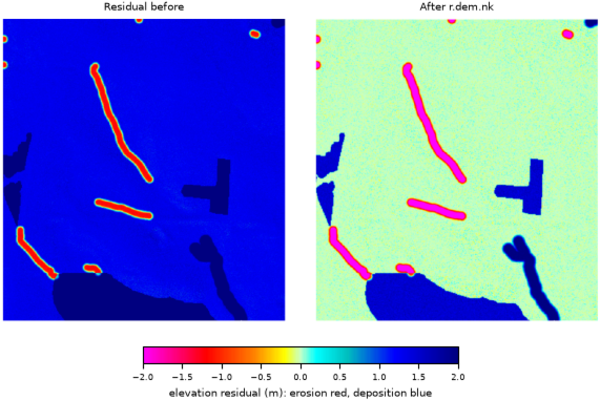

## DESCRIPTION

*r.dem.nk* implements the Nuth and Kääb (2011) algorithm for co-registering
two Digital Elevation Models (DEMs). The algorithm estimates and corrects for
vertical and horizontal offsets between the DEMs by minimizing elevation
differences on stable terrain.

### Model

For stable terrain pixels:

```text
dh = SfM - LiDAR
   approx. delta_x * tan(slope) * cos(aspect)
         + delta_y * tan(slope) * sin(aspect)
         + delta_z
```

Where `delta_x` (east), `delta_y` (north), `delta_z` (vertical) are solved by
ordinary least squares using raster-wide sums computed internally. Only
stable-terrain cells whose slope lies between **slope_min** and **slope_max**
(degrees; defaults 2 and 85) enter the regression, excluding near-flat and
near-vertical cells.

### Iterative solve

The linear model above is only first order, so a single pass under-estimates
shifts larger than one cell. The module therefore solves the increment on a
working surface, accumulates it into the running transform, re-warps the
working surface from the original SfM by the accumulated transform, and
repeats until the increment falls below **tol** (in map units) or **max_iter**
outer passes are reached. If the passes do not converge, a warning is issued
and the last estimate is used.

### Horizontal application (native)

The solved offsets are applied as a single inverse warp: each output cell at
map coordinate `(x, y)` samples the original SfM at
`(x + delta_x, y + delta_y)` (using **interp**) and subtracts `delta_z`.
No region shifting or external resampling tool is involved.

### Robustness

Optional iterative sigma-clipping on residuals (**iters** per outer pass)
reduces outlier influence during each solve.

The module always writes a residual raster named `output_resid` which contains
`output - lidar` on the stable-terrain mask used for regression.
When **-k** is provided, additional intermediate rasters are written:
`output_slope`, `output_aspect`, and `output_mask`.

### Saving and reusing a transform

**transform_output** writes the solved offsets (`dz`, `dx`, `dy`) to a small
text file. **apply_transform** reads such a file and applies it directly,
skipping the regression. This lets a transform solved on one surface (for
example a clean bare-earth DTM) be replayed onto another surface from the same
acquisition (for example its DSM) so both share the same horizontal alignment.
In apply mode the **stable_mask** is used only to define the reported residual
raster, so a near-flat mask no longer triggers the "not enough valid pixels"
error.

## NOTES

The model is first order in the elevation difference, so a smooth
long-wavelength vertical bias (e.g., photogrammetric doming) is partly
degenerate with a horizontal shift: over sloped terrain a gentle tilt and a
translation produce a similar `dh` pattern. When both are present the solve
splits the signal between them and the reported **dx** and **dy** absorb
part of the doming.

Estimate the alignment on a surface where the long-wavelength component is
small, or remove it first, and treat the horizontal offsets with suspicion
when the residual after co-registration still shows a broad, smoothly
varying pattern. *r.dem.bias* **method=spline** is the tool for the
long-wavelength part, and it operates on the difference rather than on the
DEM pair, so it runs after this step.

The **stable_mask** must cover broad, sloped, unchanged terrain. Flat
features (e.g., roads and parking lots) are filtered out by **slope_min**
and carry no aspect information, so a mask built from them alone leaves the
horizontal offsets poorly constrained. Those features belong in the PGCP
vertical step of *r.dem.coregister* instead.

## EXAMPLES

The commands below use the example scene built in the
*[r.dem](r.dem.md)* toolset manual, which is derived from the North
Carolina sample dataset. Build it there first.

Solve the offset of the misregistered surface against the lidar reference.
The stable mask must be broad, sloped terrain, not the flat roads used for
the PGCP step:

```sh
g.region raster=elev_lid792_1m

r.dem.nk sfm=dsm_offset lidar=elev_lid792_1m \
    stable_mask=stable_terrain output=dsm_nk \
    transform_output=nk_transform.txt
```

The applied offset was 0.4596 m east, 0.4596 m north, and 1.32 m up, and
the solve returns it:

```text
Converged transform: dz=1.320551 dx=0.449873 dy=0.457072
```

Replay the saved transform onto another surface from the same acquisition,
so a DSM and a DTM end up sharing one horizontal alignment:

```sh
r.dem.nk sfm=dsm_offset lidar=elev_lid792_1m stable_mask=stable_terrain \
    output=dsm_nk_replay apply_transform=nk_transform.txt
```

  
*Figure: Stable-terrain residual before and after r.dem.nk.*

## REFERENCES

- Nuth, C., and A. Kääb. 2011. "Co-Registration and Bias Corrections of
  Satellite Elevation Data Sets for Quantifying Glacier Thickness Change."
  *The Cryosphere* 5 (1): 271-90. <https://doi.org/10.5194/tc-5-271-2011>

## SEE ALSO

*[r.dem](r.dem.md)*,
*[r.dem.coregister](r.dem.coregister.md)*,
*[r.dem.icp](r.dem.icp.md)*

## AUTHORS

Corey T. White, Center for Geospatial Analytics, NC State University
