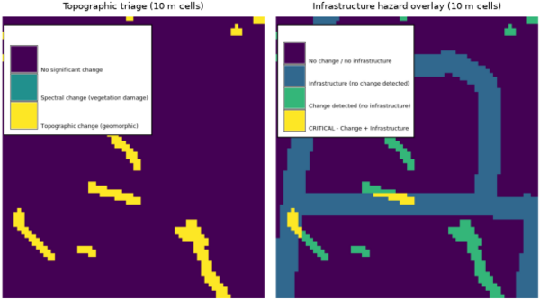

## DESCRIPTION

*r.dem.screen* performs a rapid regional triage that fuses topographic change
(from a DEM of Difference) with optional spectral change (NDVI or VARI), and can
overlay the result with infrastructure to flag hazard hotspots. It is intended
as a coarse-resolution first pass that directs detailed analysis toward the
highest-priority areas.

### Triage

The **output** raster classifies each cell into a priority class. With a
**spectral_change** raster supplied:

| Class | Meaning |
| ------- | --------- |
| 0 | No significant change |
| 1 | Spectral change only (vegetation damage) |
| 2 | Topographic change only (geomorphic) |
| 3 | Topographic and spectral change (highest priority) |

A cell is flagged for topographic change when `|dod| >= topo_threshold`, and for
spectral change when `spectral_change <= spectral_threshold` (negative values
indicate vegetation loss). Without a spectral input only topographic change is
classified (classes 0 and 2).

### Hazard overlay

When both an **infrastructure** vector and a **hazard_output** name are given,
the infrastructure is buffered by **infra_buffer_m** and intersected with the
triage result:

| Class | Meaning |
| ------- | --------- |
| 0 | No change and no infrastructure |
| 1 | Infrastructure, no change detected |
| 2 | Change detected, no infrastructure |
| 3 | CRITICAL: change intersects infrastructure |

## NOTES

The tool reports per-class cell counts and areas. Both outputs carry category
labels. Run the tool at the regional screening resolution (for example 10 m);
the **dod** input is expected to be a significant-change raster, such as the
significant DoD from *r.dem.change*.

## EXAMPLES

The commands below use the example scene built in the
*[r.dem](r.dem.md)* toolset manual, which is derived from the North
Carolina sample dataset. Build it there first.

Screening runs on a coarser grid than the change analysis: the point is to
find where to look, not to measure what happened. At 10 m this tile is only
70 by 75 cells, which is why the triage map looks blocky next to the 1 m
products. In practice the screening pass covers a whole flight corridor,
where that cell size is far below map scale.

```sh
g.region raster=elev_lid792_1m res=10 -a
r.resamp.stats input=dod_significant output=dod_10m_masked method=average

# Blocks holding no significant cell come back NULL, which for screening
# means no change rather than no data.
r.mapcalc "dod_10m = if(isnull(dod_10m_masked), 0, dod_10m_masked)"

r.dem.screen dod=dod_10m output=triage topo_threshold=1.0
```

Add the road network to flag change that reaches infrastructure:

```sh
r.dem.screen dod=dod_10m output=triage \
    infrastructure=pgcp_roads hazard_output=hazard \
    infra_buffer_m=30 topo_threshold=1.0
```

### Adding spectral change

**spectral_change** fuses vegetation loss with the topographic signal, so
that scour under stripped canopy ranks above either signal alone. It expects
a bitemporal difference (e.g., NDVI or VARI), negative where vegetation
was lost.

However, the North Carolina sample dataset carries only one date of
imagery, so a real bitemporal difference cannot be built from it. The
raster below is a stand-in: a genuine pre-event NDVI from the Landsat
bands, reduced along the flood corridor and perturbed with noise. It
illustrates the option, it does not demonstrate that the fusion works,
because the vegetation loss is imposed rather than observed. With real
imagery, difference the two dates instead.

```sh
r.mapcalc "ndvi_pre = float(lsat7_2002_40 - lsat7_2002_30) \
    / float(lsat7_2002_40 + lsat7_2002_30)"

r.surf.gauss output=ndvi_noise mean=0 sigma=0.05 seed=7
r.mapcalc "ndvi_post = ndvi_pre \
    - if(abs(change_truth) > 0.3, 0.30, 0) + ndvi_noise"
r.mapcalc "ndvi_change = ndvi_post - ndvi_pre"

r.dem.screen dod=dod_10m spectral_change=ndvi_change \
    output=triage_fused topo_threshold=1.0 spectral_threshold=-0.15
```

Reset the region afterwards, since the screening step coarsened it:

```sh
g.region raster=elev_lid792_1m
```

  
*Figure: Topographic triage and the infrastructure hazard overlay, from the
topographic signal alone. The screening grid is deliberately coarse: 10 m
cells, so only 70 by 75 of them cover this tile.*

## SEE ALSO

*[r.dem](r.dem.md)*,
*[r.dem.change](r.dem.change.md)*,
*[r.dem.errprop](r.dem.errprop.md)*,
*[v.buffer](v.buffer.md)*,
*[v.to.rast](v.to.rast.md)*

## AUTHORS

Corey T. White, Center for Geospatial Analytics, NC State University
