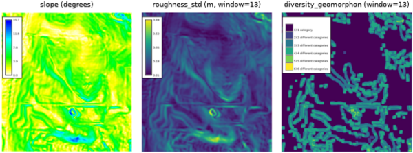

## DESCRIPTION

*r.dem.stats* computes terrain surface metrics from a DEM (or a DEM of
Difference). The outputs are the predictor rasters used to model
terrain-correlated DoD uncertainty and systematic bias, for example as inputs
to *r.dem.bias* or as an uncertainty source for *r.dem.errprop*.

A single metric is selected per run through the **metric** option:

- **slope**: surface slope from *r.slope.aspect*, in degrees or radians as
  selected with **slope_format** (default degrees).
- **roughness_std**: local roughness as the Gaussian-weighted focal
  standard deviation of elevation (*r.neighbors*).
- **diversity_geomorphon**: landform category richness in a moving
  window, computed from *r.geomorphon* forms.
- **diversity_shannon**: local Shannon diversity
  `H' = -sum(p * log(p))` over category proportions in a window, computed from
  a categorical input such as a geomorphon forms map. The logarithm base is
  selected with **log_base** (`e`, `2`, or `10`; default `e`). With the
  **-e** flag the matching Shannon evenness `J = H' / log(S)` is also written
  as `<output>_evenness`.
- **error_sigma_local**: a robust local standard deviation via the median
  absolute deviation, `sigma = 1.4826 * median(|x - median(x)|)` in a moving
  window. Use a DoD raster as **input** to obtain a spatially varying DoD
  uncertainty surface.

## NOTES

The **window** must be an odd integer of at least 3 cells. Focal metrics use a
Gaussian weighting whose falloff is derived from the window radius, matching the
focal behaviour used throughout the DoD workflow.

For **diversity_shannon** the input is expected to be categorical (integer
classes). A natural pairing is to first compute a geomorphon forms map and then
run *r.dem.stats* with `metric=diversity_shannon` on that map.

Intermediate rasters are removed on exit. The tool honours the current
computational region and the `--overwrite` flag.

## EXAMPLES

The commands below use the example scene built in the
*[r.dem](r.dem.md)* toolset manual, which is derived from the North
Carolina sample dataset. Build it there first.

Derive the terrain predictors used by *r.dem.bias* **method=regression** and
as diagnostic surfaces:

```sh
g.region raster=elev_lid792_1m

r.dem.stats input=elev_lid792_1m output=slope metric=slope
r.dem.stats input=elev_lid792_1m output=roughness \
    metric=roughness_std window=13
r.dem.stats input=elev_lid792_1m output=landforms \
    metric=diversity_geomorphon window=13
```

The **slope** metric is *r.slope.aspect* under the tool's own naming, so the
two agree cell for cell.

**metric=diversity_shannon** needs a categorical map rather than an
elevation surface, so derive the geomorphon forms first and run the metric
on those. The **-e** flag adds the matching evenness raster:

```sh
r.geomorphon elevation=elev_lid792_1m forms=landform_classes \
    search=7 flat=4

r.dem.stats -e input=landform_classes output=landform_diversity \
    metric=diversity_shannon window=13
```

  
*Figure: Slope, roughness, and geomorphon diversity on the lidar reference.*

## SEE ALSO

*[r.dem](r.dem.md)*,
*[r.dem.bias](r.dem.bias.md)*,
*[r.dem.errprop](r.dem.errprop.md)*,
*[r.geomorphon](r.geomorphon.md)*,
*[r.neighbors](r.neighbors.md)*,
*[r.slope.aspect](r.slope.aspect.md)*

## AUTHORS

Corey T. White, Center for Geospatial Analytics, NC State University
