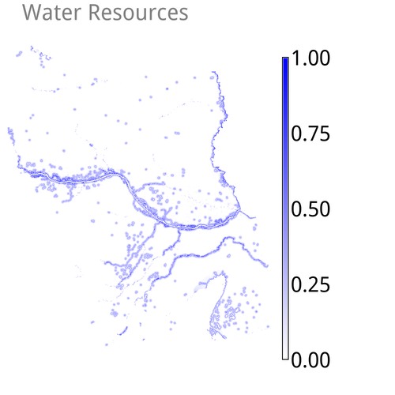
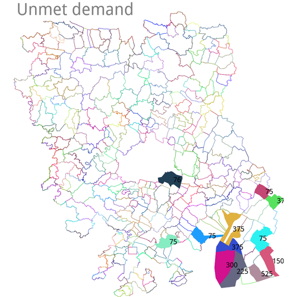

# r.estimap.recreation

## Description

*r.estimap.recreation*
is an implementation of the ESTIMAP recreation algorithm to support mapping
and modelling of ecosystem services (Zulian, 2014).

## Examples

For the sake of demonstrating the usage of the module, we use the following
"component" maps to derive a recreation *potential* map:

* `input_area_of_interest`
* `input_land_suitability`
* `input_water_resources`
* `input_protected_areas`





The maps shown above are available to download, among other sample maps, at:
<https://gitlab.com/natcapes/r.estimap.recreation.data>.

Note, the prefix `input_` in front of all maps is purposive in order to make
the examples easier to understand. Similarly, all output maps and files will
be prefixed with the string `output_`.

Before anything, we need to define the extent of interest by executing

```bash
g.region  raster=input_area_of_interest  -p
```

which returns

```text
projection: 99 (ETRS89 / LAEA Europe)
zone:       0
datum:      etrs89
ellipsoid:  grs80
north:      2879700
south:      2748850
west:       4735600
east:       4854650
nsres:      50
ewres:      50
rows:       2617
cols:       2381
cells:      6231077
```

### Using pre-processed maps

The first four input options of the module, are designed to receive pre-processed
input maps that classify as either `land`, `natural`, `water`, and
`infrastructure` resources that add to the recreational value of the area.
*Pro-processing* means here to derive a map that scores the given resources,
in the context of recreation and the ESTIMAP algorithm.

#### Potential

To produce a recreation *potential* map, the simplest command requires the user
to define the input map option `land` and name the output map via the option
`potential`. Using a pre-processed map that depicts the suitability of different
land types to support for recreation (here the map named `land_suitability`),
the command to execute is:

```bash
r.estimap.recreation  land=input_land_suitability  potential=output_potential
```


Note, this will process the map `input_land_suitability` over the extent
defined previously via `g.region`, which is the standard behaviour in GRASS GIS.

To exclude certain areas from the computations, we may use a raster map as a
mask and feed it to the input option `mask`:

```bash
r.estimap.recreation  land=input_land_suitability  mask=input_area_of_interest  potential=output_potential_1
```


The use of a mask (in GRASS GIS' terminology known as **MASK**) will ignore
areas of **No Data** (pixels in the `area_of_interest` map assigned the NULL
value). Successively, these areas will be empty in the output map
`output_potential_1`. Actually, the same effect can be achieved by using
GRASS GIS' native mask creation module `r.mask` and feed it with a raster map
of interest. The result will be a raster map named **MASK** whose presence acts
as a filter. In the following examples, it becomes obvious that if a single
input map features such **No Data** areas, they will be propagated in the
output map.

Nonetheless, it is good practice to use a `MASK` when one needs to ensure the
exclusion of undesired areas from any computations. Note also the `--o` flag:
it is required to overwrite the already existing map named `potential_1`.

Next, we add in the water component a map named `water_resources`, we modify
the output map name to `potential_2` and execute the new command without a mask:

```bash
r.estimap.recreation  land=input_land_suitability  water=input_water_resources \
    potential=output_potential_2
```


At this point it becomes clear that all `NULL` cells present in the water map,
are propagated in the output map `output_potential_2`.

Following, we provide a map of protected areas named `input_protected_areas`,
we modify the output map name to `output_potential_3` and execute the updated
command:

```bash
r.estimap.recreation land=input_land_suitability  \
    water=input_water_resources  natural=input_protected_areas \
    potential=output_potential_3
```


While the `land` option accepts only one map as an input, both the `water`
and the `natural` options accept multiple maps as inputs. For example, we
add a second map named `input_bathing_water_quality` to the *water* component
and modify the output map name to `output_potential_4`:

```bash
r.estimap.recreation  land=input_land_suitability \
     water=input_water_resources,input_bathing_water_quality \
     natural=input_protected_areas  potential=output_potential_4
```

In general, arbitrary number of maps, separated by comma, may be added to
options that accept multiple inputs.


This example, features also a title and a legend, so as to make sense of the
map (however, we will skip for now important cartographic elements).

```bash
d.rast  output_potential_4
d.legend  -c  -b  output_potential_4  at=0,15,0,1  border_color=white
d.text  text="Potential"  bgcolor=white
```

The different output map names are purposefully selected so as to enable a
visual comparison of the differences among the differenct examples. The output
maps `output_potential_1`, `output_potential_2`, `output_potential_3` and
`output_potential_4`, range within \[0,3\]. Yet, they differ in the distribution
of values due to the different set of input maps.

:exclamation:
All of the above examples base upon pre-processed maps that score the access to
and quality of land, water and natural resources. For using *raw*, unprocessed
maps, read section **Using unprocessed maps**.

We can remove all of the *potential* maps via

```bash
g.remove raster pattern=output_potential* -f
```

#### Spectrum

To derive a map with the recreation (opportunity) `spectrum`, we need in
addition an `infrastructure` component. In this example a map that scores
distance to infrastructure (such as the road network) named
`input_distance_to_infrastructure`, is defined as an additional input:


Naturally, we need to define the output map option `spectrum` too:

```bash
r.estimap.recreation  \
    land=input_land_suitability \
    water=input_water_resources,input_bathing_water_quality \
    natural=input_protected_areas \
    infrastructure=input_distance_to_infrastructure \
    spectrum=output_spectrum
```

or, the same command in a copy-paste friendly way for systems that won't
understand the special  `\` character:

<!-- markdownlint-disable line-length -->
```bash
r.estimap.recreation  land=input_land_suitability  water=input_water_resources,input_bathing_water_quality  natural=input_protected_areas  infrastructure=input_distance_to_infrastructure  spectrum=output_spectrum
```
<!-- markdownlint-enable line-length -->


Missing to define an `infrastructure` map, while asking for the `spectrum`
output, the command will abort and inform about.

The image of the *spectrum* map was produced via the following native
GRASS GIS commands

```bash
d.rast  output_spectrum
d.legend  -c  -b  output_spectrum  at=0,30,0,1  border_color=white
d.text  text="Spectrum"  bgcolor=white
```

##### Opportunity

The `opportunity` map is actually an intermediate step of the algorithm. The
option to output this map `opportunity` is meant for expert users who want to
explore the fundamentals of the processing steps. As such, and by design, it
requires to also request for the output option `spectrum`. Be aware that this
design choice is applied in the case of the `unmet` output map option too.
Building upon the previous command, we add the `opportunity` output option:

```bash
r.estimap.recreation --o \
    mask=input_area_of_interest \
    land=input_land_suitability \
    water=input_water_resources,input_bathing_water_quality \
    natural=input_protected_areas \
    infrastructure=input_distance_to_infrastructure \
    opportunity=output_opportunity \
    spectrum=output_spectrum
```

or, the same command in a copy-paste friendly way:

<!-- markdownlint-disable line-length -->
```bash
r.estimap.recreation  --o mask=input_area_of_interest  land=input_land_suitability  water=input_water_resources,input_bathing_water_quality  natural=input_protected_areas  infrastructure=input_distance_to_infrastructure  opportunity=output_opportunity  spectrum=output_spectrum
```
<!-- markdownlint-enable line-length -->

We also add the `--o` overwrite flag, because existing `output_spectrum` map
will cause the module to abort.


The image of the *opportunity* map was produced via the following native
GRASS GIS commands

```bash
d.rast  output_opportunity
d.legend  -c  -b  output_opportunity  at=0,20,0,1  border_color=white
d.text  text="Opportunity"  bgcolor=white
```

#### More input maps

To derive the outputs met `demand` distribution, `unmet` demand distribution
and the actual `flow`, additional requirements are a `population` map and one
of boundaries, as an input to the option `base` within which to quantify the
distribution of the population. Using a map of administrative boundaries for
the latter option, serves for deriving comparable figures across these
boundaries. The algorithm sets internally the spatial resolution of all related
output maps (`demand`, `unmet` and `flow`) to the spatial resolution of
the `population` input map.

##### Population


In this example, the population map named `population_2015` is of 1000m\^2.

##### Local administrative units


The map named `local_administrative_units` serves in the following example
as the base map for the zonal statistics to obtain the demand map.

#### Demand

In this example command, we remove the previously added `opportunity` and
`spectrum` output options, and logically add the `demand` output option:

```bash
r.estimap.recreation --o \
    mask=input_area_of_interest \
    land=input_land_suitability \
    water=input_water_resources,input_bathing_water_quality \
    natural=input_protected_areas \
    infrastructure=input_distance_to_infrastructure \
    population=input_population_2015 \
    base=input_local_administrative_units \
    demand=output_demand
```

Of course, the maps `output_opportunity` and `output_spectrum` still exist
in our data base, unless explicitly removed.


#### Unmet Demand

In the following example, we add `unmet` output map option. In this case of
the *unmet* distribution map too, by design the module requires the user
to define the `demand` output map option.

```bash
r.estimap.recreation --o \
    mask=input_area_of_interest \
    land=input_land_suitability \
    water=input_water_resources,input_bathing_water_quality \
    natural=input_protected_areas \
    infrastructure=input_distance_to_infrastructure \
    population=input_population_2015 \
    base=input_local_administrative_units \
    demand=output_demand \
    unmet=output_unmet_demand
```


It is left as an exercise to the user to create screenshots of the *met*, the
*unmet* demand distribution and the *flow* output maps. For example, is may be
similar to the command examples that demonstrate the use of the commands
`d.rast`, `d.legend` and `d.text`, that draw the *potential*, the *spectrum*
and the *opportunity* maps.

#### Flow

The *flow* bases upon the same function used to quantify the attractiveness
of locations for their recreational value. It includes an extra *score* term.

The computation involves a *distance* map, reclassified in 5 categories as
shown in the following table. For each distance category, a unique pair of
coefficient values is assigned to the basic equation.

```text
Distance   Kappa     Alpha
---------- --------- ---------
0 to 1     0.02350   0.00102
1 to 2     0.02651   0.00109
2 to 3     0.05120   0.00098
3 to 4     0.10700   0.00067
>4         0.06930   0.00057
```

Note, the last distance category is not considered in deriving the final
"map of visits". The output is essentially a raster map with the distribution of
the demand per distance category and within predefined geometric boundaries

```bash
r.estimap.recreation --o \
    mask=input_area_of_interest \
    land=input_land_suitability \
    water=input_water_resources,input_bathing_water_quality \
    natural=input_protected_areas \
    infrastructure=input_distance_to_infrastructure \
    population=input_population_2015 \
    base=input_local_administrative_units \
    flow=output_flow
```


If we check the output values for the `output_flow` map, they are rounded by
the module automatically to integers! Here the first few lines reporting areal
statistics on the `output_flow` map:

```bash
r.stats output_flow -acpln --q |head
```

returns

```text
52  125000000.000000 50000 1.72%
53  191000000.000000 76400 2.63%
54  303000000.000000 121200 4.17%
55  392000000.000000 156800 5.39%
56  196000000.000000 78400 2.69%
57  178000000.000000 71200 2.45%
58  286000000.000000 114400 3.93%
59  185000000.000000 74000 2.54%
60  207000000.000000 82800 2.85%
61  176000000.000000 70400 2.42%
```

If the user wants the real numbers, that derive from the mobility function,
the `-r` flag comes in handy:

```bash
r.estimap.recreation --o -r \
    mask=input_area_of_interest \
    land=input_land_suitability \
    water=input_water_resources,input_bathing_water_quality \
    natural=input_protected_areas \
    infrastructure=input_distance_to_infrastructure \
    population=input_population_2015 \
    base=input_local_administrative_units \
    flow=output_flow
```

Querying again areal statistics via

```bash
r.stats output_flow -acpln --q | head
```

returns

```text
52-52.139117 from  to  50000000.000000 20000 0.69%
52.139117-52.278233 from  to  11000000.000000 4400 0.15%
52.278233-52.41735 from  to  39000000.000000 15600 0.54%
52.41735-52.556467 from  to  32000000.000000 12800 0.44%
52.556467-52.695583 from  to  7000000.000000 2800 0.10%
52.695583-52.8347 from  to  9000000.000000 3600 0.12%
52.8347-52.973817 from  to  25000000.000000 10000 0.34%
52.973817-53.112933 from  to  13000000.000000 5200 0.18%
53.112933-53.25205 from  to  28000000.000000 11200 0.38%
53.25205-53.391167 from  to  92000000.000000 36800 1.26%
```

#### Supply and Use

The module outputs by request the *supply* and *use* tables in form of CSV files.
Here is how:

```bash
r.estimap.recreation --o -r \
    mask=input_area_of_interest \
    land=input_land_suitability \
    water=input_water_resources,input_bathing_water_quality \
    natural=input_protected_areas \
    infrastructure=input_distance_to_infrastructure \
    population=input_population_2015 \
    base=input_local_administrative_units \
    supply=output_supply \
    use=output_use
```

:exclamation:
Not surprisingly, the above command fails!

It however informs that a **land cover map** and corresponding
**reclassification rules**, for the classes of the `landcover`
map, are required. Specifically, the algorithm's designers developed
a MAES land classes scheme. The "translation" of the CORINE land
classes (left) into this scheme (classes after the `=` sign)
are for example:

```text
1 = 1 Urban
2 = 1 Urban
3 = 1 Urban
4 = 1 Urban
5 = 1 Urban
6 = 1 Urban
7 = 1 Urban
8 = 1 Urban
9 = 1 Urban
10 = 1 Urban
11 = 1 Urban
12 = 2 Cropland
13 = 2 Cropland
14 = 2 Cropland
15 = 2 Cropland
16 = 2 Cropland
17 = 2 Cropland
18 = 4 Grassland
19 = 2 Cropland
20 = 2 Cropland
21 = 2 Cropland
22 = 2 Cropland
23 = 3 Woodland and forest
24 = 3 Woodland and forest
25 = 3 Woodland and forest
26 = 4 Grassland
27 = 5 Heathland and shrub
28 = 5 Heathland and shrub
29 = 3 Woodland and forest
30 = 6 Sparsely vegetated land
31 = 6 Sparsely vegetated land
32 = 6 Sparsely vegetated land
33 = 6 Sparsely vegetated land
34 = 6 Sparsely vegetated land
35 = 7 Wetland
36 = 7 Wetland
37 = 8 Marine
38 = 8 Marine
39 = 8 Marine
```

We save this into a file named `corine_to_maes_land_classes.rules` and
feed it to the `land_classes` option, then re-execute the command:

```bash
r.estimap.recreation --o -r \
    mask=input_area_of_interest \
    land=input_land_suitability \
    water=input_water_resources,input_bathing_water_quality \
    natural=input_protected_areas \
    infrastructure=input_distance_to_infrastructure \
    population=input_population_2015 \
    base=input_local_administrative_units \
    landcover=input_corine_land_cover_2006 \
    land_classes=corine_to_maes_land_classes.rules \
    supply=output_supply \
    use=output_use
```

This time it works.
Here the first few lines
from the output CSV files:

```bash
head -5 output_*.csv
```

returns

```text
==> output_supply.csv <==
base,base_label,cover,cover_label,area,count,percents
3,,1,723.555560,9000000.000000,9,7.76%
3,,3,246142.186250,64000000.000000,64,55.17%
3,,2,21710.289271,47000000.000000,47,40.52%
1,,1,1235.207129,11000000.000000,11,7.97%

==> output_use.csv <==
category,label,value
3,,268576.031081
4,,394828.563827
5,,173353.69508600002
1,,144486.484126
```

Using other land cover maps as input, would obviously require a similar set of
land classes translation rules.

#### All in one call

Of course it is possible to derive all output maps with one call:

```bash
r.estimap.recreation --o \
    land=input_land_suitability \
    natural=input_protected_areas,input_urban_green  \
    water=input_water_resources,input_bathing_water_quality \
    infrastructure=input_distance_to_infrastructure \
    landcover=input_corine_land_cover_2006 \
    land_classes=corine_to_maes_land_classes.rules \
    mask=input_area_of_interest \
    potential=output_potential \
    opportunity=output_opportunity \
    spectrum=output_spectrum \
    base=input_local_administrative_units \
    aggregation=input_regions \
    population=input_population_2015 \
    demand=output_demand \
    unmet=output_unmet_demand \
    flow=output_flow \
    supply=output_supply \
    use=output_use \
    timestamp='2015'
```

Note the use of the `timestamp` parameter! This concerns the `spectrum` map.
If plans include working with GRASS GIS' temporal framework on time-series,
maybe this will be useful.

#### Vector map

A vector input map with the role of the *base* map, can be used too.


```bash
r.estimap.recreation --o -r \
    mask=input_area_of_interest \
    land=input_land_suitability \
    water=input_water_resources,input_bathing_water_quality \
    natural=input_protected_areas \
    infrastructure=input_distance_to_infrastructure \
    population=input_population_2015 \
    base=input_local_administrative_units \
    base_vector=input_vector_local_administrative_units \
    landcover=input_corine_land_cover_2006 \
    land_classes=corine_to_maes_land_classes.rules \
    supply=output_supply \
    use=output_use
```

This command will also:

* export results of the mobility function in the files `output_supply.csv`
  and `output_use.csv`
* add the following columns in the attribute table linked to the
  `input_vector_local_administrative_units` vector map:

  ```text
  spectrum_sum
  demand_sum
  unmet_sum
  flow_sum
  flow_1_sum
  flow_2_sum
  flow_3_sum
  flow_4_sum
  flow_5_sum
  flow_6_sum
  ```

all of which are of double precision.

For example, the

```bash
v.db.select input_vector_local_administrative_units \
    columns=lau2_no_name,spectrum_sum,demand_sum,unmet_sum,flow_sum \
    where="flow_sum IS NOT NULL" | head
 ```

following the analysis, returns

```text
lau2_no_name|spectrum_sum|demand_sum|unmet_sum|flow_sum
801 Bad Erlach|22096|2810||700
841 Leopoldsdorf|8014|1800||426
630 Rabensburg|23358|8474||1546
468 Maissau|73168|6650||2580
10 Müllendorf|19419|1902||718
544 Straß im Straßertale|57314|4368||1471
67 Forchtenstein|53009|272||848
460 Guntersdorf|27408|12183||1955
103 Sankt Andrä am Zicksee|45130|3833||1926
```

Here the vector map used for administrative boundaries with the sum of
flow for each unit:


and the corresponding unmet demand, based on the analysis



In the latter screenshot, the units bearing the unmet demand results, are not
the same as the raster map previously shown. The different results are due to
the `-r` flag used in this last analysis. The `-r` flag will round up floating
point values during computations, thus the results with or without it will
differ. The reason to use, in this last example the `-r` flag, was to have
short integer numbers to print as labels inside the units (in the vector map).

### Using unprocessed input maps

The module offers a pre-processing functionality for all of the following
input components:

* landuse
* suitability\_scores

<!-- -->

* landcover
* land\_classes

<!-- -->

* lakes
* lakes\_coefficients
* default is set to: euclidean,1,30,0.008,1

<!-- -->

* coastline
* coastline\_coefficients
* default is set to: euclidean,1,30,0.008,1
* coast\_geomorphology

<!-- -->

* bathing\_water
* bathing\_coefficients
* default is set to: euclidean,1,5,0.01101

<!-- -->

* protected
* protected\_scores
* 11:11:0,12:12:0.6,2:2:0.8,3:3:0.6,4:4:0.6,5:5:1,6:6:0.8,7:7:0,8:8:0,9:9:0

<!-- -->

* anthropic
* anthropic\_distances
* 0:500:1,500.000001:1000:2,1000.000001:5000:3,5000.000001:10000:4,10000.00001:\*:5

<!-- -->

* roads
* roads\_distances
* 0:500:1,500.000001:1000:2,1000.000001:5000:3,5000.000001:10000:4,10000.00001:\*:5

A first look on how this works, is to experiment with the `landuse` and
`suitability_scores` input options.

Let's return to the first example, and use a fragment from the unprocessed
CORINE land data set, instead of the `land_suitability` map. This requires
a set of "score" rules, that correspond to the CORINE nomenclature, to
translate the land cover types into recreation potential.


In this case, the rules are a simple ASCII file (for example named
`corine_suitability.scores`) that contains the following:

```text
1:1:0:0
2:2:0.1:0.1
3:9:0:0
10:10:1:1
11:11:0.1:0.1
12:13:0.3:0.3
14:14:0.4:0.4
15:17:0.5:0.5
18:18:0.6:0.6
19:20:0.3:0.3
21:22:0.6:0.6
23:23:1:1
24:24:0.8:0.8
25:25:1:1
26:29:0.8:0.8
30:30:1:1
31:31:0.8:0.8
32:32:0.7:0.7
33:33:0:0
34:34:0.8:0.8
35:35:1:1
36:36:0.8:0.8
37:37:1:1
38:38:0.8:0.8
39:39:1:1
40:42:1:1
43:43:0.8:0.8
44:44:1:1
45:45:0.3:0.3
```

This file is provided in the `suitability_scores` option:

```bash
r.estimap.recreation  landuse=input_corine_land_cover_2006 \
    suitability_scores=corine_suitability.scores \
    potential=output_potential_corine
```


The same can be achieved with a long one-line string too:

<!-- markdownlint-disable line-length -->
```bash
r.estimap.recreation \
    landuse=input_corine_land_cover_2006 \
    suitability_scores="1:1:0:0,2:2:0.1:0.1,3:9:0:0,10:10:1:1,11:11:0.1:0.1,12:13:0.3:0.3,14:14:0.4:0.4,15:17:0.5:0.5,18:18:0.6:0.6,19:20:0.3:0.3,21:22:0.6:0.6,23:23:1:1,24:24:0.8:0.8,25:25:1:1,26:29:0.8:0.8,30:30:1:1,31:31:0.8:0.8,32:32:0.7:0.7,33:33:0:0,34:34:0.8:0.8,35:35:1:1,36:36:0.8:0.8,37:37:1:1,38:38:0.8:0.8,39:39:1:1,40:42:1:1,43:43:0.8:0.8,44:44:1:1,45:45:0.3:0.3" \
    potential=potential_1
```
<!-- markdownlint-enable line-length -->

In fact, this very scoring scheme, for CORINE land data sets, is integrated in
the module, so we obtain the same output even by discarding the
`suitability_scores` option:

```bash
r.estimap.recreation \
    landuse=input_corine_land_cover_2006  \
    suitability_scores=suitability_of_corine_land_cover.scores \
    potential=output_potential_1 --o
```

This is so because CORINE is a standard choice among existing land data bases
that cover european territories. In case of a user requirement to provide an
alternative scoring scheme, all what is required is either of

* provide a new "rules" file with the desired set of scoring rules
* provide a string to the `suitability_scores` option

## Author

Nikos Alexandris

## Licence

Copyright 2018 European Union

Licensed under the EUPL, Version 1.2 or – as soon they will be approved by
the European Commission – subsequent versions of the EUPL (the "Licence");

You may not use this work except in compliance with the Licence. You may
obtain a copy of the Licence at:

<https://joinup.ec.europa.eu/collection/eupl/eupl-text-11-12>

Unless required by applicable law or agreed to in writing, software distributed
under the Licence is distributed on an "AS IS" basis, WITHOUT WARRANTIES OR
CONDITIONS OF ANY KIND, either express or implied. See the Licence for the
specific language governing permissions and limitations under the Licence.

Consult the LICENCE file for details.
