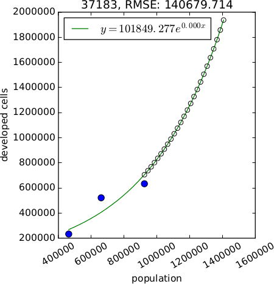
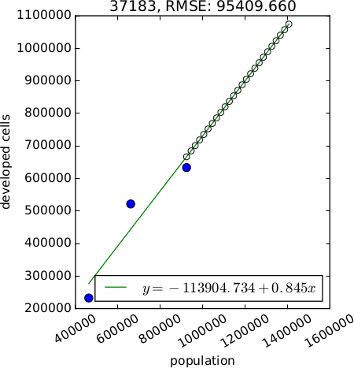
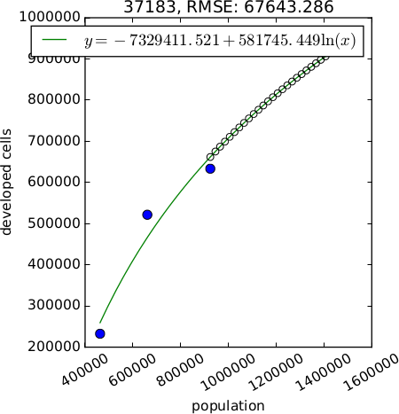
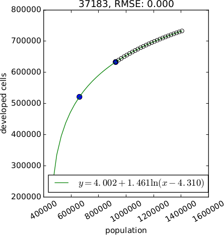
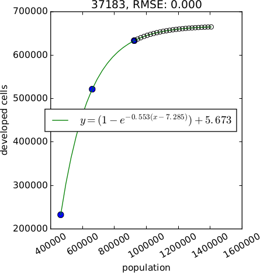

## DESCRIPTION

The *r.futures.demand* tool of FUTURES determines the quantity of
expected land changed. It creates a demand table as the number of cells
to be converted at each time step for each subregion based on the
relation between the population and developed land in the past years.

The input accepts multiple (at least 2) rasters of developed
(category 1) and undeveloped areas (category 0) from different years,
ordered by time. For these years, user has to provide the population
numbers for each subregion in parameter **observed_population** as a CSV
file. The format is as follows. First column is time (matching the time
of rasters used in parameter **development**) and first row is the
category of the subregion. The separator can be set with parameter
**separator**.

```text
year,37037,37063,...
1985,19860,10980,...
1995,20760,12660,...
2005,21070,13090,...
2015,22000,13940,...
```

The same table is needed for projected population (parameter
**projected_population**). The categories of the input raster
**subregions** must match the identifiers of subregions in files given
in **observed_population** and **projected_population**. Parameter
**simulation_times** is a comma separated list of times for which the
demand will be computed. The first time should be the time of the
developed/undeveloped raster used in
*[r.futures.simulation](r.futures.simulation.md)* as a starting point
for simulation. There is an easy way to create such list using Python:

```python
','.join([str(i) for i in range(2015, 2031)])
```

or Bash:

```bash
seq -s, 2015 2030
```

The format of the output **demand** table is:

```text
year,37037,37063,37069,...
2012,1362,6677,513,...
2013,1856,4850,1589,...
2014,1791,5972,903,...
2015,1743,5497,1094,...
2016,1722,5388,1022,...
2017,1690,5285,1077,...
2018,1667,5183,1029,...
...
```

where each value represents the number of new developed cells in each
step. It's a standard CSV file, so it can be opened in a text editor or
a spreadsheet application if needed. The separator can be set with
parameter **separator**. In case the demand values would be negative (in
case of population decrease or if the relation is inversely
proportional) the values are turned into zeros, since FUTURES does not
simulate change from developed to undeveloped sites.

The **method** parameter allows to choose the type of relation between
population and developed area. The available methods include linear,
logarithmic (2 options), exponential and exponential approach relation.
If more than one method is checked, the best relation is selected based
on RMSE. Recommended methods are *logarithmic*, *logarithmic2*, *linear*
and *exp_approach*. Methods exponential approach and logarithmic2
require [scipy](http://scipy.org/) and at least 3 data points (raster
maps of developed area).

An optional output **plot** is a plot of the relations for each
subregion. It allows to more effectively assess the relation suitable
for each subregion. The file format is determined from the extension and
can be for example PNG, PDF, SVG.





  
*Figure: Example of different relations between population and
developed area (generated with option **plot**). Starting from the
left: exponential, linear, logarithmic with 2 unknown variables,
logarithmic with 3 unknown variables, exponential approach*

## NOTES

*r.futures.demand* computes the relation between population and
developed area using simple regression and in case of method
*exp_approach* and *logarithmic2* using
[scipy.optimize.curve_fit](http://docs.scipy.org/doc/scipy-0.15.1/reference/generated/scipy.optimize.curve_fit.html).
It is possible to manually create a custom demand file where each column
could be taken from a run with most suitable method.

## EXAMPLES

```sh
r.futures.demand development=urban_1992,urban_2001,urban_2011 subregions=counties \
observed_population=population_trend.csv projected_population=population_projection.csv \
simulation_times=`seq -s, 2011 2035` plot=plot_demand.pdf demand=demand.csv
```

## REFERENCES

- Meentemeyer, R. K., Tang, W., Dorning, M. A., Vogler, J. B.,
  Cunniffe, N. J., & Shoemaker, D. A. (2013). *FUTURES: Multilevel
  Simulations of Emerging Urban-Rural Landscape Structure Using a
  Stochastic Patch-Growing Algorithm*. Annals of
  the Association of American Geographers, 103(4), 785-807. DOI:
  [10.1080/00045608.2012.707591](https://doi.org/10.1080/00045608.2012.707591)
- Dorning, M. A., Koch, J., Shoemaker, D. A., & Meentemeyer, R. K.
  (2015). *Simulating urbanization scenarios reveals tradeoffs between
  conservation planning strategies*.
  Landscape and Urban Planning, 136, 28-39. DOI:
  [10.1016/j.landurbplan.2014.11.011](https://doi.org/10.1016/j.landurbplan.2014.11.011)
- Petrasova, A., Petras, V., Van Berkel, D., Harmon, B. A., Mitasova,
  H., & Meentemeyer, R. K. (2016). *Open Source Approach to Urban Growth
  Simulation*.
  Int. Arch. Photogramm. Remote Sens. Spatial Inf. Sci., XLI-B7,
  953-959. DOI: [10.5194/isprsarchives-XLI-B7-953-2016](https://doi.org/10.5194/isprsarchives-XLI-B7-953-2016)
- Sanchez, G.M., A. Petrasova, A., M.M. Skrip, E.L. Collins,
  M.A. Lawrimore, J.B. Vogler, A. Terando, J. Vukomanovic,
  H. Mitasova, and R.K. Meentemeyer. 2023.
  *Spatially interactive modeling of land change identifies location-specific
  adaptations most likely to lower future flood risk*.
   Sci Rep 13, 18869. DOI: [https://doi.org/10.1038/s41598-023-46195-9](https://doi.org/10.1038/s41598-023-46195-9)

## SEE ALSO

[FUTURES](r.futures.md),
[r.futures.simulation](r.futures.simulation.md),
[r.futures.parallelpga](r.futures.parallelpga.md),
[r.futures.devpressure](r.futures.devpressure.md),
[r.futures.potential](r.futures.potential.md),
[r.futures.potsurface](r.futures.potsurface.md),
[r.futures.calib](r.futures.calib.md),
[r.futures.gridvalidation](r.futures.gridvalidation.md),
[r.futures.validation](r.futures.validation.md),
[r.sample.category](r.sample.category.md)

## AUTHORS

*Corresponding author:*
Anna Petrasova, akratoc ncsu edu,
[Center for Geospatial Analytics, NCSU](https://geospatial.ncsu.edu/)

*Original standalone version:*
Ross K. Meentemeyer,
Wenwu Tang,
Monica A. Dorning,
John B. Vogler,
Nik J. Cunniffe,
Douglas A. Shoemaker
(Department of Geography and Earth Sciences, UNC Charlotte)
Jennifer A. Koch
([Center for Geospatial Analytics, NCSU](https://geospatial.ncsu.edu/))

*Port to GRASS and GRASS-specific additions:*
Vaclav Petras,
[NCSU GeoForAll](https://geospatial.ncsu.edu/geoforall/)

*Development pressure, demand, calibration, validation,
preprocessing tools and maintenance:*
Anna Petrasova,
[NCSU GeoForAll](https://geospatial.ncsu.edu/geoforall/)

*Climate forcing submodel:*
Anna Petrasova,
[NCSU GeoForAll](https://geospatial.ncsu.edu/geoforall/)  
Georgina Sanchez,
[Center for Geospatial Analytics, NCSU](https://geospatial.ncsu.edu/)

*Zoning:*
Margaret Lawrimore,
[Center for Geospatial Analytics, NCSU](https://geospatial.ncsu.edu/)  
Anna Petrasova,
[NCSU GeoForAll](https://geospatial.ncsu.edu/geoforall/)
