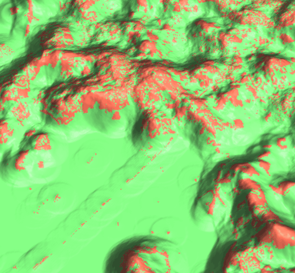

## DESCRIPTION

Tool *r.futures.potsurface* is a support tool for computing
development probability surface based on maps and coefficients selected
by *[r.futures.potential](r.futures.potential.md)*. It computes the
initial probability surface used in the patch growing algorithm in
*[r.futures.simulation](r.futures.simulation.md)*. It is not necessary
to use this tool, however it is useful to inspect the potential
surface to better understand the input data and how the predictors
influence the probability. The values range from 0 (unlikely to be
developed) to 1 (high probability of development).

The inputs are the output file from
*[r.futures.potential](r.futures.potential.md)* and the name of the
**subregions** raster map.

## EXAMPLES

```sh
r.futures.potsurface input=potential.csv subregions=counties output=pot_surface
```

  
*Figure: We can visualize the potential surface in 3D and drape
raster representing developed (red) and undeveloped (green) cells
over it.*

## REFERENCES

- Meentemeyer, R. K., Tang, W., Dorning, M. A., Vogler, J. B.,
  Cunniffe, N. J., & Shoemaker, D. A. (2013). *FUTURES: Multilevel
  Simulations of Emerging Urban-Rural Landscape Structure Using a
  Stochastic Patch-Growing Algorithm*. Annals of
  the Association of American Geographers, 103(4), 785-807. DOI:
  [10.1080/00045608.2012.707591](https://doi.org/10.1080/00045608.2012.707591)
- Dorning, M. A., Koch, J., Shoemaker, D. A., & Meentemeyer, R. K.
  (2015). *Simulating urbanization scenarios reveals tradeoffs between
  conservation planning strategies*.
  Landscape and Urban Planning, 136, 28-39. DOI:
  [10.1016/j.landurbplan.2014.11.011](https://doi.org/10.1016/j.landurbplan.2014.11.011)
- Petrasova, A., Petras, V., Van Berkel, D., Harmon, B. A., Mitasova,
  H., & Meentemeyer, R. K. (2016). *Open Source Approach to Urban Growth
  Simulation*.
  Int. Arch. Photogramm. Remote Sens. Spatial Inf. Sci., XLI-B7,
  953-959. DOI: [10.5194/isprsarchives-XLI-B7-953-2016](https://doi.org/10.5194/isprsarchives-XLI-B7-953-2016)
- Sanchez, G.M., A. Petrasova, A., M.M. Skrip, E.L. Collins,
  M.A. Lawrimore, J.B. Vogler, A. Terando, J. Vukomanovic,
  H. Mitasova, and R.K. Meentemeyer. 2023.
  *Spatially interactive modeling of land change identifies location-specific
  adaptations most likely to lower future flood risk*.
   Sci Rep 13, 18869. DOI: [https://doi.org/10.1038/s41598-023-46195-9](https://doi.org/10.1038/s41598-023-46195-9)

## SEE ALSO

[FUTURES](r.futures.md),
[r.futures.simulation](r.futures.simulation.md),
[r.futures.parallelpga](r.futures.parallelpga.md),
[r.futures.potential](r.futures.potential.md),
[r.futures.devpressure](r.futures.devpressure.md),
[r.futures.demand](r.futures.demand.md),
[r.futures.calib](r.futures.calib.md),
[r.futures.gridvalidation](r.futures.gridvalidation.md),
[r.futures.validation](r.futures.validation.md),
[r.sample.category](r.sample.category.md)

## AUTHORS

*Corresponding author:*
Anna Petrasova, akratoc ncsu edu,
[Center for Geospatial Analytics, NCSU](https://geospatial.ncsu.edu/)

*Original standalone version:*
Ross K. Meentemeyer,
Wenwu Tang,
Monica A. Dorning,
John B. Vogler,
Nik J. Cunniffe,
Douglas A. Shoemaker
(Department of Geography and Earth Sciences, UNC Charlotte)
Jennifer A. Koch
([Center for Geospatial Analytics, NCSU](https://geospatial.ncsu.edu/))

*Port to GRASS and GRASS-specific additions:*
Vaclav Petras,
[NCSU GeoForAll](https://geospatial.ncsu.edu/geoforall/)

*Development pressure, demand, calibration, validation,
preprocessing tools and maintenance:*
Anna Petrasova,
[NCSU GeoForAll](https://geospatial.ncsu.edu/geoforall/)

*Climate forcing submodel:*
Anna Petrasova,
[NCSU GeoForAll](https://geospatial.ncsu.edu/geoforall/)  
Georgina Sanchez,
[Center for Geospatial Analytics, NCSU](https://geospatial.ncsu.edu/)

*Zoning:*
Margaret Lawrimore,
[Center for Geospatial Analytics, NCSU](https://geospatial.ncsu.edu/)  
Anna Petrasova,
[NCSU GeoForAll](https://geospatial.ncsu.edu/geoforall/)
