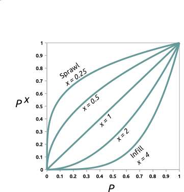
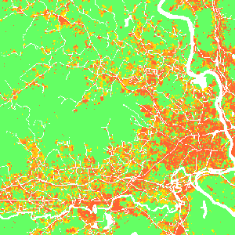
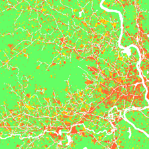
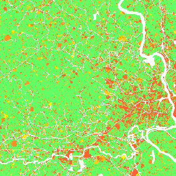
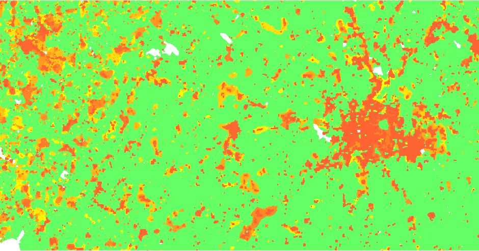
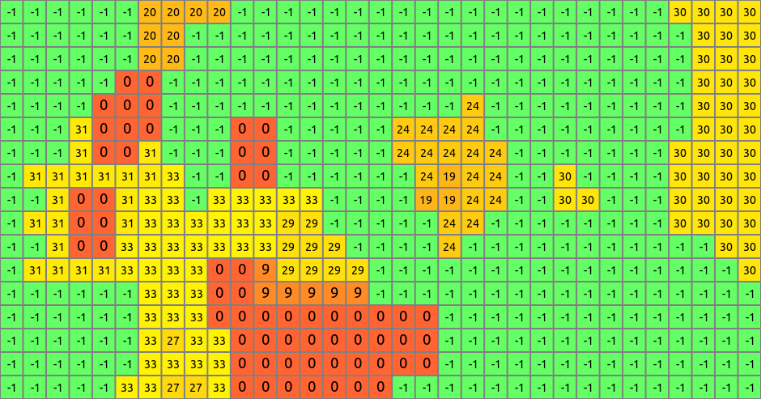

## DESCRIPTION

Tool *r.futures.simulation* is part of [FUTURES](r.futures.md) land
change model. This tool uses stochastic Patch-Growing Algorithm (PGA)
and a combination of field-based and object-based representations to
simulate land changes. PGA simulates undeveloped to developed land
change by iterative site selection and a contextually aware region
growing mechanism. Simulations of change at each time step feed
development pressure back to the POTENTIAL submodel, influencing site
suitability for the next step.

### Patch growing

Patches are constructed in three steps. First, a potential seed is
randomly selected from available cells. In case **seed_search** is
*probability*, the probability value (based on POTENTIAL) of the seed is
tested using Monte Carlo approach, and if it doesn't survive, new
potential seed is selected and tested. Second, using a 4- or 8-neighbor
(see **num_neighbors**) search rule PGA grows the patch. PGA decides on
the suitability of contiguous cells based on their underlying
development potential and distance to the seed adjusted by compactness
parameter given in **compactness_mean** and **compactness_range**. The
size of the patch is determined by randomly selecting a patch size from
**patch sizes** file and multiplied by **discount_factor**. To find
optimal values for patch sizes and compactness, use tool
*[r.futures.calib](r.futures.calib.md)*. Once a cell is converted, it
remains developed. PGA continues to grow patches until the per capita
land demand is satisfied.

### Development pressure

Development pressure is a dynamic spatial variable derived from the
patch-building process of PGA and associated with the POTENTIAL
submodel. At each time step, PGA updates the POTENTIAL probability
surface based on land change, and the new development pressure then
affects future land change. The initial development pressure is computed
using tool *[r.futures.devpressure](r.futures.devpressure.md)*. The
same input parameters of this tool (**gamma**, **scaling factor** and
**n_dev_neighbourhood**) are then used as input for
*[r.futures.simulation](r.futures.simulation.md)*.

### Scenarios

Scenarios involving policies that encourage infill versus sprawl can be
explored using the **incentive_power** parameter, which uses a power
function to transform the probability in POTENTIAL.

  
*Figure: Transforming development potential surface using incentive
tables with different power functions.*



  
*Figure: Effect of incentive table on development probability:
infill (left), status quo (middle), sprawl (right) scenario.*

Additionally, parameter **potential_weight** (raster map from -1 to 1)
enables users to include policies (such as new regulations or fees) which
limit or encourage development in certain areas. Where
**potential_weight** values are lower than 0, the probability surface is
simply multiplied by the values, which results in decreased site
suitability. Similarly, values greater than 0 result in increased site
suitability. The probability surface is transformed from initial
probability *p* with value *w* to `p + w - p * w`.

### Zoning

Parameters **zoning** (raster containing zoning district IDs) and
**zoning_effects** (table containing zoning effects corresponding to
zoning district IDs) enable users to include land use regulations (e.g.,
zoning) which constrain or incentivize development. **zoning** can be
used alone or in combination with **zoning_effects**. If
**zoning_effects** is not provided, any or all of the following zoning
IDs should be present in the **zoning** raster and the predefined zoning
effects are applied.

| Zoning District | Zoning ID | Zoning Effect |
| --- | --- | --- |
| High-Density Residential | 100 | 0 |
| Medium-High Density Residential | 101 | -0.124 |
| Medium Density Residential | 110 | -0.440 |
| Medium-Low Density Residential | 120 | -0.656 |
| Low-Density Residential | 130 | -0.780 |
| Rural Residential | 131 | -0.790 |
| Commercial | 200 | -0.157 |
| Industrial | 201 | -0.026 |
| Office | 202 | -0.127 |
| Parks and Recreation | 203 | -0.817 |
| Mixed Use | 300 | -0.105 |
| Planned Use | 301 | 0.115 |
| Downtown | 302 | -1 |
| No Zoning | 0 | 0 |

Where zoning effects are lower than 0, site suitability is decreased,
when greater than 0 site suitability is increased. For zoning effect
(*w'*) less than 0, site suitability (*p*) is adjusted following
`p(1 - |w'|)`. If zoning effects are greater than 0, site suitability is
adjusted following `p + w' - p * w'`. Note: If part of your study region
does not have zoning, or you do not wish to apply the zoning effect to
part of your study region, you may assign zoning ID 0 to those areas.

Users can also optionally provide unique zoning effects (values between
-1 and 1) or regional stringency values (values between 0 and 2) in
**zoning_effects** table. Stringency values adjust the magnitude of the
effect of each zoning district by region. Values less than 1 reduce the
magnitude of zoning effects while values greater than 1 increase the
magnitude. Given zoning effect *w* and stringency *s*, adjusted zoning
effects *w'* = max(-1, min(1, w \* s)).

Examples of **zoning_effects** table:

Region_ID values in the first column should align with region IDs in
**subregions** raster and zoning ID column headers should align with
zoning IDs in **zoning** raster.

Providing unique zoning IDs (1, 2) and effects, but no regional
stringency (set to 1):

```text
Region_ID,stringency,1,2
1,1,-0.5,0.5
2,1,-0.8,0.3
```

Using default zoning IDs and effects, but providing regional stringency
values:

```text
Region_ID,stringency
1,0.5
2,1.5
```

### Output

After the simulation ends, raster specified in parameter **output** is
written. If optional parameter **output_series** is specified,
additional output is a series of raster maps for each step. Cells with
value 0 represents the initial development, values >= 1 then represent
the step in which the cell was developed. Undeveloped cells have value
-1.

  
*Figure: Output map of developed areas*

  
*Figure: Detail of output map*

### Climate forcing

Climate forcing submodel estimates the probability that a developed
pixel will experience flood damage and the likely adaptation response
(protect and armour, retreat, or stay trapped). Response is based on
flood probability, level of damage, and local estimates of adaptive
capacity. Climate forcing submodel integrates current and future flood
probability and flood depth data with the adaptive capacity of developed
pixels to probabilistically predict flood severity and the response
evoked by flooding in a developed pixel. The model also predicts the
within- or between-county destinations of displaced residents.

The input **flood_maps_file** includes flood depth data for different
flood probabilities for different steps of the simulation:

```text
step,probability,raster
1,0.05,flood_20yr_2020_depth
1,0.01,flood_100yr_2020_depth
1,0.002,flood_500yr_2020_depth
11,0.05,flood_20yr_2030_depth
11,0.01,flood_100yr_2030_depth
11,0.002,flood_500yr_2030_depth
```

Alternatively, if such detailed data are not available, one can use
floodplain raster of given flood return period together with HAND
(Height Above Nearest Drainage) raster (**hand** option) derived from a
DEM to estimate flood depth automatically (experimental). Flood
probablity raster then contains the probability values (e.g., 0.01 for a
100-yr flood).

```text
step,raster
1,flood_probability_2020
11,flood_probability_2030
```

Option **hand_percentile** influences the derived depth, high values (>
90) tend to overestimate the flood depth.

Flood events are stochastically simulated on the level of HUCs (e.g.,
HUC 12), use **huc** input option for raster representation of HUCs. Use
**flood_logfile** to log the simulated flood events into a CSV file for
further information (step, HUC ID, flood probability).

Once a flood event is simulated, local damage is estimated using
flood-damage curves provided in a CSV file in option
**depth_damage_functions**. Its header includes inundation levels in
vertical units. The first column is an id of a subregion given in
**ddf_subregions** and the values are percentages of structural damage.

```text
ID,0.3,0.6,0.9
101,0,15,20
102,10,20,30
```

Once the damage is established, response is stochastically evaluated
based on the **adaptive_capacity** raster with values ranging from -1
(most vulnerable) to 1 (most resilient). Option **response_func**
evaluates the response based on the damage and adaptive capacity, e.g.,
with high damage vulnerable populations are less likely to protect and
armour (adapt) than higly resilient populations. Responses include 1)
retreat resulting in pixel abandonment, 2) stay and adapt, and 3) stay
trapped. When a pixel is abandoned, the **redistribution_matrix** is
used to decide to which subregion the pixel is moved. It contains
probabilities of moving from one subregion to another:

```text
ID,37013,37014,...
37013,0.6,0.01,...
37014,0.05,0.3,...
```

Output file **redistribution_output** can be used to log the
redistribution happening during the simulation.

## EXAMPLE

```sh
r.futures.simulation -s developed=lc96 predictors=d2urbkm,d2intkm,d2rdskm,slope \
  demand=demand.txt devpot_params=devpotParams.csv discount_factor=0.6 \
  compactness_mean=0.4 compactness_range=0.08 num_neighbors=4 seed_search=probability \
  patch_sizes=patch_sizes.txt development_pressure=gdp n_dev_neighbourhood=10 \
  development_pressure_approach=gravity gamma=2 scaling_factor=1 \
  subregions=subregions incentive_power=2 \
  potential_weight=weight_1 output=final_results output_series=development
```

## REFERENCES

- Meentemeyer, R. K., Tang, W., Dorning, M. A., Vogler, J. B.,
  Cunniffe, N. J., & Shoemaker, D. A. (2013). *FUTURES: Multilevel
  Simulations of Emerging Urban-Rural Landscape Structure Using a
  Stochastic Patch-Growing Algorithm*. Annals of
  the Association of American Geographers, 103(4), 785-807. DOI:
  [10.1080/00045608.2012.707591](https://doi.org/10.1080/00045608.2012.707591)
- Dorning, M. A., Koch, J., Shoemaker, D. A., & Meentemeyer, R. K.
  (2015). *Simulating urbanization scenarios reveals tradeoffs between
  conservation planning strategies*.
  Landscape and Urban Planning, 136, 28-39. DOI:
  [10.1016/j.landurbplan.2014.11.011](https://doi.org/10.1016/j.landurbplan.2014.11.011)
- Petrasova, A., Petras, V., Van Berkel, D., Harmon, B. A., Mitasova,
  H., & Meentemeyer, R. K. (2016). *Open Source Approach to Urban Growth
  Simulation*.
  Int. Arch. Photogramm. Remote Sens. Spatial Inf. Sci., XLI-B7,
  953-959. DOI: [10.5194/isprsarchives-XLI-B7-953-2016](https://doi.org/10.5194/isprsarchives-XLI-B7-953-2016)
- Sanchez, G.M., A. Petrasova, A., M.M. Skrip, E.L. Collins,
  M.A. Lawrimore, J.B. Vogler, A. Terando, J. Vukomanovic,
  H. Mitasova, and R.K. Meentemeyer. 2023.
  *Spatially interactive modeling of land change identifies location-specific
  adaptations most likely to lower future flood risk*.
   Sci Rep 13, 18869. DOI: [https://doi.org/10.1038/s41598-023-46195-9](https://doi.org/10.1038/s41598-023-46195-9)

## SEE ALSO

[FUTURES](r.futures.md),
[r.futures.parallelpga](r.futures.parallelpga.md),
[r.futures.devpressure](r.futures.devpressure.md),
[r.futures.potential](r.futures.potential.md),
[r.futures.potsurface](r.futures.potsurface.md),
[r.futures.demand](r.futures.demand.md),
[r.futures.calib](r.futures.calib.md),
[r.futures.gridvalidation](r.futures.gridvalidation.md),
[r.futures.validation](r.futures.validation.md),
[r.sample.category](r.sample.category.md)

## AUTHORS

*Corresponding author:*
Anna Petrasova, akratoc ncsu edu,
[Center for Geospatial Analytics, NCSU](https://geospatial.ncsu.edu/)

*Original standalone version:*
Ross K. Meentemeyer,
Wenwu Tang,
Monica A. Dorning,
John B. Vogler,
Nik J. Cunniffe,
Douglas A. Shoemaker
(Department of Geography and Earth Sciences, UNC Charlotte)
Jennifer A. Koch
([Center for Geospatial Analytics, NCSU](https://geospatial.ncsu.edu/))

*Port to GRASS and GRASS-specific additions:*
Vaclav Petras,
[NCSU GeoForAll](https://geospatial.ncsu.edu/geoforall/)

*Development pressure, demand, calibration, validation,
preprocessing tools and maintenance:*
Anna Petrasova,
[NCSU GeoForAll](https://geospatial.ncsu.edu/geoforall/)

*Climate forcing submodel:*
Anna Petrasova,
[NCSU GeoForAll](https://geospatial.ncsu.edu/geoforall/)  
Georgina Sanchez,
[Center for Geospatial Analytics, NCSU](https://geospatial.ncsu.edu/)

*Zoning:*
Margaret Lawrimore,
[Center for Geospatial Analytics, NCSU](https://geospatial.ncsu.edu/)  
Anna Petrasova,
[NCSU GeoForAll](https://geospatial.ncsu.edu/geoforall/)
