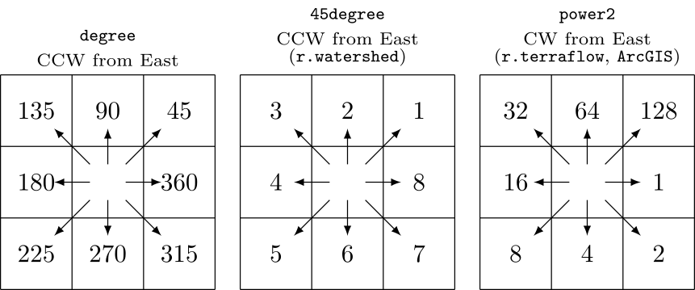
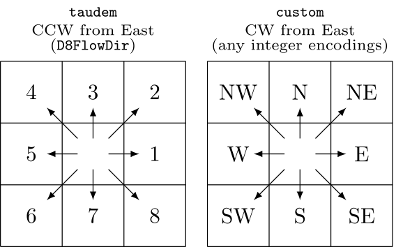
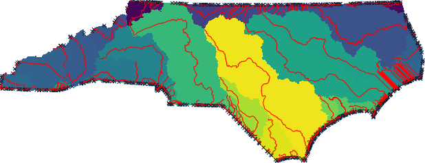

## DESCRIPTION

*r.lfp* calculates the longest flow paths for given outlet points using
the [Memory-Efficient Longest Flow Path
(MELFP)](https://github.com/HuidaeCho/melfp) OpenMP parallel algorithm
by Cho (2025).

## NOTES

*r.lfp* can automatically recognize the following three different
formats of flow directions: **degree**, **45degree**, and **power2**.
The **degree** format starts just above 0° at East (excluding 0° itself)
and goes counterclockwise up to 360°, which also corresponds to East.
The **45degree** format divides the degree format by 45°. The **power2**
format starts from 1 at East and doubles clockwise up to Northeast.



*r.lfp* also supports the **taudem** format, which is used by
[TauDEM](https://github.com/dtarb/TauDEM)'s D8FlowDir. This format is
not auto-detected because it shares the same encoding range of the
**45degree** format. Additionally, the module can accept any integer
encodings with the **custom** format and **encoding** option, which uses
eight numbers for E, SE, S, SW, W, NW, N, and NE. For example, to encode
the **45degree** format using this method, one can use **format=custom
encoding=8,7,6,5,4,3,2,1**.



Unless the **-f** option is specified, *r.lfp* defaults to computing the
longest flow paths within each subwatershed, not crossing through any
outlet points. This default behavior will produce longest flow path
lines that do not overlap among subwatersheds. However, they can still
overlap within a subwatershed if they are of the same length and share
common downstream paths within that subwatershed.

With the **-f** option, the module first computes the longest flow paths
at the subwatershed level, then performs a hierarchical analysis to
derive potentially longer watershed-level flow paths, and finally
eliminates shorter paths from both the subwatershed and hierarchically
merged watershed results.

When parallel processing is enabled with the **nprocs** option, *r.lfp*
uses OpenMP's shared-memory model and the specified number of threads to
parallelize the computation per thread initially (implicit tasking
through looping) and later switch to explicit tasking for better load
balancing as threads start becoming ideal after they finish their
allocated implicit tasks. This loop-then-task approach significantly
improves computational efficiency along with highly reduced memory
usage. In its benchmark experiment, the MELFP algorithm used in this
module achieved a 66% reduction in computation time using 79% lower peak
memory with 33% higher CPU utilization, enabling faster and larger data
processing (Cho, 2025).

## EXAMPLES

These examples use the North Carolina sample dataset.

Extract all draining cells (all outlets for the elevation raster), and
calculate all watersheds and longest flow paths:

```sh
# set computational region
g.region -ap rast=elevation

# calculate drainage directions using r.watershed
r.watershed -s elev=elevation drain=drain

# extract draining cells
r.mapcalc ex="dcells=if(\
        (isnull(drain[-1,-1])&&abs(drain)==3)||\
        (isnull(drain[-1,0])&&abs(drain)==2)||\
        (isnull(drain[-1,1])&&abs(drain)==1)||\
        (isnull(drain[0,-1])&&abs(drain)==4)||\
        (isnull(drain[0,1])&&abs(drain)==8)||\
        (isnull(drain[1,-1])&&abs(drain)==5)||\
        (isnull(drain[1,0])&&abs(drain)==6)||\
        (isnull(drain[1,1])&&abs(drain)==7),1,null())"
r.to.vect input=dcells type=point output=dcells

# delineate all watersheds using r.hydrobasin
r.hydrobasin dir=drain outlets=dcells output=wsheds nproc=$(nproc)

# calculate all longest flow paths
r.lfp dir=drain outlets=dcells lfp=lfp ocol=outlet_cat nproc=$(nproc)

# or using a custom format for r.watershed drainage (8-1 for E-NE CW)
r.lfp dir=drain format=custom encoding=8,7,6,5,4,3,2,1 outlets=dcells lfp=lfp2 ocol=outlet_cat nproc=$(nproc)
```


Perform the same analysis using the statewide DEM, elev_state_500m:

```sh
# set computational region
g.region -ap rast=elev_state_500m

# calculate drainage directions using r.watershed
r.watershed -s elev=elev_state_500m drain=nc_drain

# extract draining cells
r.mapcalc ex="nc_dcells=if(\
        (isnull(nc_drain[-1,-1])&&abs(nc_drain)==3)||\
        (isnull(nc_drain[-1,0])&&abs(nc_drain)==2)||\
        (isnull(nc_drain[-1,1])&&abs(nc_drain)==1)||\
        (isnull(nc_drain[0,-1])&&abs(nc_drain)==4)||\
        (isnull(nc_drain[0,1])&&abs(nc_drain)==8)||\
        (isnull(nc_drain[1,-1])&&abs(nc_drain)==5)||\
        (isnull(nc_drain[1,0])&&abs(nc_drain)==6)||\
        (isnull(nc_drain[1,1])&&abs(nc_drain)==7),1,null())"
r.to.vect input=nc_dcells type=point output=nc_dcells

# delineate all watersheds using r.hydrobasin
r.hydrobasin dir=nc_drain outlets=nc_dcells output=nc_wsheds nproc=$(nproc)

# calculate all longest flow paths
r.lfp dir=nc_drain outlets=nc_dcells lfp=nc_lfp ocol=outlet_cat nproc=$(nproc)

# or using a custom format for r.watershed drainage (8-1 for E-NE CW)
r.lfp dir=nc_drain format=custom encoding=8,7,6,5,4,3,2,1 outlets=nc_dcells lfp=nc_lfp2 ocol=outlet_cat nproc=$(nproc)
```



## SEE ALSO

*[r.hydrobasin](r.hydrobasin.md),
[r.flowaccumulation](r.flowaccumulation.md),
[r.accumulate](r.accumulate.md),
[r.watershed](https://grass.osgeo.org/grass-stable/manuals/r.watershed.html)*

## REFERENCES

Huidae Cho, September 2025. *Loop Then Task: Hybridizing OpenMP
Parallelism to Improve Load Balancing and Memory Efficiency in
Continental-Scale Longest Flow Path Computation.* Environmental
Modelling & Software 193, 106630.
[doi:10.1016/j.envsoft.2025.106630](https://doi.org/10.1016/j.envsoft.2025.106630)

## AUTHOR

[Huidae Cho](mailto:grass4u@gmail-com), New Mexico State University
