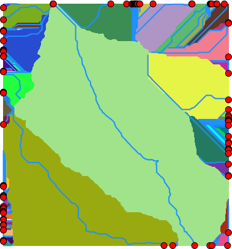

## DESCRIPTION

*r.lfp* calculates the longest flow paths for given outlet points using
the [Memory-Efficient Longest Flow Path
(MELFP)](https://github.com/HuidaeCho/melfp) OpenMP parallel algorithm
by Cho (2025).

## NOTES

*r.lfp* creates a longest flow path vector map using a flow direction
raster map and an outlet point vector map.

## EXAMPLES

These examples use the North Carolina sample dataset.

Create the longest flow path for one outlet:

```sh
# set computational region
g.region -ap raster=elevation

# calculate drainage directions using r.watershed
r.watershed -s elevation=elevation drainage=drain

# extract draining cells
r.mapcalc ex="dcells=if(\
        (isnull(drain[-1,-1])&&abs(drain)==3)||\
        (isnull(drain[-1,0])&&abs(drain)==2)||\
        (isnull(drain[-1,1])&&abs(drain)==1)||\
        (isnull(drain[0,-1])&&abs(drain)==4)||\
        (isnull(drain[0,1])&&abs(drain)==8)||\
        (isnull(drain[1,-1])&&abs(drain)==5)||\
        (isnull(drain[1,0])&&abs(drain)==6)||\
        (isnull(drain[1,1])&&abs(drain)==7),1,null())"
r.to.vect input=dcells type=point output=dcells

# delineate all watersheds using r.hydrobasin
r.hydrobasin dir=drain outlets=dcells output=wsheds nproc=$(nproc)

# calculate all longest flow paths
r.lfp dir=drain outlets=dcells lfp=lfp ocol=outlet_cat nproc=$(nproc)

# or using a custom format for r.watershed drainage (8-1 for E-NE CW)
r.lfp dir=drain format=custom encoding=8,7,6,5,4,3,2,1 outlets=dcells lfp=lfp2 ocol=outlet_cat nproc=$(nproc)
```



## SEE ALSO

*[r.flowaccumulation](r.flowaccumulation.md),
[r.hydrobasin](r.hydrobasin.md), [r.accumulate](r.accumulate.md),
[r.watershed](https://grass.osgeo.org/grass-stable/manuals/r.watershed.html),*

## REFERENCES

Huidae Cho, Accepted in July 2025. *Loop Then Task: Hybridizing OpenMP
Parallelism to Improve Load Balancing and Memory Efficiency in
Continental-Scale Longest Flow Path Computation.* Environmental
Modelling & Software.

## AUTHOR

[Huidae Cho](mailto:grass4u@gmail-com), New Mexico State University
