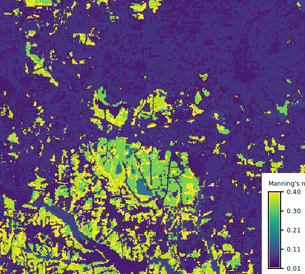

## DESCRIPTION

*r.manning* converts a land cover raster to a Manning's roughness
coefficient raster for use in hydraulic and hydrological modeling.

Manning's roughness coefficient (Manning's n) quantifies the resistance
to flow over a surface and is a key parameter in hydraulic simulations
such as flood modeling, overland flow, and channel flow calculations.

The **input** parameter specifies the land cover raster map. The tool
supports two standard land cover classification systems specified by
**landcover**: NLCD (National Land Cover Database) used in the United States,
and ESA WorldCover used globally.

Manning's coefficients for ESA WorldCover are based on values
used by [QGIS Manning's Roughness Generator plugin by Azzam](https://github.com/mabdazzam/mannings_roughness_generator).
For NLCD, the **source** parameter selects the source
of Manning's n coefficients.

- **kalyanapu**: Values from Kalyanapu et al. (2009), suitable for
  shallow overland flow modeling (flow depths in mm to cm range).
  Available for NLCD only. This is the default for NLCD.
- **hecras**: Values from the HEC-RAS 2D User's Manual, suitable for
  deep flow and floodplain modeling (flow depths > 0.3 m). Available for NLCD.

The **method** parameter controls which roughness estimate to use:

- **low**: Lower bound estimate (minimal surface resistance)
- **medium**: Typical conditions (default)
- **high**: Upper bound estimate (maximum surface resistance)
- **random**: Uniform random value between low and high bounds

For custom land cover classifications, use **landcover=custom** with
a **rules** file in CSV format.

## NOTES

### Source of values

Kalyanapu et al. (2009) does not include ranges for Manning's n values.
These were estimated using 0.75/1.33 multipliers on the original single
values to reflect ranges from Chow (1959).
These multipliers were also used to estimate default values from ranges
in the HEC-RAS 2D User's Manual.

Kalyanapu et al. (2009) does not include NLCD value for cultivated crops,
this tool uses conventional tillage from McCuen (2005).

### Custom rules file

For custom land cover classifications, provide a CSV file with the
**rules** parameter. Two formats are supported:

Single value (used for all methods):

```csv
# code,n
1,0.035
2,0.120
3,0.050
```

Three values (low, medium, high):

```csv
# code,n_low,n_medium,n_high
1,0.025,0.035,0.045
2,0.080,0.120,0.160
3,0.040,0.050,0.060
```

Lines starting with `#` are treated as comments.

### Uncertainty Analysis

Manning's n values are inherently uncertain due to spatial and temporal
variability in vegetation density, surface conditions, and flow characteristics.
The **method=random** option generates spatially uniform random values
between low and high bounds for each land cover class, which can be used
for Monte Carlo uncertainty analysis.

## EXAMPLES

### Basic usage with NLCD land cover

Import NLCD into North Carolina sample dataset and
convert it to Manning's n using Kalyanapu values for
shallow overland flow:

```sh
r.manning input=nlcd_landcover output=mannings_n \
          landcover=nlcd source=kalyanapu
```

  
*Figure: Manning's n values for 2024 NLCD using Kalyanapu et al.*

### Deep flow modeling

Use HEC-RAS values for flood modeling:

```sh
r.manning input=nlcd_landcover output=mannings_n \
          landcover=nlcd source=hecras
```

### ESA WorldCover for global applications

```sh
r.manning input=worldcover output=mannings_n \
          landcover=worldcover
```

### Conservative high roughness estimate

```sh
r.manning input=nlcd_landcover output=mannings_n \
          landcover=nlcd source=kalyanapu method=high
```

### Stochastic Manning's n values

Generate random Manning's n values for stochastic simulation:

```python
from grass.tools import Tools

tools = Tools()

for i in range(100):
    tools.r_manning(
        input="nlcd_landcover",
        output=f"mannings_n_{i}",
        landcover="nlcd",
        source="kalyanapu",
        method="random",
        seed=i,
    )
```

### Integration with r.sim.water

Use the output with GRASS hydrological simulation:

```sh
r.manning input=nlcd_landcover output=mannings_n \
          landcover=nlcd source=kalyanapu

r.sim.water elevation=dem dx=dx dy=dy \
            man=mannings_n depth=water_depth
```

## REFERENCES

- HEC-RAS 2D User's Manual, Version 6.6. U.S. Army Corps of Engineers,
  Hydrologic Engineering Center.
  [https://www.hec.usace.army.mil/software/hec-ras/documentation.aspx](https://www.hec.usace.army.mil/software/hec-ras/documentation.aspx)

- Kalyanapu, A. J., Burian, S. J., and McPherson, T. N. (2009). Effect of
  land use-based surface roughness on hydrologic model output. *Journal
  of Spatial Hydrology*, 9(2), 51-71.
  [https://scholarsarchive.byu.edu/josh/vol9/iss2/2/](https://scholarsarchive.byu.edu/josh/vol9/iss2/2/)

- McCuen, R. H. (2005). *Hydrologic Analysis and Design* (3rd ed.).
  Pearson Prentice Hall.

- Chow, V. T. (1959). *Open-Channel Hydraulics*. McGraw-Hill.

- Azzam, A. QGIS Manning's Roughness Generator plugin.
  [https://github.com/mabdazzam/mannings_roughness_generator](https://github.com/mabdazzam/mannings_roughness_generator)

## SEE ALSO

*[r.sim.water](https://grass.osgeo.org/grass-stable/manuals/r.sim.water.html)*,
*[r.recode](https://grass.osgeo.org/grass-stable/manuals/r.recode.html)*

## AUTHORS

Anna Petrasova, NCSU Center for Geospatial Analytics
