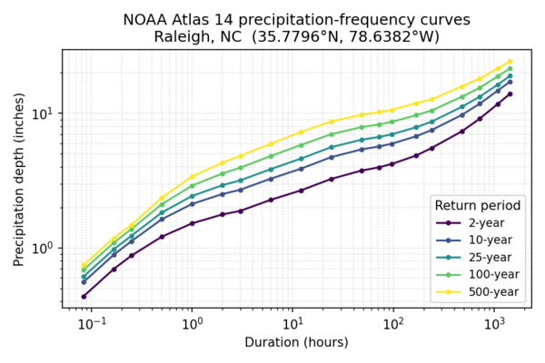

## DESCRIPTION

*r.noaa.atlas14* downloads and imports NOAA Atlas 14 precipitation-frequency
data into GRASS. It supports two acquisition modes:

- **mode=point** queries the NOAA Precipitation Frequency Data Server (PFDS)
  point-query endpoint for one or more longitude/latitude pairs and writes the
  returned precipitation-frequency estimates as JSON or CSV. Optionally, a GRASS
  vector point map is created with the expected/upper/lower tables stored as
  JSON attributes.
- **mode=grid** discovers, downloads, and imports NOAA Atlas 14 GIS-compatible
  grid archives (ZIP) for a given Atlas 14 volume/subregion, optionally filtered
  by duration, average recurrence interval (ARI), bound, statistic, units, and
  series. A manifest CSV describing the imported rasters can be written.

The module retrieves data directly from NOAA's public services:

- PFDS point query: `https://hdsc.nws.noaa.gov/cgi-bin/new/fe_text.csv`
- GIS grid archives: `https://hdsc.nws.noaa.gov/pub/hdsc/data/` (autodiscovery),
  or any user-supplied `archive_url=`.

## NOTES

### Point mode

Point results include the *expected* value and the *upper*/*lower* bounds of
the 90% confidence interval, for each duration/return-period combination
published by NOAA. Use `bound=expected|upper|lower|all` to select the table(s).

`coordinates=` accepts one or more `lon,lat` pairs, e.g.
`coordinates=-78.6382,35.7796,-81.0,29.5`. When `coordinates=` is omitted,
the module queries the center of the current computational region; the
region bounds are reprojected to WGS84 lon/lat via `g.region -b` so this
works from any GRASS location CRS.

  
*Figure: Precipitation-frequency (depth vs. duration) curves for Raleigh,
North Carolina, produced from an `r.noaa.atlas14 mode=point` query to the
NOAA Precipitation Frequency Data Server. Each curve is the expected value
for the labeled return period.*

When multiple points are queried, JSON output is emitted as a list of
per-point result objects, and CSV output prepends `lon,lat,bound` columns so
rows from different points and bounds can be disambiguated. Single-point
output keeps the original unwrapped format for backward compatibility.

The `statistic` option controls whether PFDS returns precipitation *depth* or
*intensity*. The `units` option (`english` or `metric`) and `series` option
(`pds` or `ams` — partial-duration or annual-maximum series) are passed
through to PFDS.

If `vector_output=` is given, the module creates a vector point map with one
feature per queried point and columns `lon`, `lat`, `expected_json`,
`upper_json`, `lower_json`. Point geometries are reprojected from WGS84 into
the current project's CRS, while the `lon`/`lat` columns keep the original
WGS84 coordinates. The JSON
columns contain the full per-duration tables so they can be queried later with
`v.db.select` / `db.select`.

### Grid mode

NOAA organizes Atlas 14 GIS archives under per-volume subdirectories of
`base_gis_url=`, e.g.
`https://hdsc.nws.noaa.gov/pub/hdsc/data/se/` for Volume 9 Southeastern
States. When `region=` is given, autodiscovery fetches the listing at
`<base_gis_url>/<region>/` and parses every `*.zip` href.

Filenames follow a compact convention
`<region><ari>yr<NN><unit>a[l|u][_ams].zip`, e.g.:

- `se2yr24ha.zip` — Southeastern, 2-year ARI, 24-hour, expected, PDS
- `orb1000yr30mau_ams.zip` — Ohio River Basin, 1000-year, 30-minute, upper
  bound, AMS
- `se1000yr60dal.zip` — Southeastern, 1000-year, 60-day, lower bound, PDS

where `<unit>` is `m`, `h`, or `d` (minute/hour/day), bound is absent for the
expected value and `l`/`u` for the lower/upper 90% confidence bounds, and
`_ams` marks the annual-maximum series (absent = partial-duration series).

If autodiscovery fails or a custom mirror is used, pass `archive_url=`
directly with either a `.zip` URL or a directory listing URL that contains
the ZIPs.

The `-l` flag lists matching archives (as JSON lines) without downloading them.

Filtering behavior:

- `durations=` and `aris=` are *strict*: candidates whose duration or ARI
  could not be inferred from the filename are rejected.
- `bound=` and `series=` are *permissive*: a candidate with an unknown attribute
  is allowed through, to avoid discarding rasters whose filenames do not encode
  every attribute.
- `statistic=` and `units=` do **not** filter archives in grid mode. NOAA only
  publishes depth in english units, so the module always downloads that and
  rescales the imported rasters to the requested `statistic`/`units` as output
  targets.

Rasters are imported with `r.in.gdal` by default; pass `-i` to use `r.import`
(which supports reprojection via `resample=`). Pass `-o` to override the
projection check when using `r.in.gdal`. Imported raster names follow the
pattern `<output_prefix>_<statistic>_<bound>_<duration>_<ari>yr_<units>_<series>_<region>`,
with missing parts omitted.

#### Value encoding

NOAA Atlas 14 GIS grids encode precipitation depth as **integer 1000ths of
an inch** in the raw archives. Grid mode converts the imported rasters
automatically, so no manual rescaling is needed: depth is written in inches
(or mm with `units=metric`) and intensity in in/hr (or mm/hr), according to
the requested `statistic` and `units`. The raster `units` and title set by
`r.support` describe the converted values. NODATA cells become GRASS NULLs on
import, so the sentinel value (which varies by volume) does not need to be
handled.

### Safety

Extracted ZIP members are validated against path traversal (zip-slip): any
member whose resolved path escapes the temporary extraction directory causes
the import to abort.

## EXAMPLES

### Point query to CSV

```sh
r.noaa.atlas14 mode=point coordinates=-78.6382,35.7796 \
    statistic=intensity units=english series=pds bound=expected \
    format=csv output=/tmp/raleigh_idf.csv
```

### Point query to JSON and create a vector point

```sh
r.noaa.atlas14 mode=point coordinates=-78.6382,35.7796 \
    statistic=depth units=english series=pds bound=all \
    format=json output=/tmp/raleigh_atlas14.json \
    vector_output=atlas14_raleigh
```

### Multiple points as a single CSV and a multi-point vector

```sh
r.noaa.atlas14 mode=point \
    coordinates=-78.6382,35.7796,-80.8431,35.2271,-77.8868,34.2257 \
    statistic=depth units=english series=pds bound=expected \
    format=csv output=/tmp/nc_cities_idf.csv \
    vector_output=atlas14_nc_cities
```

### Query the center of the current computational region

```sh
g.region raster=elevation
r.noaa.atlas14 mode=point format=json bound=expected
```

### List matching grid archives without importing

```sh
r.noaa.atlas14 mode=grid region=se -l
```

### Import a known archive directly

```sh
r.noaa.atlas14 mode=grid \
    archive_url="https://hdsc.nws.noaa.gov/pub/hdsc/data/se/se100yr24ha.zip" \
    output_prefix=a14 -i
```

### Import filtered subset and write a manifest

```sh
r.noaa.atlas14 mode=grid region=se \
    durations=24hr,2day aris=10,100 bound=expected \
    output_prefix=a14 output=/tmp/a14_manifest.csv -i
```

## REFERENCES

- Bonnin, G. M., D. Martin, B. Lin, T. Parzybok, M. Yekta, and D. Riley (2004–2019),
  NOAA Atlas 14: Precipitation-Frequency Atlas of the United States.
  NOAA, National Weather Service, Silver Spring, Maryland.
- NOAA Precipitation Frequency Data Server (PFDS):
  [https://hdsc.nws.noaa.gov/pfds/](https://hdsc.nws.noaa.gov/pfds/)

## SEE ALSO

- *[r.import](https://grass.osgeo.org/grass-stable/manuals/r.import.html)*,
- *[r.in.gdal](https://grass.osgeo.org/grass-stable/manuals/r.in.gdal.html)*,
- *[r.sim.water](https://grass.osgeo.org/grass-stable/manuals/r.sim.water.html)*,
- *[v.in.ascii](https://grass.osgeo.org/grass-stable/manuals/v.in.ascii.html)*

## AUTHORS

Corey T. White, [NCSU GeoForAll
Lab](https://geospatial.ncsu.edu/geoforall/)
