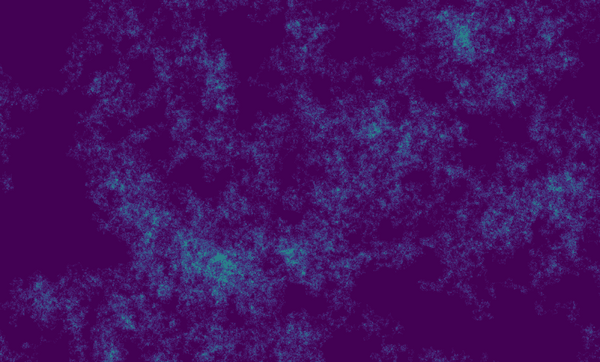

# r.random.walk

GRASS GIS module that calculates a 2D random walk over the computational region.

The module provides control of the number of steps and directions (4 or 8) the walker can take, and allows the walkers behavior to be set to revisit or self-avoiding walk (Madras et al., 1996). The output displays the frequency the walker visited each cell if the walker is allowed to revisit cells. During a self-avoiding walk If the walker behavior is set the starting cell and ending cell are labled.

```bash
r.random.walk -r output=walk_result steps=10000 directions=8
```


