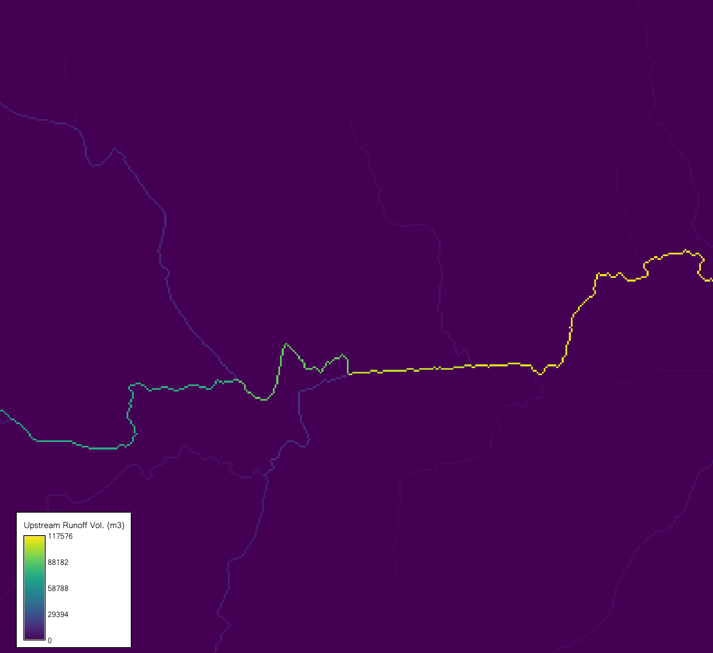

## DESCRIPTION

*r.runoff*  computes event-based runoff using the SCS Curve Number (SCS-CN)
method. For each raster cell, it calculates runoff depth (mm) and per-cell
runoff volume (m³). With a flow-direction raster, it accumulates upstream
contributing area to report total upstream runoff depth and volume. When
storm duration and time of concentration are provided, it estimates time to
peak (time of rise to the hydrograph peak) and peak discharge (m³/s), treating
each cell as a local outlet. The SCS-CN method, developed by the USDA Soil
Conservation Service (now NRCS), relates rainfall, soil hydrologic group, land
cover, and antecedent wetness to storage to partition rainfall into initial
abstraction (loss; represents interception, depression storage, and
infiltration) and direct runoff.

It provides high-level estimates of how rain is partitioned at the land
surface. When it rains, some water infiltrates, some is intercepted or
evaporates, and the remainder becomes runoff. The SCS-CN method uses a Curve
Number (CN) to represent watershed conditions (soil hydrologic group, land
cover, and antecedent runoff condition) and to predict direct runoff. This is
useful for screening-level flood planning and watershed management.

### Inputs

**rainfall:** Required raster of event-total rainfall depth $(P)$ [mm].
Spatially varying precipitation (radar/satellite/gauge regridded). NULL cells
imply no computation there (e.g., data gaps).

**duration:** Optional Storm duration $(D)$ [hours] (scalar). Needed to estimate
time-to-peak and peak discharge. If omitted, timing-based outputs are
skipped.

**curve_number:** Required raster of Curve Number [dimensionless], **$0 \leq CN \leq
100$**. Encodes land cover, soil hydrologic group, and antecedent wetness.
Higher CN equals lower storage, which equals more runoff. Out-of-range values
should be sanitized or masked. See `r.curvenumber` for further information or
generating CN rasters.

**direction:** Flow-direction raster (GRASS-coded; from `r.watershed` or
`r.stream.extract`).
Required for upstream area/volume/depth and peak discharge; defines the drainage
network for accumulation.

**lambda:** Initial abstraction ratio $(\lambda)$ [dimensionless]
($0 \leq \lambda < 0.6$; default 0.2). Controls early losses representing the
initial abstraction ratio, or how much rain is lost to initial soil wetting
before runoff begins ($I_a = \lambda S$). The default 0.2 is a standard
assumption from SCS studies, but you can tweak it with local data (e.g., from
soil surveys) to better match your area’s behavior. This initial loss is
critical because it delays runoff until enough rain overcomes it. Some recent
studies suggest 0.05.

**time_concentration:** Raster of time of concentration $(T_c)$ [h].
Time for runoff from the hydraulically most distant point to reach the pixel; often
estimated (e.g., Kirpich). Required for time-to-peak and peak discharge; NULL where
unknown.

### Outputs

**runoff_depth**: A raster map of event runoff depth per cell [mm],
calculated by the SCS-CN method. The method balances rainfall ($P$) against
soil storage and initial loss using the following equation for Runoff $(Q)$:

$$
Q \;=\;
\begin{cases}
  \dfrac{(P - I_a)^2}{P + I_a - S} & P > \lambda S \\[6pt]
  0, & \text{otherwise}
\end{cases}
$$

where Storage $(S)$ is;

$$
S \;=\; \frac{25400}{CN} - 254
$$
and Initial abstraction $(I_a)$:  

$$
I_a \;=\; \lambda S
$$

**runoff_volume**: A raster map of runoff volumeper cell $[m^3]$. Converts
depth to meters and multiplies by CRS-aware cell area:

$$
V \;=\; \left(\frac{Q}{1000}\right)\,\text{area}_{\text{cell}}
$$

**upstream_area**: A raster map of total drainage area uphill of each cell,
including the cell itself [km²]. This is accumulated using flow direction
with
$A_{\uparrow} = \sum_{\text{upstream}} \frac{\text{area}_{\text{cell}}}{10^6}$,
showing the watershed size feeding into each point—key for understanding flood
risk across a network of cells.

**upstream_runoff_depth**: A raster map of the area-weighted average runoff
depth uphill [mm], calculated as $Q_{\uparrow} =
\frac{V_{\uparrow}}{A_{\uparrow} \cdot 1000}$. It’s zero if no uphill area
exists and NULL if data is missing

**upstream_runoff_volume**: A raster map of total upstream event volume per
cell [m²], summed from per-cell volumes using flow direction as
$V_{\uparrow} \;=\; \sum_{\text{upstream}} V$. This gives a cumulative water total,
critical for large-scale analysis of watershed runoff (e.g. estimating storage
for a dam).

**time_to_peak**: A raster map of time to peak runoff per cell [h], computed
as

$$
t_p \;=\; 0.5\,D \;+\; 0.6\,T_c
$$

where $D$ is duration and $T_c$ is time of concentration. This equation blends
the storm’s length with how long water takes to flow, based on SCS guidelines.
NULL wjere $T_c$ is missing.

**peak_discharge**: A raster map of SCS Peak Discharge $(q_p)$ estimated per
cell (as if each cell was a watershed outlet) $[m³/s]$, computed using the
equation derived from the triangular approximation to the hydrograph and uses
upstream area and upstream-average depth

$$
q_p =
\begin{cases}
0.208\,\dfrac{A_{\uparrow}\,[{km}^2]\; Q_{\uparrow}\,[mm]}{t_p\,[h]}, & t_p > 0,\\[8pt]
0, & t_p \le 0 \ \text{or}\ t_p\ \text{is NULL}.
\end{cases}
$$

**where** $q_p$ is peak discharge [m³/s], $A_{\uparrow}$ is upstream
(contributing) area [km²], $Q_{\uparrow}$ is upstream-average
(area-weighted) runoff depth $[mm]$, $t_p$ is time to peak $[h]$, and $0.208$
is the SCS metric units factor.

## Notes

- **Metric units only.** Inputs are mm and hours; outputs are mm, km², mm, m³,
  and m³/s.
- **Upstream prerequisites.** Any `upstream_*` output requires `direction`.
  Timing outputs require both `time_of_concentration` and `duration`.

## EXAMPLE

```sh
# set the region
g.region -p raster=elevation

# generate the curve number
r.curvenumber landcover=lc_esa soil=hsg landcover_source=esa output=cn

# or generate a random CN raster for the sake of this workflow
r.mapcalc "cn = int(rand(30, 93))" seed=3093 --o

# generate flow direction and stream network
r.watershed elevation=elevation drainage=fdr stream=str threshold=10 --o

# calculate time of concentration
r.timeofconcentration elevation=elevation direction=fdr streams=str tc=tc length_min=100 --o

# generate a random precipitation raster between 15 and 100 mm
# (optional, if you do not have an actual rainfall raster)
r.mapcalc "pcp = int(rand(15, 100))" seed=15100 --o

# compute runoff depth and volume (simple SCS computation; does not require duration, tc or fdr)
r.runoff rainfall=pcp cn=cn lambda=0.2 runoff_depth=runoff_depth runoff_volume=runoff_volume --o

# compute cell by cell and upstream contributing runoff depth, runoff volume, and peak discharge
r.runoff rainfall=pcp duration=1 cn=cn direction=fdr lambda=0.2 tc=tc runoff_depth=runoff_depth ttp=ttp runoff_volume=runoff_volume upstream_area=upstream_area upstream_runoff_depth=upstream_runoff_depth upstream_runoff_volume=upstream_runoff_volume peak_discharge=peak_discharge --o
```

*r.runoff* also prints some important statistics including total
runoff volume, maximum runoff depth, and peak discharge.
For example, terminal output from the last command is;

```text
Computing runoff depth [mm]
Computing per-cell volume [m³]
Total runoff volume: 2028504.82 m³
Maximum runoff depth: 76.68 mm
Computing upstream area [km²] and volume [m³]
Computing upstream-average runoff depth [mm]
Computing time to peak [hours]
Computing peak discharge [m³/s]
Peak discharge (max): 29.477 m³/s
```


*Figure1: Output upstream runoff volume raster from r.runoff sample run on NC
dataset zoomed in near the outlet*

## REFERENCES

1. USDA Soil Conservation Service. 1986. *Urban Hydrology for Small Watersheds
   (TR-55)*, 2nd ed., Washington, DC.
2. Maidment, D. R. (Ed.). 1993. *Handbook of Hydrology*. New York: McGraw-Hill.

## SEE ALSO

[r.curvenumber](https://grass.osgeo.org/grass-stable/manuals/addons/r.curvenumber.html),
[r.timeofconcentration](https://grass.osgeo.org/grass-stable/manuals/addons/r.timeofconcentration.html)

## AUTHORS

[Abdullah Azzam](mailto:mabdazzam@outlook.com)
([CLAWRIM](https://clawrim.isnew.info/), Department of Civil and Environmental
Engineering, New Mexico State University)
