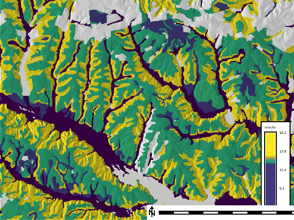
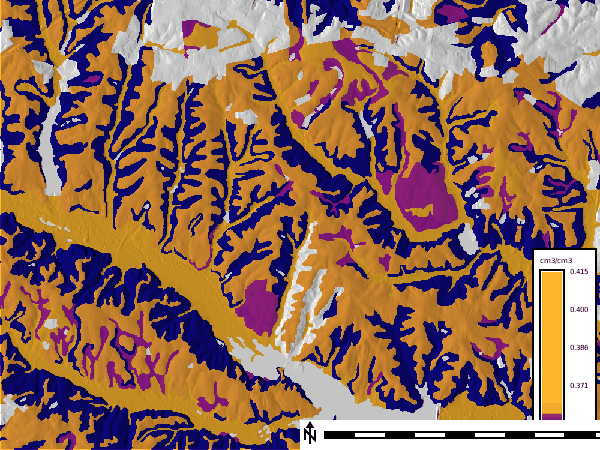

## DESCRIPTION

*r.soils.rosetta* estimates Mualem-van Genuchten soil hydraulic parameters
from soil texture using the ROSETTA pedotransfer model (Schaap et al. 2001;
Zhang and Schaap 2017). It is a raster transform: given per-cell soil texture
maps it predicts, for each cell, the residual water content (**theta_r**),
saturated water content (**theta_s**), the van Genuchten **alpha** and **n**
shape parameters, and the saturated hydraulic conductivity (**ksat**).

The required inputs are the USDA soil texture separates **sand**, **silt**, and
**clay**, each as a percentage (0-100). Prediction accuracy increases as
optional inputs are added, in this fixed order: **bulk_density** (g/cm3),
**water_content_33** (volumetric water content at 33 kPa, cm3/cm3), and
**water_content_1500** (volumetric water content at 1500 kPa, cm3/cm3). The set
of supplied inputs selects the ROSETTA model automatically:

Model | Inputs
----- | ------
2 | sand, silt, clay
3 | + bulk_density
4 | + water_content_33
5 | + water_content_1500

Only the outputs you name are computed. The **ksat** map is written in mm/hr by
default (**ksat_units=mm_per_hour**) so it can be used directly by hydrologic
tools such as *r.sim.water*; set **ksat_units=cm_per_day** for ROSETTA's native
units.

## NOTES

The tool uses the offline
[rosetta-soil](https://pypi.org/project/rosetta-soil/) Python package
(`pip install rosetta-soil`). When the package is not installed it falls back to
the [handbook60.org](https://www.handbook60.org/rosetta) ROSETTA web API, which
requires network access; the offline package is recommended for reproducible
runs. The uncertainty maps produced by the **-u** flag are only available with
the offline package.

ROSETTA reports **alpha**, **n**, and **ksat** as base-10 logarithms and
**ksat** in cm/day; the tool back-transforms these to linear units and converts
**ksat** to the requested units. The **-u** standard-deviation maps for
**alpha**, **n**, and **ksat** remain in log10 space (the standard deviation of
the log10 parameter), while **theta_r** and **theta_s** uncertainties are
linear.

A cell is predicted only where every supplied input map has data; cells that are
NULL in any input are NULL in all outputs. Because ROSETTA output depends only
on the input tuple, the tool predicts each unique combination once, which makes
it efficient on categorical inputs such as SSURGO map units.

ROSETTA is nonlinear, so applying it to depth-aggregated texture is not the same
as aggregating hydraulic parameters computed per horizon. When driving the model
from SSURGO map-unit texture (as in the workflow below), the texture has already
been depth-weighted to a single value per map unit; interpret the result
accordingly.

The tool respects the current computational region and mask and writes outputs
to the current mapset.

## EXAMPLES

### Estimate hydraulic parameters from texture maps

```sh
g.region raster=sand -p
r.soils.rosetta sand=sand silt=silt clay=clay bulk_density=bd \
  theta_s=theta_s alpha=alpha n=n ksat=ksat version=3
```

### Complete workflow: SSURGO to SIMWE

Import SSURGO with *r.in.ssurgo*, which writes depth-weighted texture and
bulk-density rasters, estimate Ksat with *r.soils.rosetta*, then run overland
flow with *r.sim.water*.

```sh
g.region raster=elevation -p

# Import SSURGO texture and bulk density for the top 25.4 cm.
r.in.ssurgo ssurgo_path=wss_SSA.zip soils=soils \
  sand=sand silt=silt clay=clay bulk_density=bd \
  hzdept_r=0 hzdepb_r=25.4

# Predict saturated hydraulic conductivity (mm/hr).
r.soils.rosetta sand=sand silt=silt clay=clay bulk_density=bd \
  ksat=ksat_vg version=3 ksat_units=mm_per_hour

# Partial derivatives of the surface for the flow solver.
r.slope.aspect elevation=elevation dx=dx dy=dy
```

  
*Figure: ROSETTA-estimated saturated hydraulic conductivity (mm/hr) from
SSURGO texture and bulk density over shaded relief (NC sample dataset, Lake
Wheeler area). Low-conductivity alluvial soils trace the drainage network;
gray areas are map units without soil data.*

  
*Figure: ROSETTA-estimated saturated water content theta_s (cm3/cm3) for the
same area.*

Ksat then enters *r.sim.water* in one of two ways. Both interpret Ksat as the
steady-state infiltration rate; do not use both at once or infiltration is
counted twice.

Variant 1: supply Ksat as the infiltration loss on flowing water (**infil**):

```sh
r.sim.water elevation=elevation dx=dx dy=dy \
  rain_value=50 infil=ksat_vg man_value=0.1 \
  depth=depth discharge=discharge -t
```

Variant 2: fold Ksat into the rainfall excess (**rain**) and leave **infil**
off. Rainfall excess is rainfall intensity minus infiltration, in mm/hr:

```sh
r.mapcalc "rain_excess = max(0.0, 50.0 - ksat_vg)"
r.sim.water elevation=elevation dx=dx dy=dy \
  rain=rain_excess man_value=0.1 \
  depth=depth discharge=discharge -t
```

## REFERENCES

- Schaap, M.G., Leij, F.J., and van Genuchten, M.T. (2001). ROSETTA: a computer
  program for estimating soil hydraulic parameters with hierarchical
  pedotransfer functions. *Journal of Hydrology* 251(3-4): 163-176.
- Zhang, Y. and Schaap, M.G. (2017). Weighted recalibration of the Rosetta
  pedotransfer model with improved estimates of hydraulic parameter
  distributions and summary statistics (Rosetta3). *Journal of Hydrology* 547:
  39-53.

## SEE ALSO

*[r.in.ssurgo](r.in.ssurgo.md)* for importing SSURGO texture and Ksat,
*[r.sim.water](https://grass.osgeo.org/grass-stable/manuals/r.sim.water.html)* for overland flow simulation,
*[r.slope.aspect](https://grass.osgeo.org/grass-stable/manuals/r.slope.aspect.html)* for surface derivatives

## AUTHORS

Corey T. White, Center for Geospatial Analytics, NC State University
