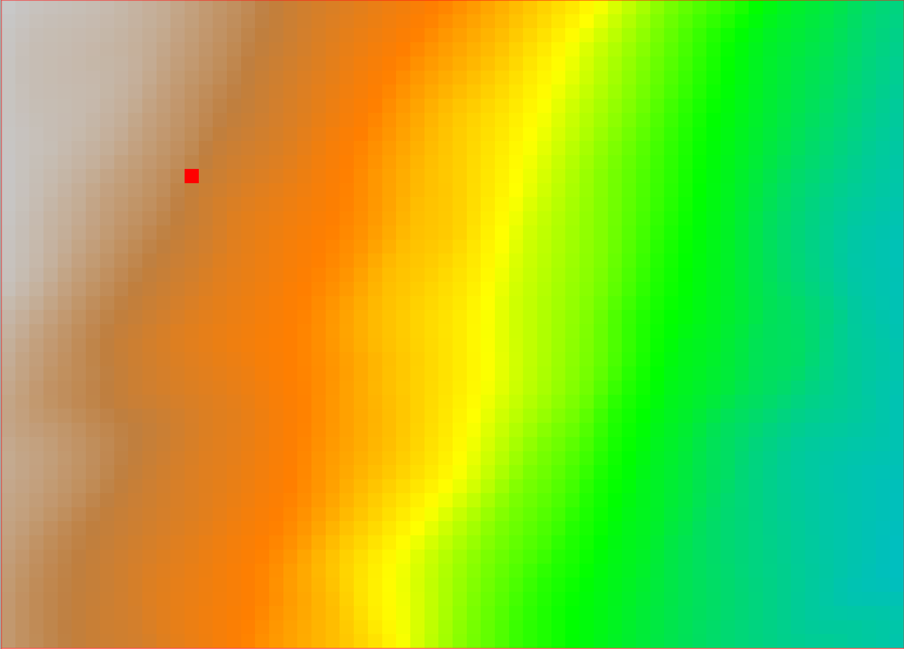
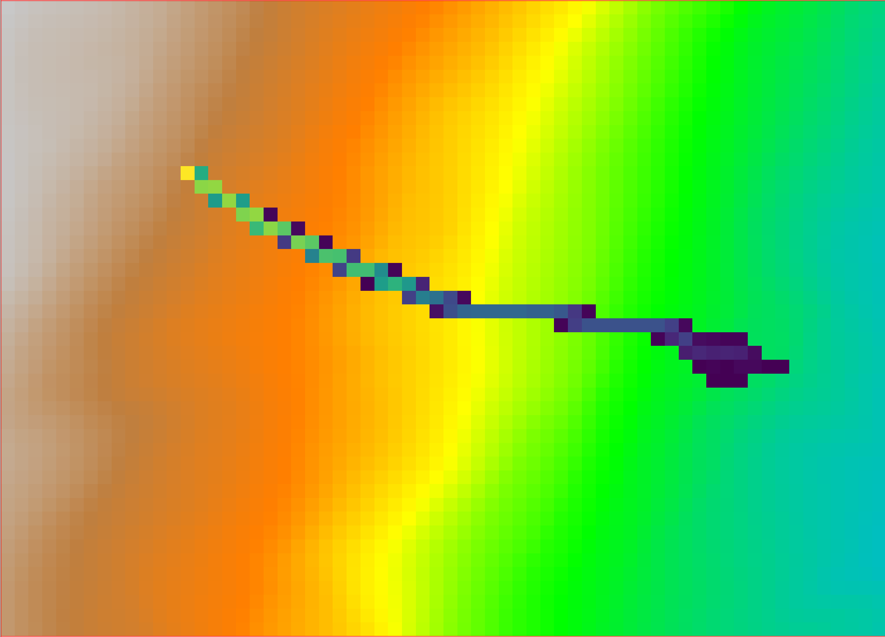

## DESCRIPTION

*r.stone* tries to model tri-dimensional paths of stones falling down a DTM.

Input DTM is a square fixed spaced DTM, but it is used as a Triangular Regular
Network. Triangles are built on the fly during run-time.

Paths are evaluated using parametric 2nd order equations after a
roto-translation of the coordinate system to the run-time triangle.

### Example usage

```bash
r.stone dem_raster=dem sources_raster=sources nrest_raster=nrest 
        trest_raster=trest friction_raster=friction stop_vel=1
        counters_raster=outcounter
```

Where:

- **dem_raster** is the input digital elevation model.
- **sources_raster** is the input sources raster.
  - This raster is used to define the start and stop points of the rock falls.
    Positive values indicate the source areas of rock falls, while a value of
    -1 indicates areas where rocks must stop, such as for example a lake.
- **nrest_raster** is the Normal Elasticity raster map.
  - This raster contains values of normal (vertical) restitution coefficient,
    used at impact points. Accepted values are from 0 (total energy dumping)
    to 100 (elastic restitution). Values are expressed in integer percentage.
- **trest_raster** is the Tangential Elasticity raster map.
  - This raster contains values of tangential (horizontal) restitution
    coefficient, used at impact points. Accepted values are from 0 (total
    energy dumping) to 100 (elastic restitution). Values are expressed in
    integer percentage.
- **friction_raster** is the Friction raster map.
  - This raster contains values of the rolling friction angle (tan(beta)).
    - Example Frictions:
      - For alluvial deposits, where the friction is high: beta = 40.4,
        tan(beta) = 0.85
      - For bedrock, where the friction is low: beta = 16.7, tan(beta) = 0.30
- **stop_vel** is the parameter used to define the minimum velocity for a rock
  to be considered in motion. A velocity lower than the one specified here
  causes the boulder to stop.
- **counters_raster** is the output raster of the number of stones that passed
  through a cell.

See the module's manual page for more details.

### Sample output

The following images show the output of the *r.stone* module.

The starting point is a simple, artificially generated DEM and a single source
point (plus the elasticity and friction rasters):



The counters output raster shows the number of stones that passed through each
cell and looks like the following:



The algorithm is based on the work of Fausto Guzzetti, Giovanni Crosta,
Riccardo Detti, Federico Agliardi (2002): STONE: a computer program for the
three-dimensional simulation of rock-falls.
*Computers & Geosciences*, 28(9), 1079-1093.
[https://doi.org/10.1016/S0098-3004(02)00025-0](
  https://doi.org/10.1016/S0098-3004(02)00025-0)

## AUTHOR

Fausto Guzzetti and Massimiliano Alvioli
