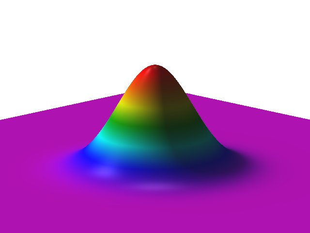
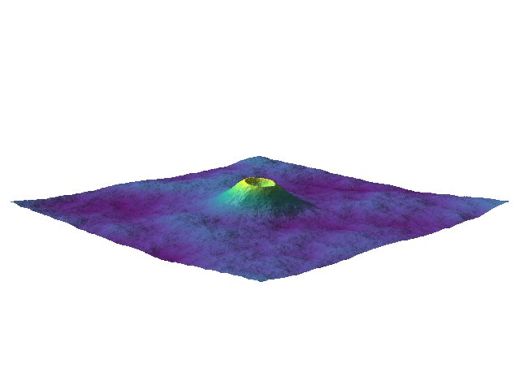

## DESCRIPTION

*r.surf.volcano* creates an artificial surface resembling a seamount or cone
volcano. The user can alter the size and shape of the mountain and optionally
roughen its surface.

## NOTES

The friction of distance controls the shape of the mountain when using the
default polynomial method. Higher values generate steeper slopes.

The *pseudo*-**kurtosis** factor is used with all other methods to control the
slope steepness. For the Gaussian method, setting the value nearer to zero
creates a flatter surface, while higher values generate steeper slopes. For
Lorentzian, logarithmic, and exponential methods, the opposite is true.

The surface roughness factor controls the fixed standard deviation distance
(**sigma**) used in the Gaussian random number generator. It is only used when
the **-r** roughen surface flag is turned on. A value closer to zero makes a
smoother surface, a higher value makes a rougher surface.

It is possible to set a negative value for the **peak** in order to create a pit.

## EXAMPLES

### Create a simple Gaussian bell

```bash
r.surf.volcano -r output=seamount method=gaussian

# view in the display monitor
r.colors seamount color=roygbiv
d.rast seamount

# render in 3D
m.nviz.image elevation_map=seamount out=gaussian \
  perspective=10 resolution_fine=1 height=3500
pnmtopng gaussian.ppm > gaussian.png

# export to Matlab
r.out.mat in=seamount out=seamount.mat

# integrate into existing DEM
r.mapcalc "seamount_dem = if(seamount > dem, seamount, dem)"
r.colors seamount_dem color=srtm
```

[](r_surf_volcano_gaussian.jpg)
*Gaussian bell*

### Create a roughened volcano with a crater

```bash
r.surf.volcano -r output=volcano crater=250 --verbose
r.relief in=volcano out=volcano.shade
```

### Create a fancy 3D scene

```bash
r.surf.volcano -r output=base_volcano peak=1000 crater=200
r.surf.fractal output=base_fractal
r.mapcalc "artificial_land = base_volcano*3.5 + base_fractal"

m.nviz.image elevation_map=artificial_land out=volcano3D \
  perspective=25 resolution_fine=1 height=30000
pnmtopng volcano3D.ppm > volcano3D.png

```

[](r_surf_volcano_volcano3D.jpg)
*Synthetic volcano from r.surf.volcano combined with fractal landscape from r.surf.fractal*

## SEE ALSO

* *[r.surf.fractal](https://grass.osgeo.org/grass-stable/manuals/r.surf.fractal.html)*
* *[r.surf.gauss](https://grass.osgeo.org/grass-stable/manuals/r.surf.gauss.html)*
* *[r.surf.random](https://www.google.com/search?q=https://grass.osgeo.org/grass-stable/manuals/r.surf.random.html)*

## AUTHOR

Hamish Bowman

*Dept. of Geology*
*University of Otago*
*Dunedin, New Zealand*
