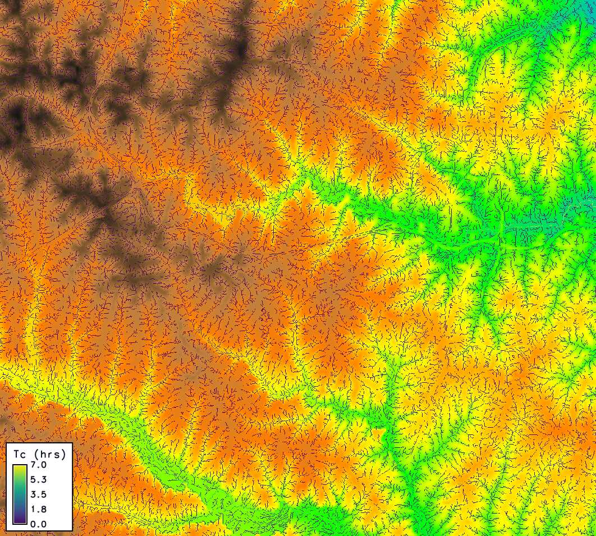

## DESCRIPTION

*r.timeofconcentration* generates a raster map of time of
concentration (Tc) [h] for each cell, using the Kirpich equation based on the
longest upstream flow-path length and path-average slope. This method, rooted
in hydrologic practice, estimates how long it takes water to travel from the
farthest point in a watershed to a given cell, aiding in runoff and flood
analysis. The tool leverages elevation and flow direction data, optionally
deriving streams if not provided, and supports diagnostic outputs like flow
length and slope. All measurements use metric units ([m], [h]).

It simplifies water travel time estimation for high-level watershed planning:
water flows downhill along paths defined by terrain, and Tc reflects the
slowest route’s duration, influenced by distance and slope steepness. This is
key for understanding how quickly runoff reaches streams or outlets.

### Inputs

**elevation:** Raster of elevation [m]. Required input to derive terrain
slopes and flow paths.

**direction:** Flow-direction raster (GRASS-coded; from `r.watershed` or
`r.stream.extract`). Required to trace upstream flow paths; defines the
drainage network for accumulation.

**streams:** Stream raster and **must be consistent** with `direction` (i.e.,
produced from the same run of `r.watershed` or from `r.stream.extract` on the
same DEM).

**outlets:** Optional raster of outlet points; Tc is computed only at these
cells (NULL elsewhere), respecting the current mask/region.

**slope_min:** Minimum path-average slope [unitless] ($10^{-4}$ default).
Prevents division by zero on flat areas by setting a floor value.

**length_min:** Minimum upstream flow-path length [m] ($10$ default). Ensures
Tc is reported only where flow paths are significant.

**vertical_units:** optional parameter that defines the vertical units of the
elevation raster. It accepts three values: `meters`, `feet`, or `factor`, and
defaults to `meters`. When `vertical_units=meters`, no conversion is applied.
When `vertical_units=feet`, elevation drops are multiplied by `1/3.28084` to
convert them to meters. When `vertical_units=factor`, the module multiplies
elevation drops by the user-supplied factor.

**factor:** Required only when `vertical_units=factor`. It must convert the
user’s vertical unit to meters (`factor × <your vertical unit> = meters`), and
the user is responsible for providing the correct factor.

### Outputs

**output:** A raster map of time of concentration per cell [h], computed using
the Kirpich equation:

$$
T_c \;=\; \frac{K \cdot L^a \cdot S_{\text{avg}}^b}{60}
$$

where $L$ is upstream flow-path length [m], $S_{\text{avg}}$ is path-average
slope [unitless], $K = 0.01947$, $a = 0.77$, $b = -0.385$ are Kirpich
constants, and the result is converted from minutes to hours by dividing by 60.
Tc is NULL if L < length_min or outlets are undefined.

**length:** Optional output raster of longest upstream flow-path length per
cell [m], derived from `r.stream.distance`.

**drop:** Optional output raster of flow-path elevation drop per cell [m]
($\geq 0$), computed as the maximum elevation difference.

**sbar:** Optional raster of path-average slope per cell [unitless], calculated
as $S_{\text{avg}} = \max(\frac{\Delta z}{L}, \text{slope}_\text{{min}})$,
where $\Delta z$ is the drop and $L$ is the length.

## Notes

- **CRS-aware distance** `r.stream.distance` returns lengths in meters,
  even if the CRS is geographic or projected (meters or feet).
- **Static Tc** Tc is a steady-state estimate; no temporal
  routing or storage is modeled.

## EXAMPLE

These examples use the North Carolina sample dataset.

Calculate time of concentration using r.watershed and r.timeofconcentration:

```sh
# set the region
g.region -p raster=elevation

# calculate positive flow accumulation and drainage directions using r.watershed
r.watershed -sa elevation=elevation drainage=fdr stream=str threshold=10

# compute the time of concentration
r.timeofconcentration elevation=elevation direction=fdr streams=str tc=tc_nc

# use length_min parameter for coarser tc on important streams only
r.timeofconcentration elevation=elevation direction=fdr streams=str tc=tc_nc_250 length_min=250

# if the vertical units of the DEM are in feet
r.timeofconcentration elevation=elevation vunits=feet dir=fdr str=str tc=tc

# if the vertical units of the DEM are in units other than meters or feet (e.g., cm)
r.timeofconcentration elevation=elevation vunits=factor factor=0.01 dir=fdr str=str tc=tc
```


*Figure: Output from r.timeofconcentration with length_min=250 on NC dataset
zoomed near the watershed outlet*

## REFERENCES

1. Kirpich, Z. P. (1940). Time of concentration of small agricultural
   watersheds. Civil Eng., 10(6), 362.
2. United States Department of Agriculture, Natural Resources Conservation
   Service. (2008). National Engineering Handbook, Part 630 Hydrology: Chapter
   15 – Time of Concentration (210-VI-NEH)

## SEE ALSO

[r.watershed](https://grass.osgeo.org/grass-stable/manuals/r.watershed.html),
[r.stream.distance](https://grass.osgeo.org/grass64/manuals/addons/r.stream.distance.html)

## AUTHORS

[Abdullah Azzam](mailto:mabdazzam@outlook.com)
([CLAWRIM](https://clawrim.isnew.info/), Department of Civil and Environmental
Engineering, New Mexico State University)
