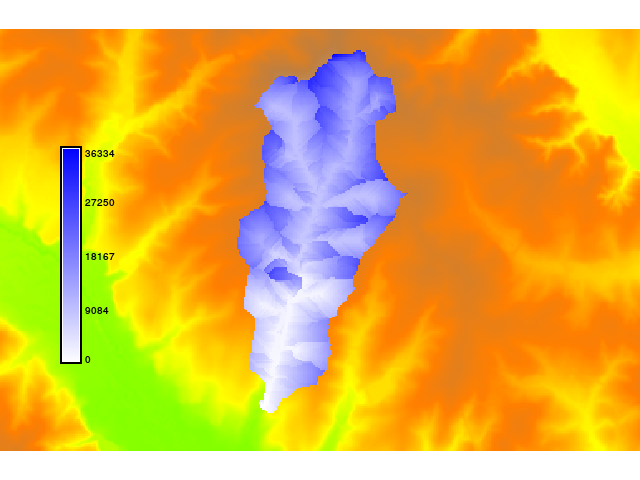

## DESCRIPTION

*r.traveltime* computes the travel time of surface runoff to an outlet.
The program starts at the basin outlet and calculates the travel time
for each raster cell recursively. A drainage area related threshold
considers either surface runoff or channel runoff. Travel times are
derived by assuming kinematic wave approximation.  
In order to derive channel flow velocities, an equilibrium discharge for
each cell is calculated (Q=Area\*specific discharge).  
The results can be used to derive a time-area function. This might be
useful for precipitation-runoff calculations (estimation of flood
predictions) with a lumped hydrological model (user-specified unit
hydrograph).

## REMARKS

The program ist restricted to SI units (meters). The algorithm is
recursive. Maybe it will not work with extensive datasets. It is assumed
that the minimum slope is 0.001. For smaller gradients the program uses
this value.  
Please not that the flow accumulation map must be defined as single
direction. Multiple flow directions are not supported. Thus, the "SFD
(D8) flow" option has to be set if, e.g., the r.watershed module is used
to generate the input files (parameter s). The flow accumulation map
should include positive values only (-a of r.watershed). Flow direction
definitions are in accordance to the r.fill.dir program using the
"agnps" format option.

## KNOWN ISSUES

The program does not work correctly if Manning's roughness grid is
defined as double (float expected). To define a simple uniform roughness
distribution try: r.mapcalc 'roughness = 0.1f'
Some users reported void spaces in results, which might be caused by
problem areas identified by r.fill.dir. The solution is explained in
the r.fill.dir documentation: "In some cases it may be necessary to
run r.fill.dir repeatedly (using output from one run as input to the
next run) before all of problem areas are filled."
If catchment boundaries are located in flat areas, the flow direction
from r.fill.dir might differ from drainage directions from r.watershed,
since both modules identify direction in a different manner. Converting
the drainage map to the "agnps" format to be used as input to r.traveltime
(direction) could help to overcome this limitation:

```sh
r.mapcalc "drain_agnps2 = if(drainage == 1, 2, \
                          if(drainage == 2, 1, \
                          if(drainage == 3, 8, \
                          if(drainage == 4, 7, \
                          if(drainage == 5, 6, \
                          if(drainage == 6, 5, \
                          if(drainage == 7, 4, \
                          if(drainage == 8, 3, null()))))))))"
```

## EXAMPLE

*This example uses the North Carolina sample dataset.*

```sh
g.region raster=elevation
r.mapcalc "n = 0.1f"
r.fill.dir input=elevation output=fill direction=flowdir format=agnps
r.fill.dir input=fill output=fill2 direction=flowdir2 format=agnps
r.watershed -a -s elevation=fill2 accumulation=accu
r.traveltime --overwrite dir=flowdir2 accu=accu dtm=fill2 manningsn=n \
    out_x=634613 out_y=217014 threshold=250 b=3 nchannel=0.03 slopemin=0.01 \
    dis=900 out=ttime
r.colors ttime colors=blues
```

  

## SEE ALSO

*[r.watershed](https://grass.osgeo.org/grass-stable/manuals/r.watershed.html),
[r.fill.dir](https://grass.osgeo.org/grass-stable/manuals/r.fill.dir.html)*  

## REFERENCES

- Förster, K., (2026): *r.traveltime – historical technical description.*
    Software documentation. Zenodo.
    [https://doi.org/10.5281/ZENODO.22226846](https://doi.org/10.5281/ZENODO.22226846)
- Kilgore, J. L. (1997): *Development and evaluation of a GIS-based
    spatially distributed unit hydrograph model*, master thesis,
    Virginia Polytechnic Institute and State University.
- Melesse, A. M., Graham, W. D. (2004): *Storm runoff predicition
    based on a spatially distributed travel time method utilizing remote
    sensing and GIS*, Journal of the American Water Resources
    Association, 8, 863-879.
- Muzik, I. (1996): *Flood modelling with GIS-derived distributed unit
    hydrographs*, Hydrological Processes, 10, 1401-1409.

## AUTHOR

Kristian Foerster
