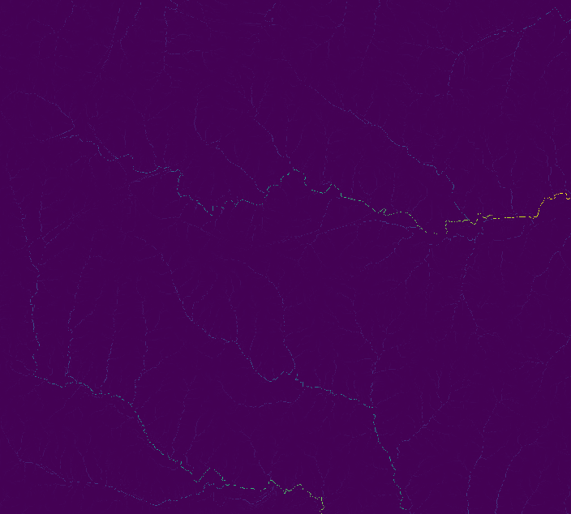
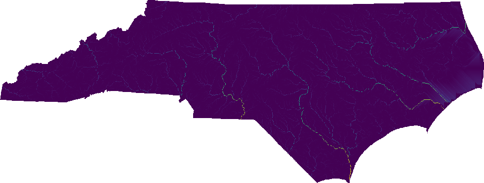

## DESCRIPTION

r.upflowlength calculates upstream flow length using the
[Memory-Efficient Upstream Flow Length](https://github.com/HuidaeCho/meufl)
OpenMP parallel algorithm by Cho (2026).

## NOTES

*r.upflowlength* can automatically recognize the following three different
formats of flow directions: **degree**, **45degree**, and **power2**. The
**degree** format starts just above 0° at East (excluding 0° itself) and goes
counterclockwise up to 360°, which also corresponds to East. The **45degree**
format divides the degree format by 45°. The **power2** format starts from 1 at
East and doubles clockwise up to Northeast.


*r.upflowlength* also supports the **taudem** format, which is used by
[TauDEM](https://github.com/dtarb/TauDEM)'s D8FlowDir. This format is not
auto-detected because it shares the same encoding range of the **45degree**
format. Additionally, the module can accept any integer encodings with the
**custom** format and **encoding** option, which uses eight numbers for E, SE,
S, SW, W, NW, N, and NE. For example, to encode the **45degree** format using
this method, one can use **format=custom encoding=8,7,6,5,4,3,2,1**.


When parallel processing is enabled with the **nprocs** option,
*r.upflowlength* uses OpenMP's shared-memory model and the specified number of
threads to parallelize the computation.

## EXAMPLES

These examples use the North Carolina sample dataset.

Extract all draining cells (all outlets for the elevation raster), and
calculate all watersheds and longest flow paths:

```sh
# set computational region
g.region -ap rast=elevation

# calculate drainage directions using r.watershed
r.watershed -s elev=elevation drain=drain

# calculate upstream flow length
r.upflowlength input=drain output=uflen

# or using a custom format for r.watershed drainage (8-1 for E-NE CW)
r.upflowlength input=drain format=custom encoding=8,7,6,5,4,3,2,1 output=uflen2
```



Perform the same analysis using the statewide DEM, elev_state_500m:

```sh
# set computational region
g.region -ap rast=elev_state_500m

# calculate drainage directions using r.watershed
r.watershed -s elev=elev_state_500m drain=nc_drain

# calculate upstream flow length
r.upflowlength input=nc_drain output=nc_uflen

# or using a custom format for r.watershed drainage (8-1 for E-NE CW)
r.upflowlength input=nc_drain format=custom encoding=8,7,6,5,4,3,2,1 output=nc_uflen2
```



## SEE ALSO

*[r.hydrobasin](r.hydrobasin.html),
[r.lfp](r.lfp.html),
[r.flowaccumulation](r.flowaccumulation.html),
[r.accumulate](r.accumulate.html),
[r.watershed](https://grass.osgeo.org/grass-stable/manuals/r.watershed.html)*

## REFERENCES

Huidae Cho, Accepted in May 2026. *Flow in Float: Memory-Efficient Upstream
Flow Length Parallel Computation Using an IEEE-754-Based Union Encoding.*
Environmental Modelling & Software, 107045.
[doi:10.1016/j.envsoft.2026.107045](https://doi.org/10.1016/j.envsoft.2026.107045).

## AUTHOR

[Huidae Cho](mailto:grass4u@gmail-com)
([HydroCS](https://hydro.isnew.info/), New Mexico State University)
