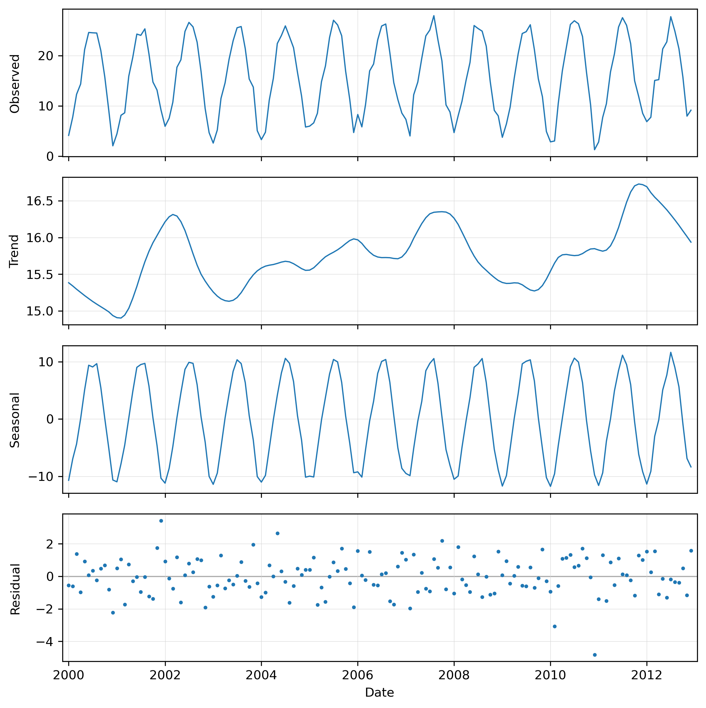
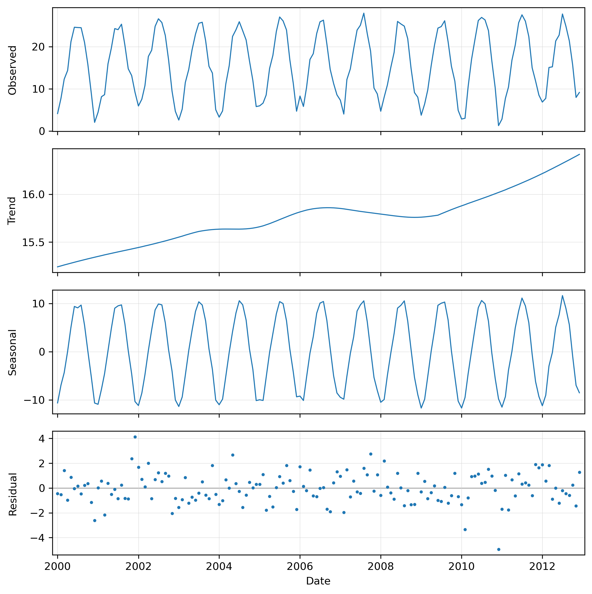
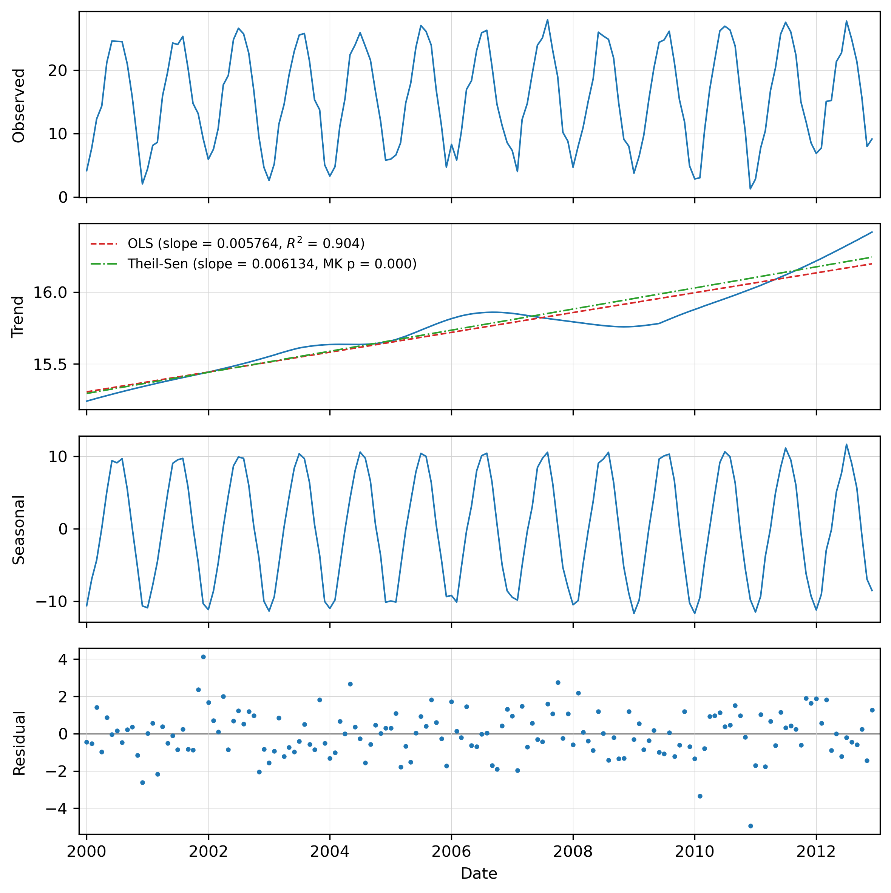
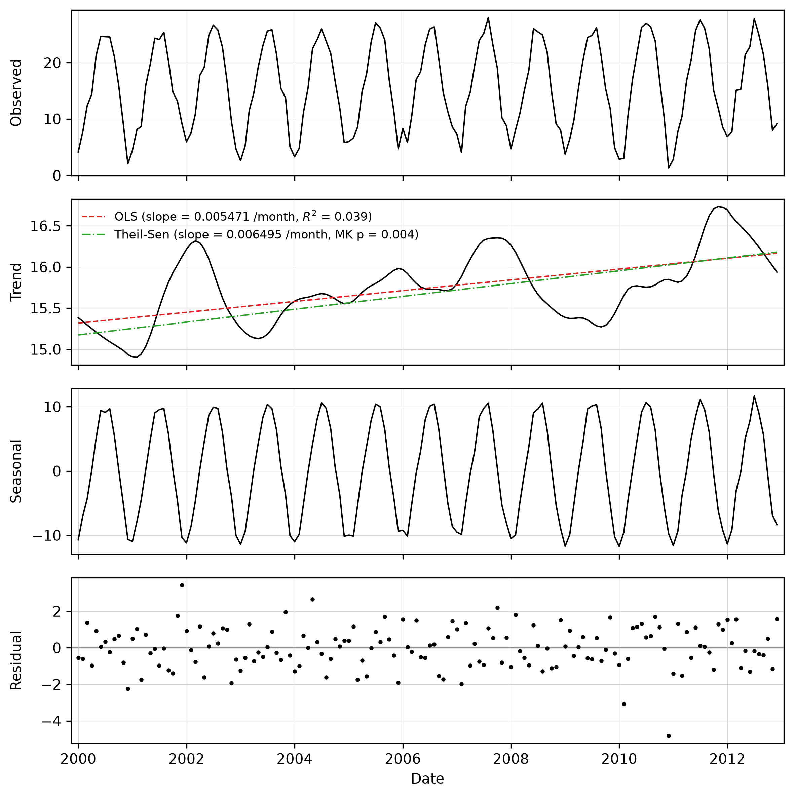
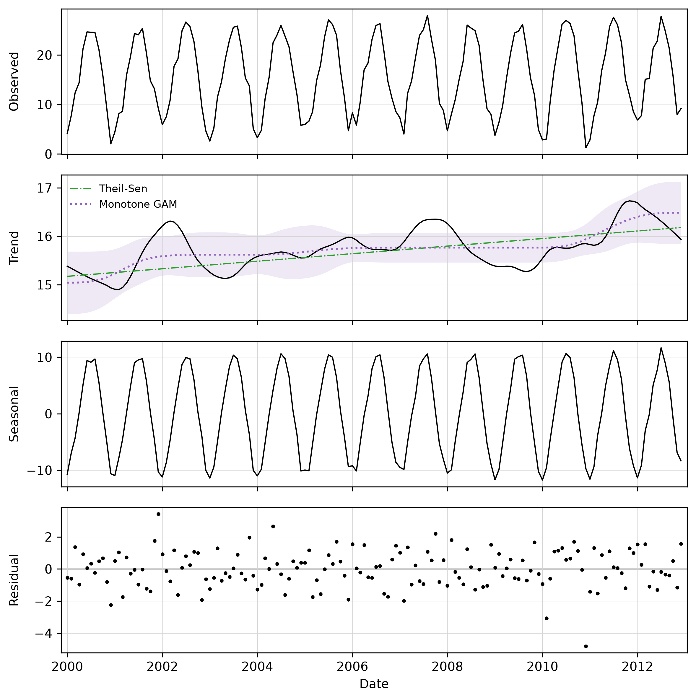
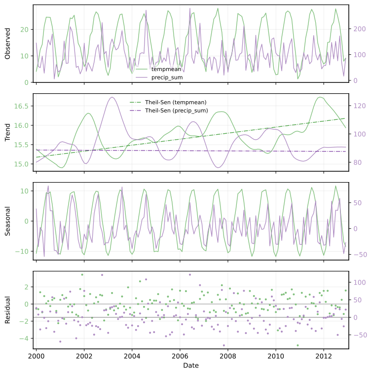

## DESCRIPTION

*t.rast.stl* extracts the time series of a single user-selected point from a
space-time raster dataset (strds), runs an **STL decomposition** (Seasonal-Trend
decomposition using LOESS) on it, and produces a multi-panel plot of the
observed series together with its *trend*, *seasonal* and *residual* (remainder)
components. Optionally, one or more trend regressions are fitted to the
deseasonalized series and drawn on the trend panel: an ordinary least-squares
(OLS) line, a robust Theil-Sen line, and/or a shape-constrained (monotone)
Generalized Additive Model (GAM) curve.

The module is a standalone tool that works on any strds, with either absolute
(calendar-dated) or relative (integer-stepped) time. Internally it uses
*[t.rast.what](t.rast.what.md)* to sample the pixel value at every registered
timestep, regularizes the resulting irregular series onto an evenly spaced time
axis (a hard requirement of STL), and then runs
[statsmodels.tsa.seasonal.STL](https://www.statsmodels.org/stable/generated/statsmodels.tsa.seasonal.STL.html).

### About STL

Environmental time series derived from remote sensing, like a vegetation index,
land surface temperature, snow cover, or soil moisture, are normally composed
of:

- a repeating **seasonal** pattern, e.g. vegetation greening up every spring and
  senescing every autumn;
- a slower **trend**, e.g. a multi-year changes such as recovery after a
  disturbance, or climate change;
- short-term **residual** variation that is left over once season and trend are
  removed. This can be noise from weather, sensor noise, residual cloud
  contamination, or one-off events such as a fire or a flood.

STL is a procedure that separates these three temporal patterns. It models the
observed value at each date as

```text
observed = trend + seasonal + residual
```

It estimates the trend and seasonal patterns by repeatedly fitting **LOESS**
(LOcally Estimated Scatterplot Smoothing) curves. These are flexible local
regressions that follow the data without assuming a fixed global functional
shape. STL is robust, handles long seasonal cycles, and (in its robust variant)
can down-weight outliers such as undetected clouds.

Once decomposed, each component answers a different question. The **seasonal**
panel shows the typical within-year cycle; the **trend** panel shows where the
system is heading once seasonality is removed and the **residual** panel
highlights dates that depart from the expected season-plus-trend behaviour.
These include normal day-to-day variation, but could also be used to flag
anomalies.

The module can be run with default settings to explore patterns. The minimum
input is the strds and point coordinates. If the maps in the strds are not
regularly spaced, you will need to provide the required frequency as well. For
more information about this parameter and other fine-tune options, see the next
section.

### Point selection

The point is given with **coordinates=east,north** in the coordinate system of
the current GRASS project. When the module dialog is launched from within the
GRASS GUI, the coordinates field can also be filled by clicking a location in
the map display (when launched from the terminal, clicking a location will not
work).

The module samples the value at the point in the *current computational
region*'s resolution. Set the region with *[g.region](g.region.md)* before
running if needed. The point must fall inside the current region.

### Comparing two datasets

A second space-time raster dataset can be supplied with **strds2**. When given,
the full analysis (regularization, STL decomposition and trend regression) is
run on both datasets and the two are drawn together on the same four panels
(Observed, Trend, Seasonal, Residual). By default the first dataset is plotted
against the left y-axis and the second against its own twin right y-axis on each
panel, so two quantities with very different units or ranges (for example
temperature and precipitation) can be compared on a shared time axis. The two
series are distinguished by colour, with the y-axis tick numbers coloured to
match and a single legend in the Observed panel naming each dataset.

The trend regression lines requested with **-o**, **-s** and **-g** are drawn on
the Trend panel for both datasets. Each dataset's regression lines use a colour
family matching its series, while the line style identifies the regression type
(OLS dashed, Theil-Sen dash-dot, GAM dotted). The **-t** flag adds the
slope/R²/*p* statistics to it. The full statistics for each dataset are always
printed to the terminal regardless.

When the two datasets are in comparable units, the **-y** flag forces them onto
a single common y-axis range per panel (instead of separate left/right axes), so
their magnitudes can be read directly against one another. This flag has no
effect unless **strds2** is given.

The series line colours can be set with **color** (for **strds**) and **color2**
(for **strds2**). Each accepts a standard GRASS colour name (such as `blue` or
`aqua`), an `R:G:B` triplet with each component in 0-255 (such as `0:0:255`),
hex code (`#1f77b4`) or a `tab:` name. The trend regression lines for a dataset
are drawn in a darker family derived from its series colour. In the
single-dataset case **color** sets the series colour while the OLS/Theil-Sen/GAM
lines keep their default (red/green/purple).

Both datasets must share the same temporal type (both absolute or both
relative). The second series is extracted at the same point and regularized with
the same **frequency**/**step** and **interpolation** settings as the first.

### Absolute vs. relative time

The tool handles both temporal types of strds. For **absolute-time** datasets
the x-axis of the plot is labelled with dates. For **relative-time** datasets
the x-axis is labelled "Time step".

### Regularization

STL requires an evenly spaced, gap-free series. The series is therefore
resampled onto a regular axis and any gaps are then filled in. Three options
control this:

**frequency** sets the spacing of the regular axis for absolute-time datasets.
It is a [pandas offset
alias](https://pandas.pydata.org/docs/user_guide/timeseries.html#time-span-representation).
Common choices are `D` (daily), `W` (weekly), `MS` (month start), or e.g., `16D`
for a 16-day composite series. For absolute-time datasets that are already
regularly spaced, **frequency** may be omitted and the spacing is inferred. For
irregular data you should set it explicitly to fit the desired / intended
spacing.

**step** sets the spacing for relative-time datasets, as an integer in the
dataset's own time unit (**frequency** is ignored for relative-time datasets).
If **step** is omitted, the dataset granularity reported by `t.info` is used,
and the extent of the regular axis is taken from the data. Observations that do
not fall on a grid node are snapped to the nearest node (with a warning), and
two observations landing on the same node are averaged.

**interpolation** chooses how gaps left after resampling are filled. The default
is a `linear` interpolation. If gaps are uneven, you might want to use the
`time` option, which takes into account the actual time distance between
observations. For the other options, `nearest`, `pchip`, `akima`, `cubic`,
`quadratic`, `spline` and `polynomial`, see the manual page of the Pandas
[Series.interpolate](https://pandas.pydata.org/docs/reference/api/pandas.Series.interpolate.html)
function, which this module uses for the gap filling.

You will normally want to make sure the **frequency** (or **step**) matches the
real sampling of your data. If these are not matching, your data will be
resampled. For example, setting data that is actually 16-day composites to `D`
(daily) will create many interpolated points and smoothen the data series.

### Decomposition (STL)

The decomposition wraps `statsmodels.tsa.seasonal.STL`. Its most important
parameter is **period**, which is tied to the regularized frequency (or, for
relative-time data, the step / granularity). It is the number of observations in
one full seasonal cycle. For example 12 for monthly data, 23 for a 16-day
composite series (≈ 365 / 16), or 365 for daily data with an annual cycle. If
**period** is not given it is estimated from the resampled frequency (or, for
relative-time data, the dataset granularity). Set it explicitly whenever you are
unsure the inference will be right, or when your cycle is not annual.

The remaining STL options fine-tune the LOESS smoothers. For users familiar with
[R's stl()](https://stat.ethz.ch/R-manual/R-devel/library/stats/html/stl.html)
function, many of these parameters are similar or identical, although the
defaults may differ.

**seasonal**: length of the seasonal smoother (odd integer ≥ 7). Smaller values
let the seasonal shape change quickly from cycle to cycle; larger values force a
more stable, near-constant season. The equivalent parameter in R's stl()
function is `s.window`.

**trend**: length of the trend smoother (odd integer). Larger values give a
smoother, stiffer trend that ignores short wiggles; smaller values let the trend
bend more. If left empty, statsmodels derives a default from the period and
seasonal window. The equivalent parameter in R's stl() function is `t.window`.

**low_pass**: length of the low-pass smoother (odd integer ≥ 3). This is an
internal step separating season from trend; the default (the smallest odd number
larger than **period**) is almost always fine. The equivalent parameter in R's
stl() function is `l.window`.

**seasonal_degree**, **trend_degree**, **low_pass_degree**: the degree of the
local polynomial each LOESS uses (0 = locally constant, 1 = locally linear).
statsmodels defaults to 1. R's `stl()` also uses 1 for the trend (`t.degree`)
and low-pass (`l.degree`) smoothers, but 0 for the seasonal smoother
(`s.degree`).

**seasonal_jump**, **trend_jump**, **low_pass_jump**: control the trade-off
between speed and accuracy. The LOESS is evaluated every jump observations and
interpolated in between; 1 (the default) evaluates at every point and is the
most exact.

**-r** (robust flag): turns on robust fitting, which iteratively down-weights
outliers. This is worth enabling when residual cloud or sensor spikes are
distorting the fit.

### Trend lines

Beyond the visual decomposition, the tool quantifies the long-term change by
fitting regressions to the **deseasonalized observed** series and drawing them
on the trend panel. The deseasonalized series is `trend + residual`
(equivalently `observed - seasonal`)

Three fits are available. The first is an ordinary least-squares (OLS) line,
reported with its **slope** and **R²**. The second is a robust Theil-Sen line
(SciPy's
[theilslopes](https://docs.scipy.org/doc/scipy/reference/generated/scipy.stats.theilslopes.html)),
reported with its slope and a monotonic-trend *p*-value from Kendall's
rank-correlation test (SciPy's
[kendalltau](https://docs.scipy.org/doc/scipy/reference/generated/scipy.stats.kendalltau.html)).
Note that this differs from a full Mann-Kendall test, which applies tie and
variance corrections. The reported *p*-values may therefore differ slightly when
the data contain ties.

Which line(s) appear on the trend panel is controlled by flags: **-o** draws the
OLS line, **-s** draws the Theil-Sen line, and **-g** draws a monotone GAM curve
(see below). Note that the Theil-Sen slope with the non-parametric Kendall test
is more resistant to outliers and does not assume normal residuals.

The **-t** flag adds the trend-line statistics (slope, R², Mann-Kendall
*p*-value, and GAM net change) to the legend. The statistics are always printed
to the terminal regardless of this flag.

The third fit, enabled with **-g**, is a shape-constrained (monotone)
**Generalized Additive Model** fitted with
[pyGAM](https://pygam.readthedocs.io/). It is a smooth, flexible curve, but
constrained to never reverse direction. The **gam_direction** option sets the
constraint direction: `increasing`, `decreasing`, or `auto` (the default, which
picks the direction from the sign of the Theil-Sen slope). The GAM is summarised
by its **net change** (fitted value at the last point minus the first, over the
fitted span) and the **explained deviance**. The **-b** flag additionally shades
the GAM's 95% confidence band.

The slopes (OLS, Theil-Sen) and the GAM net change are expressed per observation
of the regularized series, i.e., per step of the chosen **frequency** (absolute
series) or **step** (relative series). For a daily (D) series this is per day;
for a 16-day composite (16D) it is per 16-day step, for a monthly (MS) series
per month, and so on.

**A note on significance.** The reported *p*-values (both the OLS slope test and
the Kendall test behind Theil-Sen) assume independent residuals. Deseasonalized
environmental series are almost always serially autocorrelated, which inflates
significance (*p*-values come out too small). The values here therefore do
**not** account for serial autocorrelation; for formal inference, consider a
trend-free pre-whitening of the series, or a variance correction such as the
Hamed–Rao modification of the Mann-Kendall test, before drawing conclusions
about significance.

The STL trend LOESS has to **extrapolate** at both ends of the series because,
near the boundaries, it can only use data from one side. The corresponding ends
of the deseasonalized series are therefore the least reliable and can
disproportionately influence the fitted regressions. The **trend_trim** option
reduces this edge effect by dropping a portion of each end before fitting. The
same trim is applied to all three fits (OLS, Theil-Sen and GAM) so they describe
the same span. The trimming amount is specified as a fraction of the effective
trend window:

- `none` (default) uses the whole series;
- `0.1` / `0.25` remove only the outermost, most biased points;
- `0.5` removes the entire theoretically-extrapolated zone (about half the trend
  window at each end);
- `1` is the most conservative.

If you see a fitted line or curve being pulled by an upswing or downswing right
at the edge of the plot, increasing **trend_trim** is the appropriate fix.

### Output

By default the multi-panel plot is shown in an interactive window. If **output**
is given, the plot is instead saved to that file and the image format is taken
from the file extension (`.png`, `.pdf`, `.svg`, ...). Plot appearance is
controlled by **dpi** (resolution, default 300) and **plot_dimensions**
(width,height in inches, default 8,8). The **style** option applies a
Matplotlib [style
sheet](https://matplotlib.org/stable/gallery/style_sheets/style_sheets_reference.html)
to the plot, e.g. *style=ggplot*.

The **backend** option selects the matplotlib rendering backend. You rarely need
it: `Agg` is chosen automatically when writing to a file, and `WXAgg` (an
interactive window) when no output file is given. Override it only if your
system needs a different interactive backend (e.g. `TkAgg`, `Qt5Agg`).

The **csv** option additionally writes the observed, trend, seasonal and
residual components per date, so they can be replotted or analysed in your
software tool of choice.

The **vector** option creates a point vector layer at the selected location,
carrying the trend regression results (OLS slope, R², *p*-value, Theil-Sen
slope, Mann-Kendall tau and *p*-value) as attributes. When a monotone GAM was
fitted (**-g**), its net change and explained deviance are stored as well.

### Subsetting and performance

The **where** option accepts a temporal WHERE clause (as used by other `t.*`
modules) to restrict the analysis to a subset of timestamps, for example a
particular range of years.

The **nprocs** option sets the number of parallel processes used during sampling
by *[t.rast.what](t.rast.what.md)*, potentially making the module substantially
faster to run.

## NOTES

This addon requires the Python packages *numpy*, *pandas*, *scipy*, *matplotlib*
and *statsmodels*. They are all pip-installable, e.g.

```sh
pip install numpy pandas scipy matplotlib statsmodels
```

If a dependency is missing the module exits with a message indicating which
package to install. Exception is *pygam*, which is an optional dependency
(`pip install pygam`). It is imported only when **-g** is used, so the rest of
the module works without it.

Computation depend on the following libraries:

- **pandas** builds the time-indexed series, resamples it onto the regular axis
  (`Series.resample`) and fills gaps (`Series.interpolate`).
- **statsmodels** performs the STL decomposition
  ([statsmodels.tsa.seasonal.STL](https://www.statsmodels.org/stable/generated/statsmodels.tsa.seasonal.STL.html)),
  splitting the series into trend, seasonal and residual components.
- **scipy** fits the trend regressions: the OLS line
  ([scipy.stats.linregress](https://docs.scipy.org/doc/scipy/reference/generated/scipy.stats.linregress.html)),
  the robust Theil-Sen line
  ([scipy.stats.theilslopes](https://docs.scipy.org/doc/scipy/reference/generated/scipy.stats.theilslopes.html)),
  and the monotonic-trend *p*-value from Kendall's rank correlation
  ([scipy.stats.kendalltau](https://docs.scipy.org/doc/scipy/reference/generated/scipy.stats.kendalltau.html)).
- **pygam** fits the optional shape-constrained (monotone) GAM curve
  ([LinearGAM](https://pygam.readthedocs.io/en/latest/reference/_autosummary/pygam.pygam.LinearGAM.html)).
- **numpy** provides the array operations underlying the above, and
  **matplotlib** renders the multi-panel plot.

## EXAMPLES

The examples use the North Carolina mapset with climatic data time series
(nc_climate_spm_2000_2012), which you can download from the
[GRASS sample data](https://grass.osgeo.org/download/data/) page.

### Data preparation

The following is borrowed from the
[NSCU-Geoforall](https://ncsu-geoforall-lab.github.io/grass-temporal-workshop/)
tutorial. We create temporal datasets which serve as containers for the time
series. First step is to create empty datasets of type strds (space-time raster
dataset). Note, that we use absolute time.

```sh
t.create output=tempmean type=strds temporaltype=absolute \
title="Average temperature" description="Monthly temperature average in NC [deg C]"
```

Now we register raster maps into the space-time raster datasets we just created.
We use `g.list` to list separately temperature and precipitation maps. Note that
`g.list` lists maps alphabetically which in this case orders the maps
chronologically which is what we need. Using backticks to pass the maps directly
to t.register

```sh
t.register -i input=tempmean type=raster start=2000-01-01 increment="1 months"
maps=`g.list type=raster pattern="*tempmean" separator=comma --quiet`
```

### Decompose monthly temperature series

Decompose the monthly temperature series at a point and save the outcome as PNG:

```sh
g.region raster=2000_01_tempmean -p

t.rast.stl strds=tempmean coordinates=636000,221000 output=t_rast_stl_02.png
```

Resulting image:



### Fine tune

The trend line shows inter-annual variation, with the years 2002, 2007 and 2012
being warmer than the surrounding years. To emphasize the longer term trend
rather than the inter-annual swings, set trend= to something larger. For
example, set the trend to 85.

```sh
t.rast.stl strds=tempmean coordinates=636000,221000 trend=85 output=t_rast_stl_02.png
```

Resulting image:



### Add linear trend lines

The previous result suggests a steady increase in temperatures between 2000 and
2012. To further explore this, the OLS and Theil-Sen trend lines can be added
with **-o** and **-s**, and the **-t** flag shows their statistics in the legend.

```sh
t.rast.stl -ost strds=tempmean coordinates=636000,221000 \
output=t_rast_stl_03.png
```

Resulting image:



### Choose the slope reporting unit

By default the reported OLS and Theil-Sen slopes are expressed per a calendar
unit chosen automatically from the series span (here, with a multi-year monthly
series, per year). Use **slope_unit** to force a specific unit, for example to
report the warming rate per year explicitly, or per month to match the sampling:

```sh
t.rast.stl -ost strds=tempmean coordinates=636000,221000 slope_unit=month \
output=t_rast_stl_04.png
```

Resulting image:



Note, the fitted lines on the plot are identical regardless of **slope_unit**;
only the slope numbers in the legend (shown with **-t**) and the terminal report
change.

### Add a monotone GAM trend curve

Where a one-directional change is expected, a shape-constrained GAM curve can
summarise the trajectory. The **-g** flag adds it (with **-b** to shade its 95%
confidence band); the direction is chosen automatically from the Theil-Sen slope
unless **gam_direction** is set. Drop the outer values before fitting the trend
lines seting `trend_trim=0.25`.

```sh
t.rast.stl -sgb strds=tempmean coordinates=636000,221000 trend_trim=0.25 \
output=t_rast_stl_05.png
```

Resulting image:



The trend regressions, including the GAM, are fitted on the deseasonalized
series (`trend + residual`), so the confidence band reflects the genuine
short-term scatter. Keep in mind that the reported *p*-values do not account for
serial autocorrelation (see the trend regression section above).

### Compare two datasets

Supply a second strds with **strds2** to decompose and analyze it alongside the
first. Both are drawn on the same panels, the second on its own (right) y-axis
(here temperature against precipitation). Set the line colours with
**color**/**color2** (for example comparing minimum and maximum temperature):

```sh
t.rast.stl -s strds=tempmean strds2=precip_sum coordinates=636000,221000 \
color=127:191:123 color2=#af8dc3 output=t_rast_stl_06.svg
```

Resulting image:



And reported (excerpt) on the console:

```text
[tempmean] Trend (Theil-Sen / Mann-Kendall): slope=0.07793 /year, tau=0.156,
p=0.00389

[precip_sum] Trend (Theil-Sen / Mann-Kendall): slope=-0.07590 /year,
tau=-0.006, p=0.917
```

The trend lines are drawn for both datasets; their slopes and statistics are
printed to the terminal (prefixed with each dataset's name). Tip: write as svg
file to make it easier to improve the plot, like placing legends, etc. manually
in e.g., Inkscape.

When the two datasets are in comparable units, add **-y** to put them on one
shared y-axis.

## SEE ALSO

*[t.rast.line](t.rast.line.md),
[t.rast.what](t.rast.what.md),[t.rast.univar](t.rast.univar.md)*

## REFERENCES

- Cleveland, R. B., Cleveland, W. S., McRae, J. E., & Terpenning, I. (1990).
  STL: a seasonal-trend decomposition procedure based on loess. *Journal of
  Official Statistics*, 6, 3–73:
  [STL paper (PDF)](https://www.math.unm.edu/~lil/Stat581/STL.pdf).
- Dasari, N. (2025a). Time Series Forecasting Made Simple (Part 1):
  Decomposition and Baseline Models. *Towards Data Science*
  [Part I article](https://towardsdatascience.com/time-series-forecasting-made-simple-part-1-decomposition-baseline-models).
- Dasari, N. (2025b). Time Series Forecasting Made Simple (Part 2): Customizing
  Baseline Models. *Towards Data Science*
  [Part II article](https://towardsdatascience.com/time-series-forecasting-made-simple-part-2-customizing-baseline-models/).
- Local regression. (2026). In *Wikipedia*
  [Wikipedia local regression article](https://en.wikipedia.org/wiki/Local_regression).
- statsmodels. (2025). *Statsmodels* (Version 0.14.6) [Python]
  [statsmodels repository](https://github.com/statsmodels/statsmodels/).
- Servén, D., & Brummitt, C. (2018). pyGAM: Generalized Additive Models in
  Python. *Zenodo*. [pyGAM documentation](https://pygam.readthedocs.io/).
- Hamed, K. H., & Rao, A. R. (1998). A modified Mann-Kendall trend test for
  autocorrelated data. *Journal of Hydrology*, 204(1–4), 182–196.

## AUTHOR

[Paulo van Breugel](https://ecodiv.earth),
[Innovative Biomonitoring](https://www.has.nl/en/research/professorships/innovative-bio-monitoring-professorship/)
and
[Climate-robust Landscapes](https://www.has.nl/en/research/professorships/climate-robust-landscapes-professorship/)
research groups at the [HAS green academy](https://has.nl)
