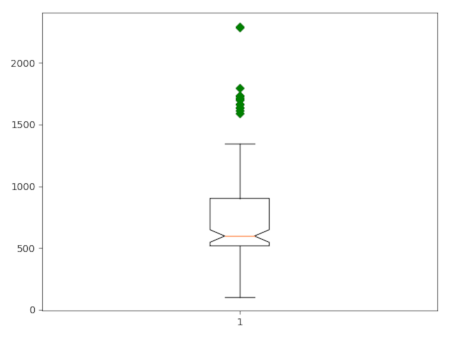
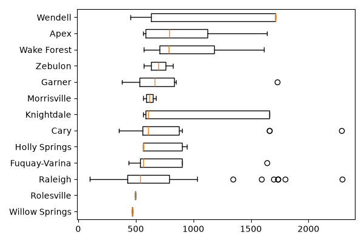

## DESCRIPTION

The *v.boxplot* module draws a boxplot of the values in a vector **map**
attribute **column**. Users can use the **where** option to select a
subset of the attribute table. Values in the column can also be grouped
according to the categories in another column (**group\_by**), creating
separate boxplots for each group.

### Appearance

Options to customize the appearance of the plot include rotating the
plot and x-axis labels, adding notches, removing outliers, and defining
the colors of various boxplot components. By default, the resulting plot
is displayed on the screen. However, users can save the plot to a file
by specifying the desired width, height, and resolution. The format of
the saved file is determined by the provided file extension. For
example, if `plot_output = outputfile.png`, the plot will be saved as a
PNG file.

### Outlier map

Setting **outliers_map** creates a vector map with only features whose
**column** value is a boxplot outlier. With **group_by**, outliers are computed
separately per group. The output keeps the original attributes and adds:

* **side**: `low` or `high` outlier.
* **iqr_dist**: signed distance beyond the relevant fence, in IQR units.
* **n_overlap**: number of other groups whose value range contains the outlier.
* **GRASSRGB**: color string; high outliers are red, low outliers blue. More
  exceptional values are darker and more saturated.

**overlap_basis** defines the comparison range. With **whisker**, outliers are
compared with other groups’ non-outlier range, between fences. With **box**,
they are only compared with other groups’ interquartile range, *Q1–Q3*.

n_overlap is the number of other groups whose value range contains the outlier’s
value. It distinguishes outliers that are exceptional relative to all groups
(n_overlap = 0) from those that are unusual only within their own group
(n_overlap > 0). For predicted classes, n_overlap > 0 marks features that may be
difficult to classify because their values are typical of one or more other
classes. In contrast, n_overlap = 0 marks values distinct from every other
class. Mapping n_overlap therefore shows where class ambiguity is geographically
concentrated.

## NOTE

The outlier map is created in addition to the plot; both are derived from the
same selection, so the exported outliers always match those shown in the figure.
If the selection contains no outliers, the map is not created and a warning is
issued.

## EXAMPLE

### Example 1

Use the vector layer `schools_wake` from the [NC sample
dataset](https://grass.osgeo.org/download/data/) to create boxplots of
the core capacity of schools in Wake County, North Carolina. Use the
**Where** clause to exclude all records with no data. Use the **-o**
flag to draw outliers.

```sh
v.boxplot -n -o map=schools_wake column=CORECAPACI where="CORECAPACI >0"
```

[](v_boxplot_01.png)  
*Figure 1: Boxplot of core capacity of schools in Wake County.*

### Example 2

Use the vector layer `schools_wake` from the [NC sample
dataset](https://grass.osgeo.org/download/data/) to create boxplots of
the core capacity of the schools in Wake County, North Carolina, grouped
by city. Use the **Where** clause to exclude all records with missing
data. Use the **-o** flag to draw outliers.

```sh
v.boxplot -h -o map=schools_wake column=CORECAPACI where="CORECAPACI >0" group_by=ADDRCITY order=ascending
```

[](v_boxplot_02.png)  
*Figure 2: Boxplot of core capacity of schools in Wake County, grouped
by city.*

## SEE ALSO

*[v.scatterplot](https://grass.osgeo.org/grass-stable/manuals/addons/v.scatterplot.html),
[d.vect.colhist](https://grass.osgeo.org/grass-stable/manuals/addons/d.vect.colhist.html),
[r.boxplot](https://grass.osgeo.org/grass-stable/manuals/addons/r.boxplot.html),
[r.series.boxplot](https://grass.osgeo.org/grass-stable/manuals/addons/r.series.boxplot.html),
[t.rast.boxplot](https://grass.osgeo.org/grass-stable/manuals/addons/t.rast.boxplot.html),
[r.scatterplot](https://grass.osgeo.org/grass-stable/manuals/addons/r.scatterplot.html)
[r3.scatterplot](https://grass.osgeo.org/grass-stable/manuals/addons/r3.scatterplot.html)*

## AUTHOR

[Paulo van Breugel](https://ecodiv.earth), [HAS green
academy](https://has.nl), [Innovative Biomonitoring research
group](https://www.has.nl/en/research/professorships/innovative-bio-monitoring-professorship/),
[Climate-robust Landscapes research
group](https://www.has.nl/en/research/professorships/climate-robust-landscapes-professorship/)
