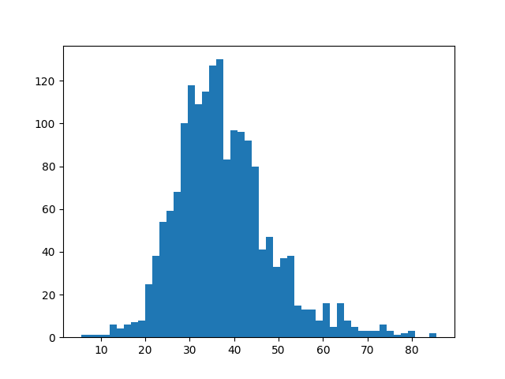
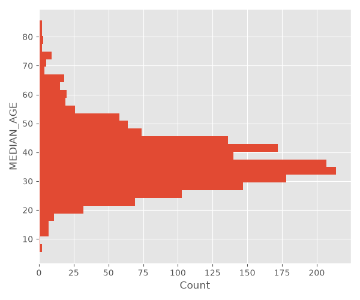

## DESCRIPTION

*v.histogram* draws a histogram of the values in a vector map attribute
column. Use the **where** option to select a subset of the records and
**bins** to set the number of bars.

The histogram can be drawn horizontally (**-h**), with grid lines
(**-g**), rotated value-axis labels (**-r**), and a limited value axis
(**axis_limits**). The bar **color**, **border_color**, border
**line_width** and relative bar width (**rwidth**) can be set. A
Matplotlib [style
sheet](https://matplotlib.org/stable/gallery/style_sheets/style_sheets_reference.html)
can be applied with the **style** option, e.g. *style=ggplot*. The
**fontsize**, figure size (**plot_dimensions**, in inches) and resolution
(**dpi**) can be set as well.

The **plot\_output** parameter determines whether the result is displayed
on screen (default, `-`) or exported to a graphics file, with the format
taken from the file extension.

Options to customize the appearance of the plot include, among others, rotating
the plot and x-axis labels, setting font size, and defining the colors of
various plot components. The **style** option applies a Matplotlib [style
sheet](https://matplotlib.org/stable/gallery/style_sheets/style_sheets_reference.html)
to the plot, e.g. *style=ggplot*.

## EXAMPLE

Show the histogram of median age values in the census block map:

```sh
v.histogram map=censusblk_swwake column=MEDIAN_AGE where="TOTAL_POP>0"
```

  
Histogram of median age values in census blocks

Show the same histogram, but apply the *ggplot* stylesheet, and plot the bars
horizontally.

```sh
v.histogram map=censusblk_swwake column=MEDIAN_AGE where="TOTAL_POP>0" \
style="ggplot" plot_dimensions="6,5" -h
```

  
Histogram of median age values in census blocks


## AUTHOR

Moritz Lennert (original code)

Paulo van Breugel (added style sheet, plot and histogram format options)