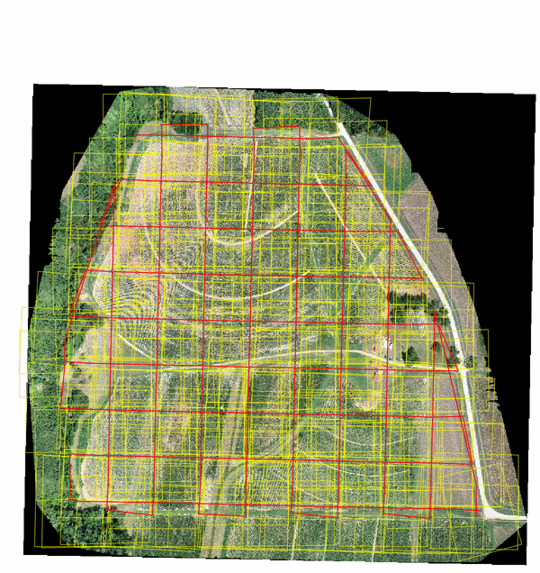
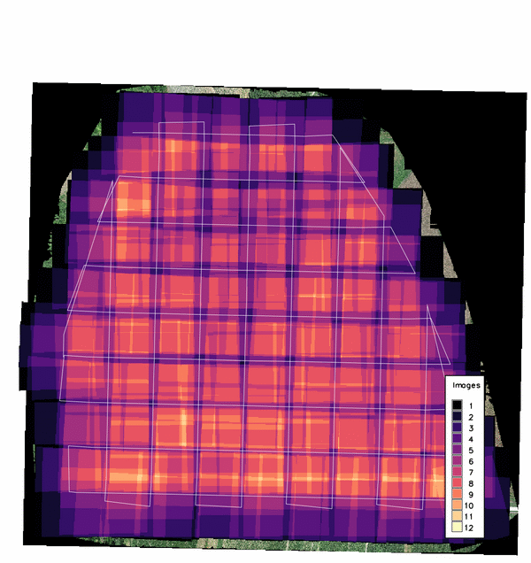

## DESCRIPTION

*v.photo.geometry* recovers acquisition geometry from a directory of
aerial photos whose flight metadata is incomplete. From the image
metadata and an elevation model it derives the camera positions and
orientations, above-ground altitude, ground sample distance (GSD), and
image footprints, and writes them as vector maps:

- **footprints**: one 3D area per image, ray-traced onto the elevation
  model (or projected onto flat ground with **-f**), with the full set
  of per-image attributes.
- **stations**: 3D points at the camera positions with the same
  attributes (yaw, pitch, roll, altitude, AGL, GSD, sensor size,
  camera make, model, lens, and body serial number).
- **path**: one 3D line per camera body and flight segment,
  reconstructing the flown track. Curved tracks (typical for manned
  sorties) are smoothed with a Catmull-Rom spline; grid patterns
  (typical for UAS mapping missions) are kept as straight legs.
- **overlap**: a per-image forward and side overlap report written as
  plain text, CSV, or JSON (**format**), to a file or to standard
  output (`overlap=-`).
- **overlap_density**: a raster counting the number of images that
  cover each cell, colored with the magma color table.

At least one of these outputs is required.

The tool was written for imagery that arrives without flight logs,
such as post-disaster reconnaissance photos, where flight planning
parameters have to be reconstructed from the images themselves.

  
*Figure: Recovered image footprints (yellow), camera stations (dots),
and flight path (red) of a 215-image DJI Phantom 4 Pro mission over
the Lake Wheeler field laboratory, NCSU, on the same-day
orthomosaic.*

## NOTES

### ExifTool requirement

Image metadata is read with [ExifTool](https://exiftool.org/)
(version 12.0 or newer), which must be installed separately;
*g.extension* cannot install it. On Debian/Ubuntu install
`libimage-exiftool-perl`, on Fedora `perl-Image-ExifTool`, on macOS
`brew install exiftool`. JPEG, TIFF, and DNG images are read,
recursively below the **input** directory.

The Python package `pyproj` is also required and is not installed by
*g.extension*: `pip install pyproj`.

### Sensor size

The physical sensor size drives the GSD and footprint scale. It is
resolved in this order:

1. the **sensor** option (width,height in mm), when given;
2. the EXIF focal plane resolution tags;
3. the 35 mm equivalence scale factor, which ExifTool derives from its
   internal camera database when the focal plane tags are absent (the
   common case for drones).

The source used is reported per camera model. Estimated values inherit
the precision of the source tags and are commonly a few percent larger
than the true sensor dimensions, which propagates linearly into GSD
and footprint size. When the sensor dimensions are known, pass them
with **sensor** for exact results.

### Orientation and heading

Yaw, pitch, and roll are taken from the maker orientation tags
(for example DJI `FlightYawDegree`, `GimbalPitchDegree`,
`GimbalRollDegree`, or `GPSImgDirection`) when present. Without them
the camera is assumed nadir and the heading of each image is estimated
from the GPS track: images are grouped per camera body (serial
number), split into flight segments wherever consecutive exposures are
more than **time_gap** seconds apart, and the heading is interpolated
along each segment. Multi-camera rigs that fire simultaneously against
a single GPS record are handled by this per-body grouping.

### Footprints and the computational region

Footprint corners are ray-traced from the camera through the sensor
corners onto the **elevation** raster, read once at the current
computational region resolution. The region must cover the photo
block. The GPS altitude and the elevation model must share a vertical
datum; a datum offset shifts the AGL and scales every footprint.
With **-f** the terrain is ignored and each footprint is a flat
rectangle at the ground elevation below the camera, which is faster
but degrades with relief and off-nadir angles. Overlap statistics and
the density raster treat each footprint as a convex quadrilateral;
on very steep relief the terrain-draped corners can violate that
assumption slightly.

### Overlap statistics

Forward overlap is the fraction of an image footprint covered by the
next image of the same camera within the same flight segment. Side
overlap is the maximum overlap with any non-consecutive image of the
same camera, which captures adjacent flight lines without
reconstructing the line layout. Images without a footprint report
empty values.

The **overlap_density** raster counts the images covering each cell of
the current computational region, computed from the footprint polygons
in memory. Cells covered by no image are NULL. The magma color table
is applied to the output.

  
*Figure: Overlap density of the same mission; the double-grid
crosshatch peaks at 12 images per cell.*

Footprints of adjacent images overlap by design, so the **footprints**
map contains overlapping areas; GRASS reports duplicate centroids when
building its topology, which is expected here.

## EXAMPLES

Recover the full geometry of a photo block:

```sh
g.region raster=dtm -p
v.photo.geometry input=/data/mission01 elevation=dtm \
    footprints=m01_footprints stations=m01_stations \
    path=m01_path overlap=m01_overlap.csv \
    overlap_density=m01_density
```

Known camera, flat terrain, overlap only, printed to the terminal:

```sh
v.photo.geometry -f input=/data/mission01 elevation=dtm \
    sensor=36.0,24.0 overlap=- format=plain
```

## SEE ALSO

*[g.region](g.region.md),
[i.ortho.photo](i.ortho.photo.md),
[v.info](v.info.md)*

## REFERENCES

- [ExifTool](https://exiftool.org/), Phil Harvey
- [ExifTool EXIF tag names](https://exiftool.org/TagNames/EXIF.html)

## AUTHORS

Corey T. White, [NCSU GeoForAll
Lab](https://geospatial.ncsu.edu/geoforall/)
