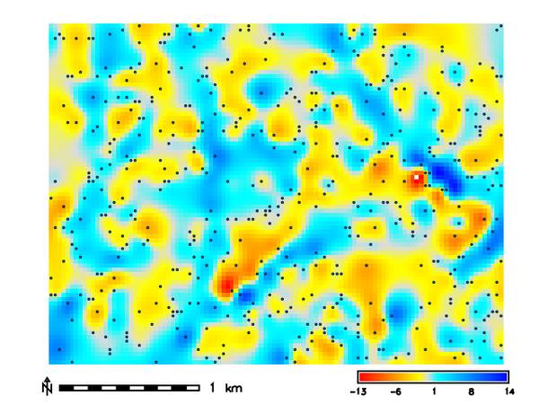
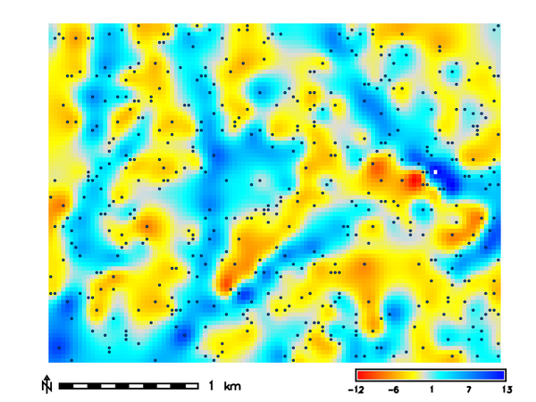
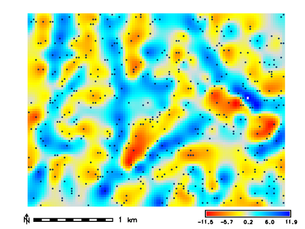
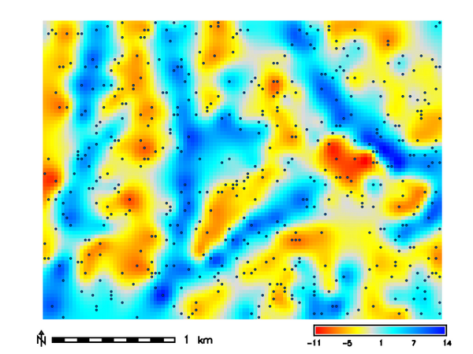

## DESCRIPTION

*v.surf.rst.cv* finds well performing parameters for the regularized
spline with tension (RST) interpolation implemented in
[v.surf.rst](https://grass.osgeo.org/grass-stable/manuals/v.surf.rst.html)
by running its leave-one-out cross-validation procedure over combinations
of parameter values. For every combination, each input point is withheld
in turn, the surface is approximated from the remaining points, and the
predictive error (predicted minus observed value) is recorded. The tool
summarizes the errors of every combination, reports the best one, and
optionally saves the cross-validation error maps. The **mask**,
**zcolumn**, **where**, **zscale**, and **layer** options are passed
through unchanged to every v.surf.rst run.

The **tension** and **smooth** options accept lists of values and form
the core search space. The remaining RST parameters (**npmin**,
**segmax**, **dmin**, **dmax**, **theta**, **scalex**) also accept lists
and are swept as an outer loop: every combination of their values is
combined with the full tension and smoothing search. See the NOTES for
why these parameters need more care when interpreting results.

Two search methods are available:

- **method=grid** (default) evaluates the full Cartesian product of the
  tension and smoothing lists.
- **method=refine** first evaluates the tension x smoothing grid and then
  recursively refines the search around the best combination: geometric
  midpoints between the best cell and its neighbors are evaluated, up to
  **levels** times or until the error differences within the refinement
  window become negligible. Use it to locate a finer optimum without
  enumerating a dense grid. When the best combination lies on the border
  of the searched range, a warning recommends widening the range.

Parameter combinations are cross-validated in parallel; **nprocs**
controls the number of concurrent runs (each v.surf.rst process runs
single threaded). A failing combination is reported as a row with an
error instead of stopping the search.

### Error metrics

For each combination the tool reports the number of cross-validated
points (*n*), mean error (*me*, a measure of bias), mean absolute error
(*mae*), root mean square error (*rmse*), median error, normalized median
absolute deviation (*nmad*), the 68.3rd and 95th percentiles of the
absolute error (*p68*, *p95*), the extreme errors, and the normalization
factor (*dnorm*, see below). The best combination is selected by RMSE.
The best combinations under MAE and NMAD are also reported; when the
metrics disagree, the tool warns, because the selection is then driven by
a small number of large errors and the residual distribution should be
inspected before accepting the result.

The reported cross-validation error of the winning combination is an
optimistic estimate of the accuracy of the final surface, because it was
selected as the minimum over many candidates. Use an independent set of
withheld points to estimate the accuracy of the resulting surface.

### Tension, dnorm, and the -t flag

v.surf.rst internally normalizes coordinates by a factor

```text
dnorm = sqrt(area * npmin / n)
```

where *area* is the bounding box of the points and *n* their count. The
effective range of the spline is therefore proportional to
*dnorm/tension*: the same tension value acts differently for different
point counts, extents, and **npmin** settings. Consequences:

- A tension optimized for one data set does not transfer to another data
  set, or even to a subsample of the same data set, unless the **-t**
  flag (scale dependent tension) is used. With **-t**, tension is
  rescaled by *dnorm/1000* and acts on the real coordinates.
- Sweeping **npmin** together with tension without **-t** compares
  different effective tensions across rows; the tool warns in this case.

The computed *dnorm* is reported for every combination, and with **-t**
the rescaled tension is reported as *tension_rescaled*. The reported
*dnorm* is derived from the bounding box of the input points and is
approximate when the computational region clips part of the input.

### Cross-validation on large data sets

Leave-one-out cross-validation is reasonable for up to several thousand
points. For larger data sets, set **npoints** to cross-validate on a
spatially stratified random subsample: one point is drawn per cell of a
coarse grid sized to yield approximately **npoints** points, which
preserves the spatial coverage of clustered point clouds better than
simple random sampling. Use **seed** for a reproducible selection.
Combine subsampling with the **-t** flag, otherwise the optimal tension
found on the subsample does not apply at full point density (the tool
warns about this).

### Saved cross-validation maps

When **cv_prefix** is set, the cross-validation error vector map of every
combination is kept as `<cv_prefix>_<index>` (the *cvdev* column of the
report gives the map name for each row), the errors are interpolated into
a raster map of the same name, and a diverging color scheme centered on
the median error is applied to both. The error value is stored in the
`flt1` attribute column as predicted minus observed.

## NOTES

Parameters swept in the outer loop change more than the model fit:

- **dmin** removes nearly coincident points before interpolation and
  **dmax** inserts additional points along lines. Both change which
  points receive a cross-validation error, so error metrics of rows with
  different **dmin** or **dmax** values are computed over different point
  sets and are not directly comparable; compare the *n* column and
  interpret those rows with care (the tool warns when *n* differs).
- **npmin** and **segmax** control segmentation. For data sets larger
  than *2 x npmin* points, v.surf.rst requires *npmin > segmax*. To skip
  segmentation entirely for smaller data sets, set *segmax = 2 x npmin*.
- **theta** and **scalex** (anisotropy) are supported, but the current
  v.surf.rst evaluates cross-validation errors without applying the
  anisotropy transformation used in the interpolation, so
  cross-validation results with anisotropy are unreliable until this is
  fixed in GRASS; the tool warns when they are used.

The cross-validation procedure works well only for well-sampled phenomena
and when minimizing the predictive error is the goal. The parameters
found by minimizing the predictive error may not be the best for poorly
sampled phenomena (the result could be strongly smoothed with lost details
and fluctuations) or when significant noise is present that needs to be
smoothed out.

The computational region affects the result: points outside the region
receive no cross-validation error and the default **dmin** is derived
from the region resolution. Compare runs only within the same region.

Results are always printed to standard output; **output_file** writes the
same content to a file in addition. With **nprocs** greater than one, the
tool runs each combination in a temporary mapset named `tmp_cv_*` inside
the current project to avoid database contention; these mapsets are
removed when the tool ends, but may remain after a hard interruption and
can then be removed manually.

Possible future extensions include k-fold cross-validation (which would
also make **dmin**/**dmax** rows comparable), buffered leave-one-out for
data with near-duplicate points, and spatially blocked cross-validation
for gap-filling applications.

## EXAMPLES

### Basic grid search

```bash
g.region raster=elevation res=30 n=220790 s=218390 w=632680 e=635910 -a
r.random input=elevation npoints=500 seed=0 vector=points -z
v.surf.rst.cv point_cloud=points tension=10,100 smooth=0.5,5.0 \
    segmax=600 nprocs=4 format=json output_file=test_cv.json
```

The JSON output contains one entry per combination and the best
combinations per metric:

```json
{
    "input": "points",
    "method": "grid",
    "scale_dependent_tension": false,
    "subsample": null,
    "region": {...},
    "warnings": [],
    "results": [
        {
            "tension": 100.0,
            "smooth": 0.5,
            "segmax": 600,
            "cvdev": null,
            "n": 500,
            "me": 0.005205,
            "mae": 2.006109,
            "rmse": 2.715355,
            "median": -0.224484,
            "nmad": 2.269,
            "p68": 2.305549,
            "p95": 5.610012,
            "min": -9.519708,
            "max": 9.506766,
            "error": null,
            "dnorm": 2149.976744
        },
        ...
    ],
    "best": {"rmse": {...}, "mae": {...}, "nmad": {...}}
}
```

A report of the best parameter combination is printed to stderr:

```text
Best parameter combination (by RMSE)
--------------------------------------------------
Tension: 100
Smoothing: 0.5
segmax: 600
RMSE: 2.71536
MAE: 2.00611
NMAD: 2.269
--------------------------------------------------
```

### Refined search

Instead of a dense grid, refine around the best coarse cell:

```bash
v.surf.rst.cv point_cloud=points tension=10,40,160 smooth=0.01,0.1,1.0 \
    segmax=600 method=refine levels=3 nprocs=4
```

### Sweeping structural parameters

Evaluate the effect of segmentation settings on the optimum, using scale
dependent tension so tension values stay comparable across npmin:

```bash
v.surf.rst.cv -t point_cloud=points tension=10,40,160 smooth=0.01,0.1,1.0 \
    npmin=150,300 segmax=120 nprocs=4
```

### Large data sets

Cross-validate on a spatially stratified subsample of 2000 points:

```bash
v.surf.rst.cv -t point_cloud=lidar_points npoints=2000 seed=42 nprocs=8
```

### Saving the error maps

When **cv_prefix** is set, the error point maps are kept and interpolated
into deviation surfaces:

```bash
v.surf.rst.cv point_cloud=points tension=10,100 smooth=0.5,5.0 \
    segmax=600 cv_prefix=cvdev nprocs=4
```


*Tension: 100 Smooth: 0.5*

*Tension: 100 Smooth: 5*

*Tension: 10 Smooth: 0.5*

*Tension: 10 Smooth: 5*

## REFERENCES

- Mitasova, H., Mitas, L. and Harmon, R.S., 2005, Simultaneous spline
approximation and topographic analysis for lidar elevation data in open source
GIS, IEEE GRSL 2 (4), 375- 379.
- Hofierka, J., 2005, Interpolation of Radioactivity Data Using Regularized
Spline with Tension. Applied GIS, Vol. 1, No. 2, pp. 16-01 to 16-13. DOI: 10.2104/ag050016
- Hofierka J., Parajka J., Mitasova H., Mitas L., 2002, Multivariate
Interpolation of Precipitation Using Regularized Spline with Tension.
Transactions in GIS 6(2), pp. 135-150.
- H. Mitasova, L. Mitas, B.M. Brown, D.P. Gerdes, I. Kosinovsky, 1995, Modeling
spatially and temporally distributed phenomena: New methods and tools for
GRASS GIS. International Journal of GIS, 9 (4), special issue on Integrating
GIS and Environmental modeling, 433-446.
- Mitasova, H. and Mitas, L., 1993: Interpolation by Regularized Spline with
Tension: I. Theory and Implementation, Mathematical Geology ,25, 641-655.
- Mitasova, H. and Hofierka, J., 1993: Interpolation by Regularized Spline
with Tension: II. Application to Terrain Modeling and Surface Geometry
Analysis, Mathematical Geology 25, 657-667.
- Mitas, L., and Mitasova H., 1988, General variational approach to the
approximation problem, Computers and Mathematics with Applications, v.16, p. 983-992.
- Neteler, M. and Mitasova, H., 2008, Open Source GIS: A GRASS GIS Approach,
3rd Edition, Springer, New York, 406 pages.
- Talmi, A. and Gilat, G., 1977 : Method for Smooth Approximation of Data,
Journal of Computational Physics, 23, p.93-123.
- Wahba, G., 1990, : Spline Models for Observational Data, CNMS-NSF
Regional Conference series in applied mathematics, 59, SIAM,
Philadelphia, Pennsylvania.

## SEE ALSO

*[r.resamp.rst](https://grass.osgeo.org/grass-stable/manuals/r.resamp.rst.html),
[v.surf.bspline](https://grass.osgeo.org/grass-stable/manuals/v.surf.bspline.html),
[v.surf.idw](https://grass.osgeo.org/grass-stable/manuals/v.surf.idw.html),
[v.surf.rst](https://grass.osgeo.org/grass-stable/manuals/v.surf.rst.html),
[v.vol.rst](https://grass.osgeo.org/grass-stable/manuals/v.vol.rst.html)*

## AUTHORS

Corey T. White [NCSU GeoForAll Lab](https://geospatial.ncsu.edu/geoforall/)
