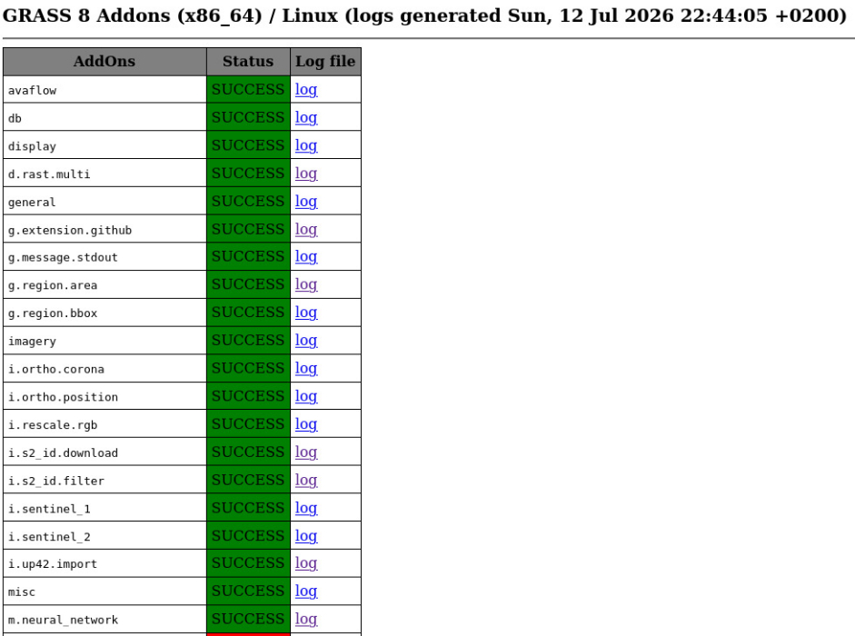

# GRASS GIS addons overview generator

## Description

Generates manual pages for GRASS GIS addons from all public GitHub
repositories tagged with the topic
[grass-gis-addons](https://github.com/topics/grass-gis-addons),
excluding the main OSGeo/grass-addons repository.

The script can run on any Linux machine (or anywhere GRASS GIS runs).
It does **not** need to be inside a git repo — just download the
script and run it.

The output is an HTML table with all addon manual pages, the source
repository link, and a testsuite indicator:

- addon manual pages generated at: `$ADDONMANPATH/index.html`
- compilation log files written to: `$ADDON_PATH/logs/index.html`

## How it works

1. **Discover**: uses the GitHub CLI (`gh`) to query for public repos
   with topic `grass-gis-addons`, excluding OSGeo/grass-addons.
2. **Clone**: shallow-clones each repo into a working directory.
   Clones are cached between runs (re-pulled instead of re-cloned).
3. **Reorganize**: detects addon directories (those with a Makefile
   referencing `MODULE_TOPDIR`) and consolidates them into a single
   source tree. Both single-addon repos (addon at root) and
   multi-addon repos (addons in subdirectories) are supported,
   including repos with subdirectories like `src/` or
   `grass-addons/`.
4. **Compile**: compiles each addon using the standard GRASS build
   system, recording success/failure and log files. Addons whose
   source is unchanged since the last successful run are cached
   (logged as `CACHED` and skipped).
5. **Generate**: creates an HTML index of all manual pages, grouped
   by module prefix, annotated with source repository links and
   testsuite status.

### Manual page overview


### Compilation log overview



## Requirements

- **GitHub CLI (`gh`)**: installed and authenticated
  (<https://cli.github.com/>). Run `gh auth login` first.
- **GRASS GIS**: a working GRASS GIS installation (same major.minor
  as the addons being compiled).
- **git**: with SSH key configured for private repos.
- Python packages (see `requirements.txt`).

## Installation

```bash
# Install GitHub CLI (gh)
# See: https://github.com/cli/cli/blob/trunk/docs/install_linux.md
sudo apt-get install gh

# Authenticate
gh auth login

# Install Python dependencies
pip3 install -r requirements.txt
```

## Usage

The script can be placed anywhere — it does not need to be inside a
specific directory or git repository.

```bash
bash compile_addons_git.sh
```

Optional arguments:

| Flag   | Long form        | Description                                                                       |
|--------|------------------|-----------------------------------------------------------------------------------|
| `-b`   | `--addonbinpath` | Target dir for compiled addon binaries (default: `~/.grass8/addons`)              |
| `-m`   | `--addonmanpath` | Target dir for generated manual pages (default: `~/.grass8/addons/all_docs/`)     |
| `-s`   | `--alladdonssrc` | Consolidated source tree (default: `/tmp/grass_addons`)                           |
| `-w`   | `--workdir`      | Working dir for cloned repos (default: `/tmp/grass_addons_repos`)                 |
| `-c`   | `--cachedir`     | Compilation checksum cache directory (default: `~/.cache/grass_addons_compiler/`) |
|        | `--no-cache`     | Force full rebuild, bypassing compilation cache                                   |

### Caching

Two levels of caching speed up re-runs:

1. **Repo cache**: cloned repositories in `WORKDIR_REPOS` persist
   between runs. On subsequent runs, `git pull --ff-only` is used
   instead of a full `git clone`. Delete `WORKDIR_REPOS` to force a
   fresh clone of all repos.

2. **Compilation cache**: after each successful compilation, a SHA256
   checksum of the addon's source files is stored in `CACHEDIR`
   (`~/.cache/grass_addons_compiler/addon_cache.json`). If the source
   is unchanged on the next run and the compiled output already
   exists, the addon is logged as `CACHED` and skipped. To force a
   full rebuild: `bash compile_addons_git.sh --no-cache` or
   `rm -f ~/.cache/grass_addons_compiler/addon_cache.json`.

### CI execution in docker

See `docker/` subdirectory.

## Authors and acknowledgment

Markus Neteler, 2022-2026
Carmen Tawalika, [mundialis](https://www.mundialis.de/)

based on
<https://github.com/OSGeo/grass-addons/blob/grass8/utils/cronjobs_osgeo_lxd/compile_addons_git.sh>

## License

GPL-3 or later
